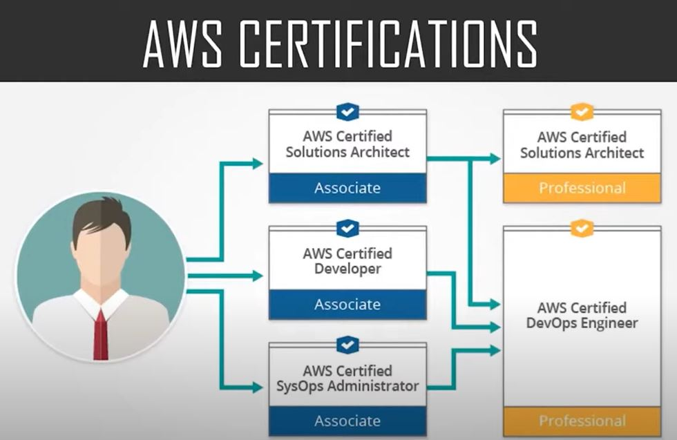

# List of certifications
* https://www.youtube.com/watch?v=Gat9uLmDJ5I&ab_channel=edureka%21\

## Do in following order:
* AWS Certified Cloud Practitioner
* AWS Certified Solutions Architect - Associate
* AWS Certified Developer - Associate
* AWS Certified Solutions Architect - Professional
* AWS Certified SysOps Administrator - Associate
* AWS Certified DevOps Engineer - Professional
------
# Exam details
* aws certified solutions architect - associate
	* multiple choice questions and multiple answers
	* 130 minutes
	* $150 USD
* AWS certified Developer Associate
	* multiple choice questions and multiple answers
	* 80 minutes
	* $150 USD
* AWS certified SysOps Administrator Associate
	* multiple choice questions and multiple answers
	* 80 minutes
	* $150 USD
* aws certified solutions architect - professional
	* pre-requisite: aws certified solutions architect - associate
	* multiple choice questions and multiple answers
	* 170 minutes
	* $300 USD
* AWS certified DevOps Engineer Professional
	* pre-requisite: AWS certified Developer Associate (or) AWS certified SysOps Administrator Associate
	* multiple choice questions and multiple answers
	* 170 minutes
	* $300 USD
------
# Materials certification wise
* AWS Certified Cloud Practitioner
	* Udemy - [NEW] Ultimate AWS Certified Cloud Practitioner - 2022
	* Udemy - [NEW] AWS Certified Cloud Practitioner 2022
* AWS certified Developer Associate
	* Udemy - Ultimate AWS Certified Developer Associate 2022 - NEW!
	* Udemy - Practice Exams | AWS Certified Developer Associate 2022