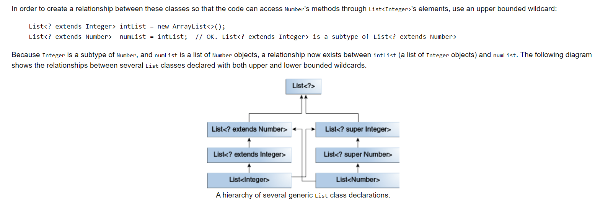

# Generics Notes

# Upper Bounded wild card
```
List<? extends Class>
```
* Upper bounded wild card example
```
private void method4(List<? extends  Number> list){
}

public void method5(){
    List<Integer> list1 = new ArrayList<>();
    method4(list1);

    List<Double> list2 = new ArrayList<>();
    method4(list2);
}
```
------
# Lower Bounded wild card
```
List<? super Class>
```
* Lower bounded wild card example
```
private void method6(List<? super Integer> list){
}

public void method7(){
    List<Object> list1 = new ArrayList<>();
    method6(list1);

    List<Integer> list2 = new ArrayList<>();
    method6(list2);

    List<Number> list3 = new ArrayList<>();
    method6(list3);
}
```
------
# Unbounded wild card
```
List<?>
```
* Unbounded wild card example
```
public static void printList(List<?> list) {
    for (Object elem: list)
        System.out.print(elem + " ");
    System.out.println();
}

List<Integer> li = Arrays.asList(1, 2, 3);
List<String>  ls = Arrays.asList("one", "two", "three");
printList(li);
printList(ls);
```
------
# Wild cards subtyping relationship

------
# Erasure
* After compilation generics will be removed
```
List<string>, List<Integer> , List<List<Integer>> -> List
List<String>[] - List[]
T without bounds -> Object
T extends Foo -> Foo
```
* Compilation Error, after compilation both List&lt;String&gt; and List&lt;Integer&gt; will be converted to List as explained in Erasure
```
public void print(List<String> list) { --} 
public void print(List<Integer> list) { --} 
This will throw compile error - both methods have same erasure
```
*  During the type erasure process, the Java compiler erases all type parameters and replaces each with its first bound if the type parameter is bounded, or Object if the type parameter is unbounded.
* Consider the following generic class that represents a node in a singly linked list:
```
public class Node<T> {

    private T data;
    private Node<T> next;

    public Node(T data, Node<T> next) {
        this.data = data;
        this.next = next;
    }

    public T getData() { return data; }
    // ...
}
```
* Because the type parameter T is unbounded, the Java compiler replaces it with Object:
```
public class Node {

    private Object data;
    private Node next;

    public Node(Object data, Node next) {
        this.data = data;
        this.next = next;
    }

    public Object getData() { return data; }
    // ...
}
```
* In the following example, the generic Node class uses a bounded type parameter:
```
public class Node<T extends Comparable<T>> {

    private T data;
    private Node<T> next;

    public Node(T data, Node<T> next) {
        this.data = data;
        this.next = next;
    }

    public T getData() { return data; }
    // ...
}
```
* The Java compiler replaces the bounded type parameter T with the first bound class, Comparable:
```
public class Node {

    private Comparable data;
    private Node next;

    public Node(Comparable data, Node next) {
        this.data = data;
        this.next = next;
    }

    public Comparable getData() { return data; }
    // ...
}
```
## Erasure of Generic Methods
* The Java compiler also erases type parameters in generic method arguments. Consider the following generic method:
```
// Counts the number of occurrences of elem in anArray.
public static <T> int count(T[] anArray, T elem) {
    int cnt = 0;
    for (T e : anArray)
        if (e.equals(elem))
            ++cnt;
        return cnt;
}
```
* Because T is unbounded, the Java compiler replaces it with Object:
```
public static int count(Object[] anArray, Object elem) {
    int cnt = 0;
    for (Object e : anArray)
        if (e.equals(elem))
            ++cnt;
        return cnt;
}
```
* Suppose the following classes are defined:
```
class Shape { /* ... */ }
class Circle extends Shape { /* ... */ }
class Rectangle extends Shape { /* ... */ }
```
* You can write a generic method to draw different shapes:
```
public static <T extends Shape> void draw(T shape) { /* ... */ }
```
* The Java compiler replaces T with Shape:
```
public static void draw(Shape shape) { /* ... */ }
```
## Refer [Type Erasure](https://docs.oracle.com/javase/tutorial/java/generics/erasure.html) for more
