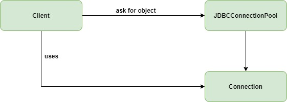

# What is Object pool pattern
* Object pool is a container which contains some amount of objects
* when an object is taken from the pool, it is not available in the pool until it is put back
* Objects in the pool have a lifecycle
	* Creation
	* Validation
	* Destroy

# Flow diagram

# Explanation
* `ObjectPoolPattern`: This class uses `Connection` object
* `Connection`: object that is expensive or slow to instantiate, or that has limited availability, so is to be held in the object pool
* `JDBCConnectionPool`: The Pool class is the most important class in the object pool design pattern. Maintains a list of available objects and a collection of objects that have already been requested from the pool

# Example
* Let’s take the example of the database connections. Too many connections might affect the performance for several reasons 
	* Creating a connection is an expensive operation
	* When there are too many connections opened it takes longer to create a new one and the database server will become overloaded

# Classes
* [Connection](Connection.java) - Pooled object
* [JDBCConnectionPool](JDBCConnectionPool.java) - Maintains pooled objects
* [ObjectPoolPattern](ObjectPoolPattern.java) - Client which uses pooled object

# Advantages
* It offers a significant performance boost
* It manages the connections and provides a way to reuse and share them
* Object pool pattern is used when the rate of initializing an instance of the class is high

# When to use Object Pool Design Pattern
* When we have a work to allocates or deallocates many objects
* When we know that we have a limited number of objects that will be in memory at the same time