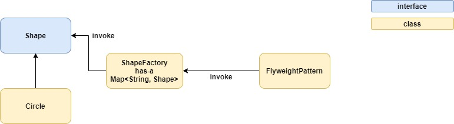

# Flyweight pattern
* minimize memory usage by sharing as much data as possible with similar objects

# Example

# Files
* [Shape](Shape.java)
* [Circle](Circle.java)
* [ShapeFactory](ShapeFactory.java)
* [FlyweightPattern](FlyweightPattern.java)