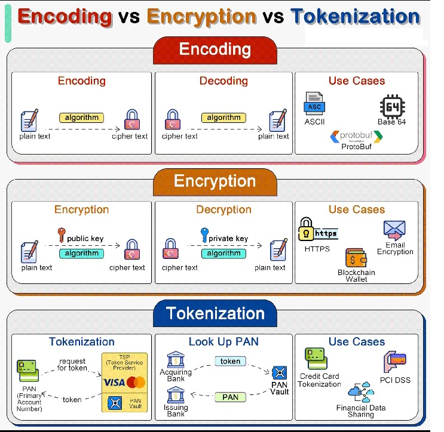

### [<<Back](../README.md) | [Java V2 All Examples](https://github.com/avinashbabudonthu/java/blob/master/java-v2/README.md) | [Java All Examples](https://github.com/avinashbabudonthu/java/blob/master/README.md)
------
# Encoding Encryption Tokenization
* Encoding, encyption, tokenization are three distinct processes that handle data in different ways for various purposes. Including data transmission, security and compliance
* In system design we need to select right approach for handling sensitive information\

------
# Encoding
* Encoding converts data into different format using schema that be easily reversed. Examples include Base64 encoding, which encodes binary data into ASCII characters, making it easier to transmit data over media that are designed to deal with textual data
* Encoding is NOT meant for securing data. The encoded data can be easily decoded using same scheme without need for a key
------
# Encryption
* Encryption involves complex algorithms that use keys for transforming data
* 2 types of encryptions
    * Symmetric - Using same key for encryption and decryption
    * Asymmetric - Using public key for encryption and private key for decryption
* Encryption is designed to protect the data confidentiality by transforming readable data (plain text) into an unredeable format (cipher text) using an algorithm and secret key. Only those with correct key can decrypt and access the original data
------
# Tokenization
* Tokenization is process of substituting sensitive data with non-sensitive placeholders called tokens. The mapping between original data and token is stored security in token vault. Those tokens can be used in various systems and processes without exposing the original data, reducing the risk of data breaches
* Tokenization is often used for protecting credit card information, personal identification numbers and other sensitive data. Tokenization is higly secure as tokens do not contain any part of original data and thus cannot be reverse-engineered to reveal the original data. It is particularly useful for compliance with regulations like PCI DSS
------
### [<<Back](../README.md) | [Java V2 All Examples](https://github.com/avinashbabudonthu/java/blob/master/java-v2/README.md) | [Java All Examples](https://github.com/avinashbabudonthu/java/blob/master/README.md)