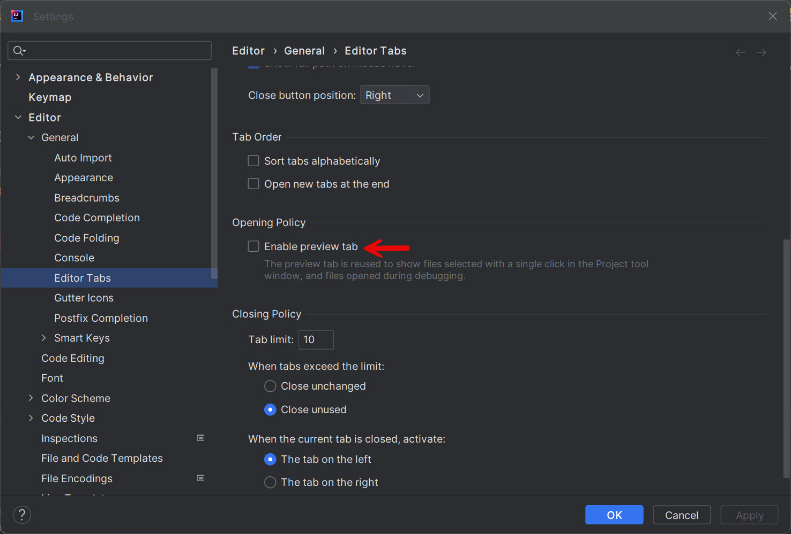

### [<<Back](../README.md) | [Java V2 All Examples](https://github.com/avinashbabudonthu/java/blob/master/java-v2/README.md) | [Java All Examples](https://github.com/avinashbabudonthu/java/blob/master/README.md)
------
# Disable preview mode
* While navigating classes, on opening a class by default it opens in preview mode
* Same tab is used on opening another class closing previously opened class
* This issue will be resolved by disabling preview mode. Uncheck below check box

------
### [<<Back](../README.md) | [Java V2 All Examples](https://github.com/avinashbabudonthu/java/blob/master/java-v2/README.md) | [Java All Examples](https://github.com/avinashbabudonthu/java/blob/master/README.md)