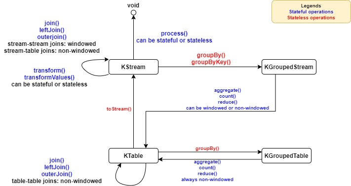

### [<<Back](../README.md) | [Java V2 All Examples](https://github.com/avinashbabudonthu/java/blob/master/java-v2/README.md) | [Java All Examples](https://github.com/avinashbabudonthu/java/blob/master/README.md)
------
# KStream KGroupedStream KTable KGroupedTable

------
### [<<Back](../README.md) | [Java V2 All Examples](https://github.com/avinashbabudonthu/java/blob/master/java-v2/README.md) | [Java All Examples](https://github.com/avinashbabudonthu/java/blob/master/README.md)