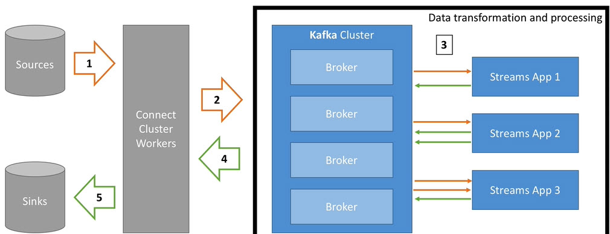

### [<<Back](../README.md) | [Java V2 All Examples](https://github.com/avinashbabudonthu/java/blob/master/java-v2/README.md) | [Java All Examples](https://github.com/avinashbabudonthu/java/blob/master/README.md)
------
# What is kafka streams?
* Library to process and transform data within kafka 
* Used for
	* Data transformations
	* Data Enrichment
	* Fraud Detection
	* Monitoring and Alerting
* Standard java application library
* No need to create separate kafka clusters
* Highly scalable, elastic and fault tolerant
* Exactly once capabilities - means process the record exactly once
* Processes one record at a time (no batching)
* Works for any application size\

------
# Internal topics
* Running kafka streams creates internal intermediary topics
* Two types
	* Repartitioning topics: In case you start transforming the key of your stream then repartitioning will happen at some processor
	* Changelog topic: In case you perform aggregation then kafka streams will save compacted data in these topics
* Internal topics
	* Managed by kafka streams
	* Are used by kafka streams to save/restore state and re-partition data
	* Are prefixed by `application.id` parameter
	* Should never be deleted, altered and published to
------
# KStreams
* All `inserts`
* Similar to log
* Infinite
* Unbounded data streams
------
# KTable
* Upserts on non null values
* Deletes on null values
* Similar to table
* Parallel with log compacted topics
------
# When to KStrams vs KTable
* KStreams reading from topic that is not compacted
* KTable reading from topic that is log compacted (aggregations)

* KStream if new data is partial information or transactional
* KTable if you need structures like `database table` where every update is atomic (example: Total Bank balance)
------
# Filter and FilterNot
* Takes one record and produces zero or one record

## Filter
* Does not change keys or values
* Does not trigger re-partition
* For KStreams and KTables
* example
```
KStream<String, Long> positives = stream.filter((key,value) -> value > 0);
```
* Above example keeps record (foo, 10). Deletes (bar, -5)

## FilterNot
* Inverse of Filter
------
# Map and MapValues
* Takes one record and produces one record

## MapValues
* Only effecting values
* Does not change keys
* Does not trigger re-partition
* For KStreams and KTables
* Example. (foo, bar) -> (foo, BAR)
```
KStream<byte[], String> upperCase = stream.mapValues(value -> value.toUpperCase());
```

## Map
* Effects both keys and values
* Triggers re-partition
* For KStreams only
------
# FlatMap and FlatMapValues
* Takes one record and produces zero, one or more records

## FlatMapValues
* Does not changes keys
* Does not trigger re-partition
* For KStreams only
* Example
```
words = record.flatMapValues(value -> Arrays.asList(value.split("\\s+")));
```
* Output of above code
	* Input: (greet, welcome to kafka)
	* Output: (greet, welcome), (greet, to), (greet, kafka)
	
## FlatMap
* Changes keys
* Triggers re-partition
* For KStreams only
------
# Branch
* Branch: split KStream based on one or more predicates
* predicates are evaluated in order, if no matches, records are dropped
* You get multiple KStreams as a result
```
KStream<String, Long>[] branches = stream.branch(
	(key,value) -> value > 100, /* 1st predicate -> 1st branch */
	(key,value) -> value > 10, /* 2nd predicate -> 2nd branch */
	(key,value) -> value > 0, /* 3rd predicate -> 3rd branch */
);
```
------
# SelectKey
* Assigns new key to record (from old key and value)
* Triggers re-partitioning
* Best practice while coding - Isolate this code to know exactly where partitioning happens
```
resultStream = stream.selectKey((key, value) -> key.substring(0, 1));
```
* Output of above code
	* (foo, hello) -> (f, hello)
	* (bar, welcome) -> (b, welcome)
------
# KStream and KTable Reading from kafka
* Can read topic as KStream, KTable, GlobalKTable
* Reading as KStream
```
KStram<String, Long> wordCount = builder.stream(
	Serdes.String(), /* Key serde */
	Serdes.Long(), /* Value serder */
	"word-count-input-topic"
);
```
* Reading as KTable
```
KTable<String, Long> wordCount = builder.table(
	Serdes.String(), /* Key serde */
	Serdes.Long(), /* Value serder */
	"word-count-input-topic"
);
```
* Reading as GlobalKTable
```
GlobalKTable<String, Long> wordCount = builder.globalTable(
	Serdes.String(), /* Key serde */
	Serdes.Long(), /* Value serder */
	"word-count-input-topic"
);
```
------
# KStream and KTable writing to kafka
* Can write any KStream or KTable back to topic
* While writing KTable, think about create log compacted topic which save space and retrieval time
* To - Terminal Operation - write records to topic
```
stream.to("word-count-output")
stream.to("word-count-output", org.apache.kafka.streams.kstream.Produced.with(Serdes.String(), Serdes.Long()));

table.to("word-count-output")
table.toStream().to("word-count-output", org.apache.kafka.streams.kstream.Produced.with(Serdes.String(), Serdes.Long()));
```
* Through: write to topic and get stream / table from topic
```
KStream<String, Long> newStream = stream.through("user-clicks-topic");

KTable<String, Long> newStream = table.through("user-clicks-topic");
```
------
# Transform KTable to KStream
* Helpful to transform KTable to KStream in order to keep changelog of all the changes to KTable
* Can be done with below code
```
KTable<byte[], String> table = ...;

// Overloaded toStream() methods are available. Check API documentation
KStream<byte[], String> stream = table.toStream();
```
------
# Transform KStream to KTable
* 2 ways
* Using `groupByKey()` and aggregation step
```
KTable<String, Long> table = stream.groupByKey().count();
```
* Writing to kafka and read as KTable
```
stream.to("intermediary-topic")
stream.to("intermediary-topic", org.apache.kafka.streams.kstream.Produced.with(Serdes.String(), Serdes.Long()));

KTable<String, String> table = builder.table("intermediary-topic");
```
------
### [<<Back](../README.md) | [Java V2 All Examples](https://github.com/avinashbabudonthu/java/blob/master/java-v2/README.md) | [Java All Examples](https://github.com/avinashbabudonthu/java/blob/master/README.md)
------