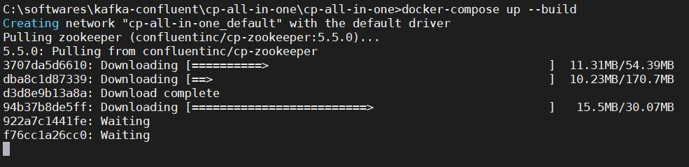

### [<<Back](../README.md) | [Java V2 All Examples](https://github.com/avinashbabudonthu/java/blob/master/java-v2/README.md) | [Java All Examples](https://github.com/avinashbabudonthu/java/blob/master/README.md)
------
# Kafka Confluent Platform Setup in windows machine Using Docker
* Clone repo - https://github.com/confluentinc/cp-all-in-one.git
```
git clone https://github.com/confluentinc/cp-all-in-one.git
```
* Clones the repo `cp-all-in-one`
* Navigate to `cp-all-in-one/cp-all-in-one` in `cmd` or `powershell`
* Execute command 
```
docker-compose up --build
```
* To run in detach mode
```
docker-compose -d up --build
```

* After starting check the status
```
docker-compose ps
or
docker ps -a
or
docker ps
```
* Open url - [http://localhost:9021](http://localhost:9021)

* Check the `control-center` port using `docker-compose ps` command result


## Reference
* https://nielsberglund.com/2019/06/18/confluent-platform--kafka-for-a-.net-developer-on-windows/
* https://nielsberglund.com/2018/07/10/install-confluent-platform-kafka-on-windows/
------
### [<<Back](../README.md) | [Java V2 All Examples](https://github.com/avinashbabudonthu/java/blob/master/java-v2/README.md) | [Java All Examples](https://github.com/avinashbabudonthu/java/blob/master/README.md)