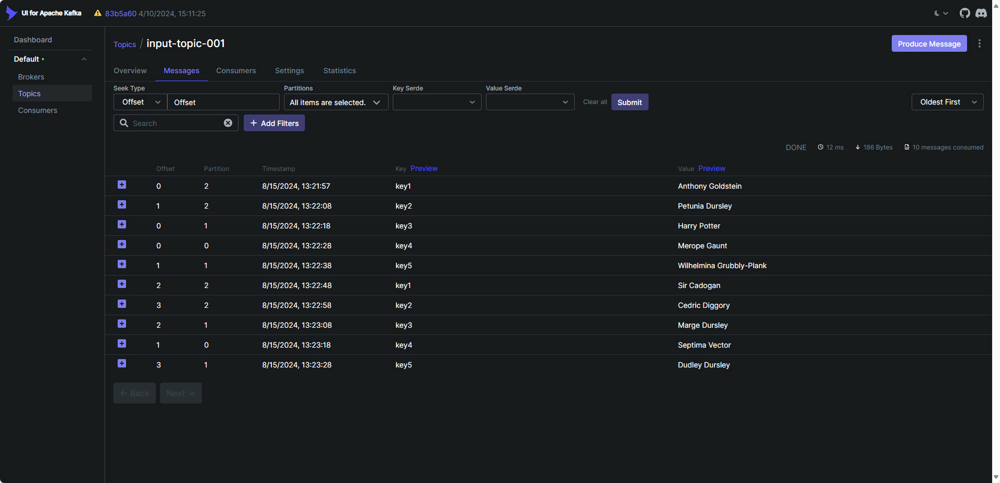

### [<<Back](../README.md) | [Java V2 All Examples](https://github.com/avinashbabudonthu/java/blob/master/java-v2/README.md) | [Java All Examples](https://github.com/avinashbabudonthu/java/blob/master/README.md)
------
# Steps to run application
* Check running containers
```
docker ps -a
```
* Run kafka using docker compose
```
docker-compose up -d
```
* Check running containers again. Should see containers - `zookeeper1`, `kafka1`, `kafkaUi1`
```
docker ps -a
```
* Check networks. Should see network `my_network_1`
```
docker network ls
```
* Wait 2 minutes. Login to kafka UI - http://localhost:8080
* Create topic `input-topic-001`
```
kafka-topics.bat --zookeeper localhost:22181 --create --topic [topic-name] --partitions 1 --replication-factor 1
```
* Stop and remove docker containers
```
docker-compose down
```
* Check running containers
```
docker ps -a
```
------
# Running from IDE
* Import application to IDE. Example: IntelliJ
* Run main class [ProducerTest](src/main/java/com/java/ProducersTest.java)
------
# Running as container
* Build fat jar
```
mvn clean compile package
```
* Build docker image
```
docker build -t kafka-example-001 .
```
* Check built image
```
docker images
```
* Should see an image `kafka-example-001`
* Run container
```
docker run -it --network my_network_1 kafka-example-001
```
* `Ctrl+c` to kill container
* Check container id
```
docker ps -a
```
* Remove container
```
docker rm [containerId]
```
------
# Explanation
* If we create topic with 3 partitions then we can see message with same key always goes to same partition

* Refer below method in class [ProducerTest](src/main/java/com/java/ProducersTest.java) and [ProducersContainerTest](src/main/java/com/java/ProducersContainerTest.java)
  * sendMessageWithKey
------
# Pushing this image to dockerhub public repository
* Build fat jar
```
mvn clean compile package
```
* Build image
```
docker build -t kafka-example-001 .
```
* Run and check
```
docker run -it --network my_network_1 kafka-example-001
```
* Tag an image
```
docker image tag kafka-example-001 donthuavinashbabu/kafka-example-001
```
* Push image
```
docker image push donthuavinashbabu/kafka-example-001
```
* Remove image from local
```
docker rmi kafka-example-001
```
* Pull from dockerhub
```
docker pull donthuavinashbabu/kafka-example-001
```
* Run and check
```
docker run -it --network my_network_1 donthuavinashbabu/kafka-example-001
```
------
### [<<Back](../README.md) | [Java V2 All Examples](https://github.com/avinashbabudonthu/java/blob/master/java-v2/README.md) | [Java All Examples](https://github.com/avinashbabudonthu/java/blob/master/README.md)

