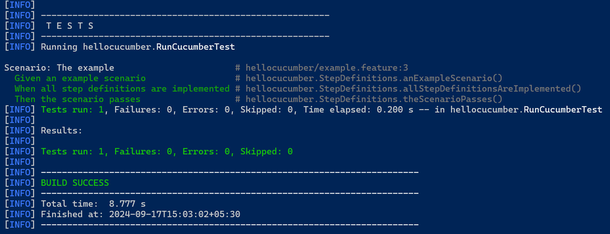

### [<<Back](../README.md) | [Java V2 All Examples](https://github.com/avinashbabudonthu/java/blob/master/java-v2/README.md) | [Java All Examples](https://github.com/avinashbabudonthu/java/blob/master/README.md)
------
# Create cucumber project
* Use below maven command
```
mvn archetype:generate "-DarchetypeGroupId=io.cucumber" "-DarchetypeArtifactId=cucumber-archetype" "-DarchetypeVersion=7.18.1" "-DgroupId=hellocucumber" "-DartifactId=hellocucumber" "-Dpackage=hellocucumber" "-Dversion=1.0.0-SNAPSHOT" "-DinteractiveMode=false"
```
* This will create cucumber project with required dependencies. Following content of pom.xml
```
<?xml version="1.0" encoding="UTF-8"?>
<project xmlns:xsi="http://www.w3.org/2001/XMLSchema-instance"
         xmlns="http://maven.apache.org/POM/4.0.0"
         xsi:schemaLocation="http://maven.apache.org/POM/4.0.0 http://maven.apache.org/xsd/maven-4.0.0.xsd">
    <modelVersion>4.0.0</modelVersion>

    <groupId>hellocucumber</groupId>
    <artifactId>hellocucumber</artifactId>
    <version>1.0.0-SNAPSHOT</version>
    <packaging>jar</packaging>

    <properties>
        <project.build.sourceEncoding>UTF-8</project.build.sourceEncoding>
    </properties>

    <dependencyManagement>
        <dependencies>
            <dependency>
                <groupId>io.cucumber</groupId>
                <artifactId>cucumber-bom</artifactId>
                <version>7.18.1</version>
                <type>pom</type>
                <scope>import</scope>
            </dependency>
            <dependency>
                <groupId>org.junit</groupId>
                <artifactId>junit-bom</artifactId>
                <version>5.10.3</version>
                <type>pom</type>
                <scope>import</scope>
            </dependency>
        </dependencies>
    </dependencyManagement>

    <dependencies>
        <dependency>
            <groupId>io.cucumber</groupId>
            <artifactId>cucumber-java</artifactId>
            <scope>test</scope>
        </dependency>

        <dependency>
            <groupId>io.cucumber</groupId>
            <artifactId>cucumber-junit-platform-engine</artifactId>
            <scope>test</scope>
        </dependency>

        <dependency>
            <groupId>org.junit.platform</groupId>
            <artifactId>junit-platform-suite</artifactId>
            <scope>test</scope>
        </dependency>

        <dependency>
            <groupId>org.junit.jupiter</groupId>
            <artifactId>junit-jupiter</artifactId>
            <scope>test</scope>
        </dependency>
    </dependencies>

    <build>
        <plugins>
            <plugin>
                <groupId>org.apache.maven.plugins</groupId>
                <artifactId>maven-compiler-plugin</artifactId>
                <version>3.13.0</version>
                <configuration>
                    <encoding>UTF-8</encoding>
                    <source>1.8</source>
                    <target>1.8</target>
                </configuration>
            </plugin>
            <plugin>
                <groupId>org.apache.maven.plugins</groupId>
                <artifactId>maven-surefire-plugin</artifactId>
                <version>3.3.1</version>
            </plugin>
        </plugins>
    </build>
</project>
```
* Run maven test command to execute cucumber scenario
```
mvn clean compile test
```
* Test cases should run and build should be successful

------
### [<<Back](../README.md) | [Java V2 All Examples](https://github.com/avinashbabudonthu/java/blob/master/java-v2/README.md) | [Java All Examples](https://github.com/avinashbabudonthu/java/blob/master/README.md)