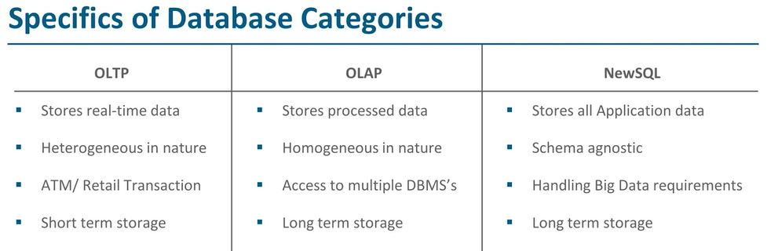
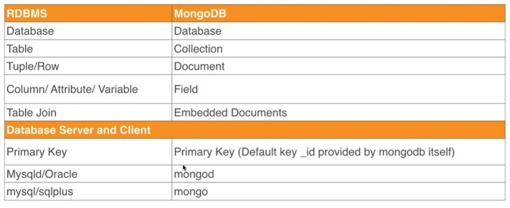
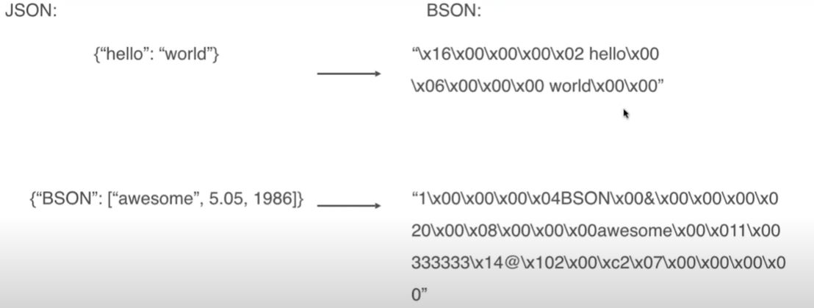
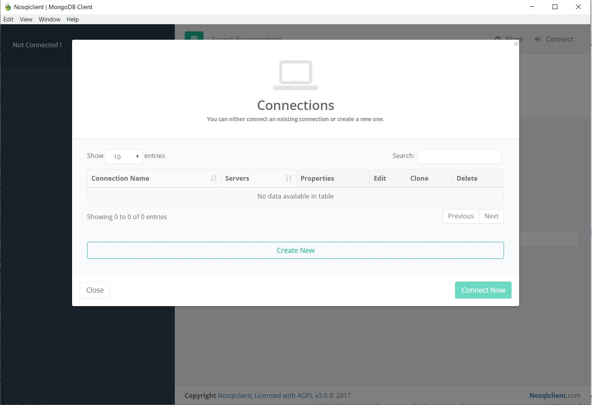
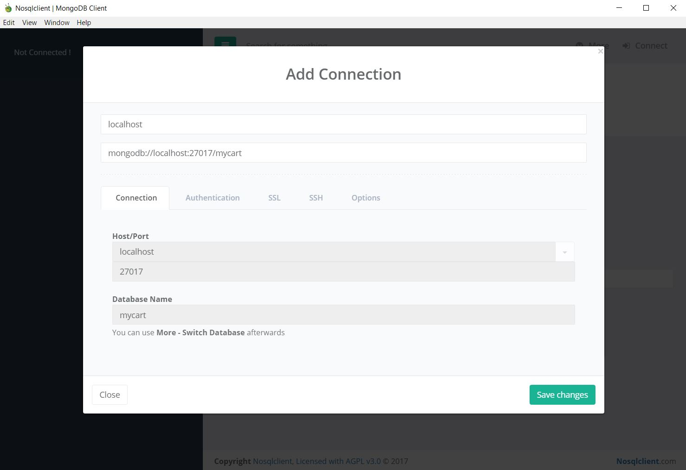

### [<<Back](../README.md) | [Java V2 All Examples](https://github.com/avinashbabudonthu/java/blob/master/java-v2/README.md) | [Java All Examples](https://github.com/avinashbabudonthu/java/blob/master/README.md)
------
# Database categories
* High level view
	* OLTP (RDBMS) - Real Time Storage
		* Oracle
		* SQL Server
		* MySQL
		* Postgre Sql
		* IBM DB2
	* NoSql
		* MongoDB
		* Redis
		* Cassandra
		* Couchbase
		* HBase
		* Neo4J
		* Elastic Search\

* Specifics\

* Sql vs NoSql
	* Vertical scaling vs Horizontal scaling
		* Horizontal scaling means scaling by adding more machines to your pool of resources (also described as `scaling out`)
		* Vertical scaling means scaling by adding more power (e.g. CPU, RAM) to an existing machine (also described as `scaling up`)\

* Sql ACID properties\

* NoSql flow\

* NoSql `BASE` property\

* Every NoSql works on `CAP` theory

* CAP combinations\

* CAP combinations with NoSql DBs\

------
# Limitations of RDBMS
* Scalability
	* Vertical scaling by increasing CPU capacity. What if we reach the state that we cannot increase anymore?
* Data complexity
	* Can save only structured data
	* What about files like music files, xml, images, FB likes etc
* Broken keys
	* If connection of PK-FK fails then connectivity of data is lost
* Define schema before loading data to database
------
# Why NoSql
* Non-relations
* Distributed database
* No schema required
* Auto elasticity
* Integrated caching
* Simpler data model
* High Availability
* Speed
------
# Features of NoSql Database
* Supports high volume of transactions - tens of thousands to millions
* Provides extremely responsive experience
* No downtime. Always available
* Quickly adopts to changing requirements with frequent updates and new features
* Handles semi and unstructured data
* Database storage\

------
# Advantage of NoSql Database
* VVVV - Volume, Velocity, Variability, Veracity
* Volume
	* Amount of data
* Velocity
	* Data in motion
		* Streaming of data
		* Milli seconds to seconds to respond
* Variability
	* Data in many forms
		* Structured
		* Unstructured
		* Text
		* Key-Value
		* Documented
		* Columnar
		* Graph
* Veracity
	* Data in doubt
		* Uncertainity due to latency, ambiguity etc
------
# Nosql Notes
* Form of database management system that is non-relational
* First coined in 1998 by Carlo Strozzi
* Data is more complex
* Many NoSql database categories
* Uses APIs or query languages to modify data
* Schema less
* Dynamic schema
* Most of NoSqls are open source
* Multiple categories
	* Text
	* Key-Value
		* Redis
		* MemcacheD
	* Document
		* MongoDB
		* Couchbase
	* Columnar
		* Cassandra
		* HBase
	* Tabular
	* Graph
		* OreintDB
		* Neo4J\

* Examples of categories\

* Horizontal Scaling
* Supports distributed by default
* No joins in most of the NoSql databases
------
# Document based database
* Deep nesting and complex structures
* Document within document
------
# Key value database
* Key and values
* No structured. No relation
* Used to store basic information after processing the data (like for caching)
------
# MongoDB Notes
* Open source document based database
* Works on concept of `collection` and `document`
* No concept of primary key and foreign key on tables
* High performance
* High availability
* Easy scalability
* Data stores in the form of `JSON`
* Features\

* Reasons to use mongo


* Queries focused on collection of documents
* We can have embedded documents
* Document key-values are `not fixed`
* RDBMS replacement for web applications
* Real time analytics
* High speed logging
* Caching and high scalability
* Single instance of mongodb can hold multiple independent databases. Each database with it's own collection
* Every document has special key `_id`. This is unique to collection
* Supports `Javascript shell`
* Data types
	* Data types by JSON
		* null
		* boolean
		* numeric
		* string
		* array
		* object
	* Data types from mongo
		* Date: `new Date()`
		* Regex
		* Embedded document: document within a document. Document becomes the value.
		* ObjectId: 12 byte of storage
		* Binary data
		* Code
* `_id` is of type `ObjectId`
* `_id` is unique to each document. Like primary key in RDBMS
------
# Tools Terminologies
* Mongo database `MongoD`
	* Physical container for collections
	* Each database get it's own files on file system
	* Single mongodb server can have multiple databases
	* handles data requests
	* manages data format
	* performs background management operations
* Collection
	* Group of similar/related documents within single database
	* Similar to `RDBMS table`
	* Do not enforce schema
	* Documents within collection can have different fields
* RDBMS terminology and MongoDB\

* Mongo Tools\

------
# JSON And BSON
* JSON\

* BSON - Binary Script Object Notation\

* BSON features
	* Lightweight
		* Optimising spatial overhead, specially when used over network
	* Traversable
		* For Primary data representation, BSON can be used, which traverses data easily
	* Efficient
		* Encoding/decoding data to/from BSON can be performed quickly
* JSON Vs BSON

------
# Which features mongo ignore for scalability
* indexes
* joins
* transactions across documents
* storage
------
# Database
* Made up of multiple collections
* Created `on-the-fly` when referenced first time
------
# Collection
* Similar to table
* Schema less
* Group of documents
* Indexed by one or more keys
* Created `on-the-fly` when referenced first time
* Capped collections
	* Fixed size
	* Old records get dropped after reaching the limit
------
# Document
* Similar to row in table
* Every document has special key `_id`. This is unique to collection. Works like a primary key
* Every document will have key and associated values
* JSON format
* Stored in collection
* Supports relationships by Embedded (or) References
* Document storage as `BSON - Binary form of JSON`
------
# Advantages
* Schema less document based database
* Supports dynamic queries on documents
* Does not require complex joins
* Easy to scale
* Enable faster access of data by using internal memory
* Mapping of application objects to database object is not needed
* Easy to tune for performance
------


# Setup
* Go to extracted folder of mongodb
* Create file named `mongo.config`
	* Created in path `C:\mongo\config`
* Add below content to `mongo.config.txt`
	* logappend = true
		* so that log is not overwritten upon restart of mongod instance
```
bind ip = 127.0.0.1
port = 27017
quiet = true
dbpath = C:\mongodb\data\db
logpath = C:\mongodb\log\mongodb.log
logappend = true
```
* Save the file
* Run mongodb with config
```
mongod.exe --config="C:\mongo\config\mongo.config"
```

# Mongo GUI Clients
* [RoboMongo](https://robomongo.org/download)
* [NoSqlClient](https://github.com/nosqlclient/nosqlclient/releases)
* Mongochef

# Setup NoSqlClient
* Extract zip downloaded using above link
* Click `Nosqlclient.exe`
* Click `Connect` on top right corner\

* Click `Create New` button\

* Enter following details to connect to admin db\

* Enter following details to connect to specific db. In this case I am connecting to `mycart` db\

* Click `Save changes` button
* Select connection details, click `Connect Now`\

* setup `mongo.exe` path to execute commands
	* Tools
	* Shell
	* `More` on top right corner
	* Settings
	* Give path to `bin` where `mongo.exe` is present\

* Click `Save`
* Now we can execute commands from Shell\


# Mongo Commands
* Run mongodb with config. refer [setup](#setup) for config file
```
mongod.exe --config="C:\mongo\config\mongo.config"
```
------
### [<<Back](../README.md) | [Java V2 All Examples](https://github.com/avinashbabudonthu/java/blob/master/java-v2/README.md) | [Java All Examples](https://github.com/avinashbabudonthu/java/blob/master/README.md)