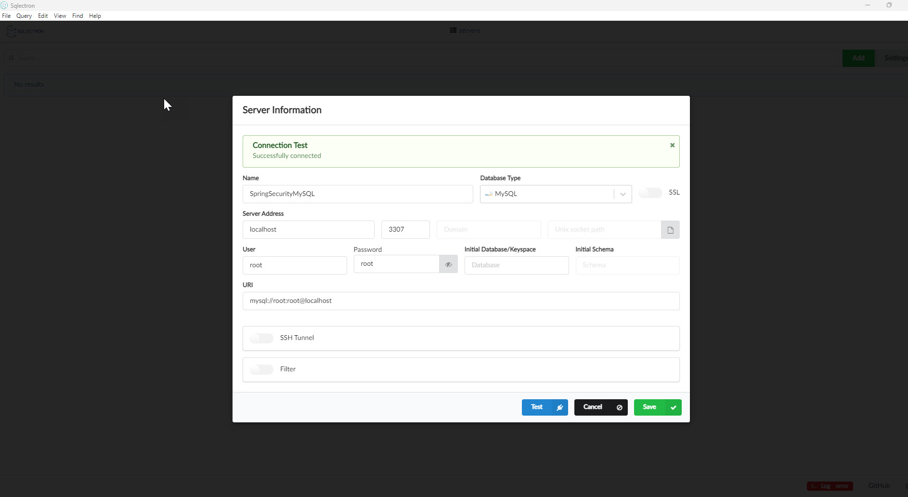

### [<<Back](../README.md) | [Java V2 All Examples](https://github.com/avinashbabudonthu/java/blob/master/java-v2/README.md) | [Java All Examples](https://github.com/avinashbabudonthu/java/blob/master/README.md)
------
# Run MySQL using docker
* Run below command
```
docker run -p 3307:3306 --name mysqlcontainer1 -e MYSQL_ROOT_PASSWORD=root -e MYSQL_DATABASE=db1 -d mysql
```
* `docker run` - To run docker container. If docker images is not present in local this will automatically download the image
* `-p 3307:3306` - Container and host port mapping. 3307 - host machine port. 3306 container port, MySql by default run on port `3306`
* `--name mysqlcontainer1` - Container name
* `-e MYSQL_ROOT_PASSWORD=root` - Environment variable to create root password
* `-e MYSQL_DATABASE=db1` - Environment variable to create database named `db1`
* `-d` - To run container as daemon process in the background
* `mysql` - Image name
* Connect to database
	* Host - localhost
	* Port - 3307
	* Username - root
	* Password - root

------
### [<<Back](../README.md) | [Java V2 All Examples](https://github.com/avinashbabudonthu/java/blob/master/java-v2/README.md) | [Java All Examples](https://github.com/avinashbabudonthu/java/blob/master/README.md)