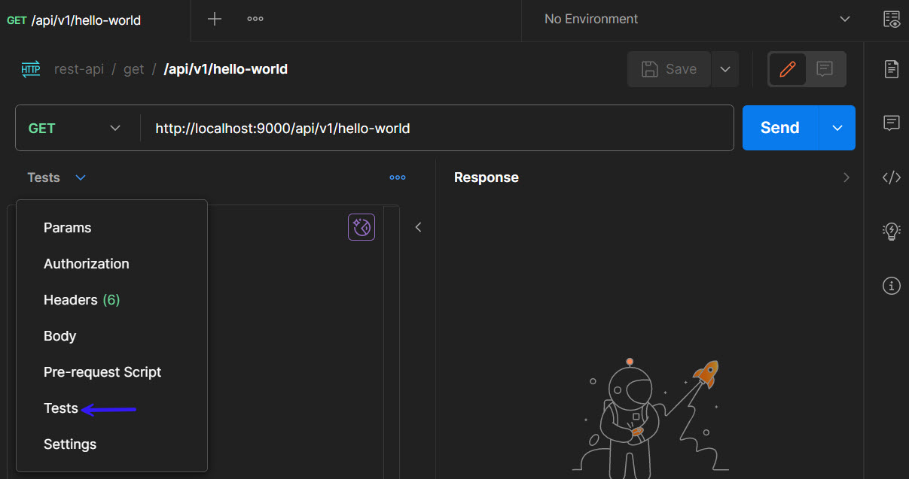

### [<<Back](../README.md) | [Java V2 All Examples](https://github.com/avinashbabudonthu/java/blob/master/java-v2/README.md) | [Java All Examples](https://github.com/avinashbabudonthu/java/blob/master/README.md)
------
# Get API Response to Test scripts
* To write custom code like validation, we need to get API response to Test scripts
* We write test scripts in `Tests` tab\

* Use below code to print response from `Test` tab to console
```
console.log( JSON.stringify(pm.response.json()))
```
------
### [<<Back](../README.md) | [Java V2 All Examples](https://github.com/avinashbabudonthu/java/blob/master/java-v2/README.md) | [Java All Examples](https://github.com/avinashbabudonthu/java/blob/master/README.md)