### [<<Back](../README.md) | [Java V2 All Examples](https://github.com/avinashbabudonthu/java/blob/master/java-v2/README.md) | [Java All Examples](https://github.com/avinashbabudonthu/java/blob/master/README.md)
------
# Technical stack
* Java 17
* Maven
* Spring Boot 3.3.1
* Lombok
------
# How to run application?
* Application starts on port `9000`

## Method 1
* Set Java 17 and Maven to path
* Import application to IntelliJ
* Run main class [Main](src/main/java/com/java/Main.java)

## Method 2
* Run below maven command
```
mvn clean compile spring-boot:run
```
* This command clean compile and run application
------
# Build docker image and push to docker hub
* Write [Dockerfile](Dockerfile)
* We are using `openjdk java 17` base image
* Build image using below command
```
docker build . -t rest-api
``` 
* Run and check the container
```
docker run -it -p 9000:9000 rest-api
```
* Open url - http://localhost:9000/swagger-ui/index.html
* Swagger should start without any issues
* Tag an image before pushing to docker hub
```
docker image tag rest-api donthuavinashbabu/rest-api
```
* Push image to docker hub
```
docker image push donthuavinashbabu/rest-api
```
------
# Files
* [pom.xml](pom.xml)
* [application.yml](src/main/resources/application.yml)
* Main class [Main](src/main/java/com/java/Main.java)
* Student Model class [Student](src/main/java/com/java/model/Student.java)
* StudentService interface [StudentService](src/main/java/com/java/service/StudentService.java)
* StudentServiceImpl class [StudentServiceImpl](src/main/java/com/java/service/impl/StudentServiceImpl.java)
* GetController interface [GetController](src/main/java/com/java/controller/GetController.java)
* GetControllerImpl class [GetControllerImpl](src/main/java/com/java/controller/impl/GetControllerImpl.java)
* PostController interface [PostController](src/main/java/com/java/controller/PostController.java)
* PostControllerImpl class [PostControllerImpl](src/main/java/com/java/controller/impl/PostControllerImpl.java)
* PutController interface [PutController](src/main/java/com/java/controller/PutController.java)
* PutControllerImpl class [PutControllerImpl](src/main/java/com/java/controller/impl/PutControllerImpl.java)
* DeleteController interface [DeleteController](src/main/java/com/java/controller/DeleteController.java)
* DeleteControllerImpl class [DeleteControllerImpl](src/main/java/com/java/controller/impl/DeleteControllerImpl.java)
* HateoasController interface [HateoasController](src/main/java/com/java/controller/HateoasController.java)
* HateoasControllerImpl class [HateoasControllerImpl](src/main/java/com/java/controller/impl/HateoasControllerImpl.java)
* GlobalExceptionHandler class [GlobalExceptionHandler](src/main/java/com/java/config/GlobalExceptionHandler.java)
* I18NController interface [I18NController](src/main/java/com/java/controller/I18NController.java)
* I18NControllerImpl class [I18NControllerImpl](src/main/java/com/java/controller/impl/I18NControllerImpl.java)
* VersioningController interface [VersioningController](src/main/java/com/java/controller/VersioningController.java)
* VersioningControllerImpl class [VersioningControllerImpl](src/main/java/com/java/controller/impl/VersioningControllerImpl.java)
------
# REST APIs
* Download and import [Postman collection](postman/rest-api.postman_collection.json) for below APIs
* [GetController](src/main/java/com/java/controller/GetController.java)
  * Interface has GET API declarations
  * Has different ways of writing GET APIs
* [GetControllerImpl](src/main/java/com/java/controller/impl/GetControllerImpl.java) class has API implementation
* Why interface and class for APIs
  * Implementation has only business logic
  * Interface will have API annotations, method comments, swagger documentation etc
* [PostController](src/main/java/com/java/controller/PostController.java)
  * Interface has POST API declarations
  * Has different ways of writing POST APIs
* [PostControllerImpl](src/main/java/com/java/controller/impl/PostControllerImpl.java) class has API implementation
* [PutController](src/main/java/com/java/controller/PutController.java)
  * Interface has PUT API declarations
  * Has different ways of writing PUT APIs
* [PutControllerImpl](src/main/java/com/java/controller/impl/PutControllerImpl.java) class has API implementation
* [DeleteController](src/main/java/com/java/controller/DeleteController.java)
  * Interface has DELETE API declarations
  * Has different ways of writing DELETE APIs
* [DeleteControllerImpl](src/main/java/com/java/controller/impl/DeleteControllerImpl.java) class has API implementation
* HateoasController interface [HateoasController](src/main/java/com/java/controller/HateoasController.java)
  * Return hateoas link in api response
* [HateoasControllerImpl](src/main/java/com/java/controller/impl/HateoasControllerImpl.java) class has API implementation
* GlobalExceptionHandler class [GlobalExceptionHandler](src/main/java/com/java/config/GlobalExceptionHandler.java)
  * Global exception handler class
  * Handles jakarta validations also. Refer method `handleMethodArgumentNotValid`
* I18NController interface [I18NController](src/main/java/com/java/controller/I18NController.java)
  * Internationalization in rest api
* [I18NControllerImpl](src/main/java/com/java/controller/impl/I18NControllerImpl.java) class has API implementation
* VersioningController interface [VersioningController](src/main/java/com/java/controller/VersioningController.java)
  * Different ways to implement rest api versioning
* [VersioningControllerImpl](src/main/java/com/java/controller/impl/VersioningControllerImpl.java) class has API implementation
------
# Hateoas APIs
* Hateoas - Hypermedia as the engine of application state
* Add below dependency
```
<dependency>
    <groupId>org.springframework.boot</groupId>
    <artifactId>spring-boot-starter-hateoas</artifactId>
</dependency>
```

## Adding link to access newly created student in header
* HateoasControllerImpl class [HateoasControllerImpl](src/main/java/com/java/controller/impl/HateoasControllerImpl.java)
* Refer `saveStudent` method. This returns link to access newly created student in response header `location`
```
import java.net.URI;
import org.springframework.web.servlet.support.ServletUriComponentsBuilder;
import org.springframework.http.ResponseEntity;

URI location = ServletUriComponentsBuilder.fromCurrentRequest().path("/{id}").buildAndExpand(savedStudent.getId()).toUri();
ResponseEntity.created(location).build();
```

## Add `_link` property
* HateoasControllerImpl class [HateoasControllerImpl](src/main/java/com/java/controller/impl/HateoasControllerImpl.java)
* Refer `saveStudents2` method
* Returns response as below
```
{
    "id": "3d6a18a7-0131-4a56-b978-d7d24ff78925",
    "name": "a",
    "book": "b1",
    "_links": {
        "all-students": {
            "href": "http://localhost:9000/hateoas/api/v1/students"
        },
        "this-student-by-id": {
            "href": "http://localhost:9000/hateoas/api/v1/students/3d6a18a7-0131-4a56-b978-d7d24ff78925"
        }
    }
}
```
------
# API with pagination
* Refer `studentsV7` method in [GetController](src/main/java/com/java/controller/GetController.java)
* We can directly use `Pageable`
* `ParameterObject` is used for swagger documentation
* Swagger without `ParameterObject`\
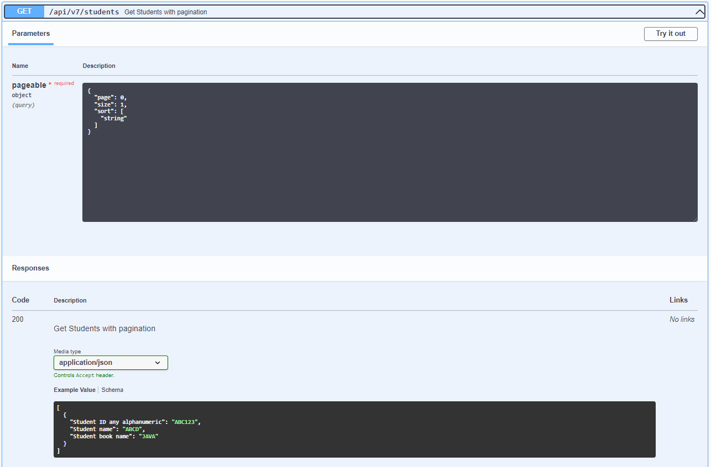
* Swagger with `ParameterObject`\
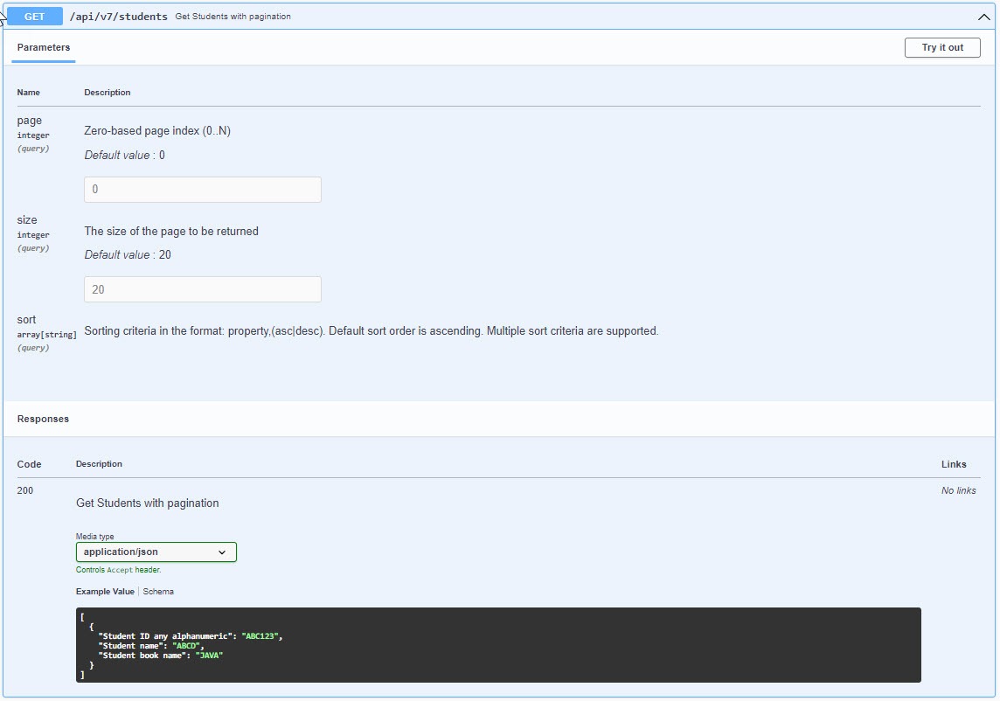
------
# Swagger Spring Doc Open API Documentation
* Pre-requisite for this is to understand how to write APIs. Refer [here](#REST-APIs)
* Add below dependency. Refer [pom.xml](pom.xml)
```
<dependency>
    <groupId>org.springdoc</groupId>
    <artifactId>springdoc-openapi-starter-webmvc-ui</artifactId>
    <version>2.0.3</version>
</dependency>
```
* Add below annotations to API method. Refer [GetController](src/main/java/com/java/controller/GetController.java) & [PostController](src/main/java/com/java/controller/PostController.java)
```
@Operation(summary = "Hello World GET API")
    @ApiResponses(value = {
            @ApiResponse(responseCode = "200", description = "Hello World",
                content = {@Content(mediaType = TEXT_PLAIN_VALUE, schema = @Schema(implementation = String.class))}
            )
    })
```
* Add below annotation to define API class
```
@Tag(name = "Get APIs")
```
* Start application
* Open URL - http://localhost:9000/swagger-ui/index.html
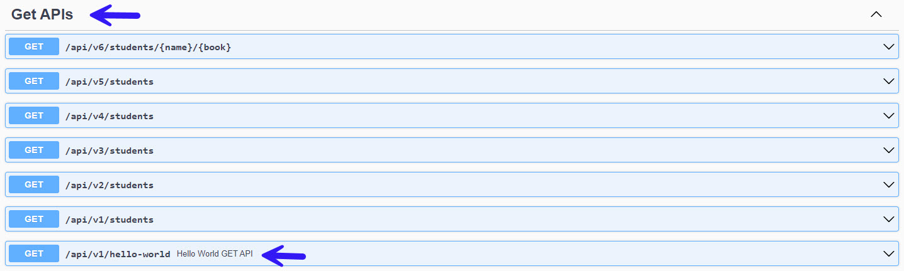
* We can find OpenAPI descriptions at `/v3/api-docs` - http://localhost:9000/v3/api-docs
* We can customize path using below property. Refer property in [application.yml](src/main/resources/application.yml). Now we can access docs using http://localhost:9000/rest-api-docs
```
springdoc.api-docs.path=/rest-api-docs
```
* Above OpenAPI definitions are in JSON format by default. For yaml format, use this link http://localhost:9000/rest-api-docs.yaml
* We can change default swagger ui path using below property. Refer [application.yml](src/main/resources/application.yml)
```
springdoc.swagger-ui.path=/rest-api-swagger.html
```
* So now our documentation is available in http://localhost:9000/swagger-ui/index.html
* We can sort the API paths according to their HTTP methods with the `springdoc.swagger-ui.operationsSorter` property
```
springdoc.swagger-ui.operationsSorter=alpha
```
* Refer swagger-ui properties here - https://springdoc.org/#swagger-ui-properties
* Reference - https://www.baeldung.com/spring-rest-openapi-documentation

## To change OpenAPI definition heading
* Add below annotation. Refer [Main](src/main/java/com/java/Main.java)
```
@OpenAPIDefinition(info = @Info(title = "Rest API Documentation"))
```
* Before
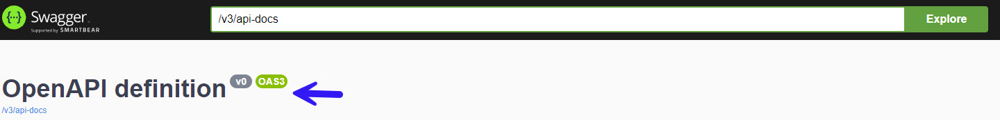
* After
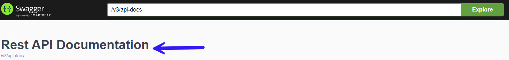
 
## Annotations explanation
* io.swagger.v3.oas.annotations.OpenAPIDefinition
  * Used to define main title of swagger documentation UI
  * Refer [Main.java](src/main/java/com/java/Main.java)
* io.swagger.v3.oas.annotations.Operation
  * Used to define API
  * Refer controller classes in [com.java.controller](src/main/java/com/java/controller)
* io.swagger.v3.oas.annotations.responses.ApiResponses
  * container for different responses returned by API
  * Refer controller classes in [com.java.controller](src/main/java/com/java/controller)
* io.swagger.v3.oas.annotations.responses.ApiResponse
  * Define details of response for different scenarios
  * Refer controller classes in [com.java.controller](src/main/java/com/java/controller)
* io.swagger.v3.oas.annotations.tags.Tag
  * Used define API class description
  * Declare at controller class level
  * Refer controller classes in [com.java.controller](src/main/java/com/java/controller)
* io.swagger.v3.oas.annotations.media.Schema
  * Used for properties of model. Refer [Student.java](src/main/java/com/java/model/Student.java)
* io.swagger.v3.oas.annotations.Parameter
  * Used for parameters of API resource request
  * Refer [DeleteController.java](src/main/java/com/java/controller/DeleteController.java)
------
# Validation
* Add below validation dependency. Refer [pom.xml](pom.xml)
```
<dependency>
    <groupId>org.springframework.boot</groupId>
    <artifactId>spring-boot-starter-validation</artifactId>
</dependency>
```
* Add `org.springframework.validation.annotation.Validated` annotation to API request body. Refer `studentV2` method in [PostController](src/main/java/com/java/controller/PostController.java)
* Add validation annotations in Student Model class [Student](src/main/java/com/java/model/Student.java)
  * import jakarta.validation.constraints.Min 
  * import jakarta.validation.constraints.NotBlank 
  * import jakarta.validation.constraints.NotNull
* Like this we have more annotation. Refer jar file\
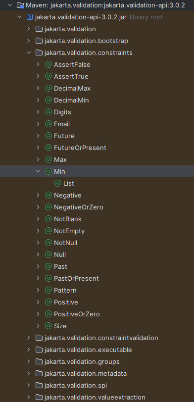
* API response without passing `name` and `book`\
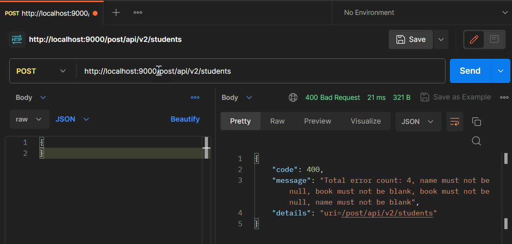
* API response without passing `book`\
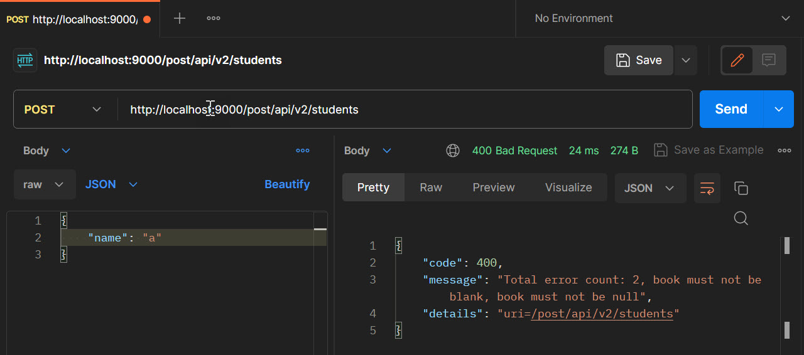
------
# Support json and xml responses
* Add below dependency in [pom.xml](pom.xml)
```
<dependency>
    <groupId>com.fasterxml.jackson.dataformat</groupId>
    <artifactId>jackson-dataformat-xml</artifactId>
</dependency>
```
* Add `org.springframework.http.MediaType.APPLICATION_XML_VALUE` to `produces` in API declaration. Refer `studentsV3` method in [GetController](src/main/java/com/java/controller/GetController.java)
* Hit API - http://localhost:9000/get/api/v3/students with header - `Accept:application/xml`\
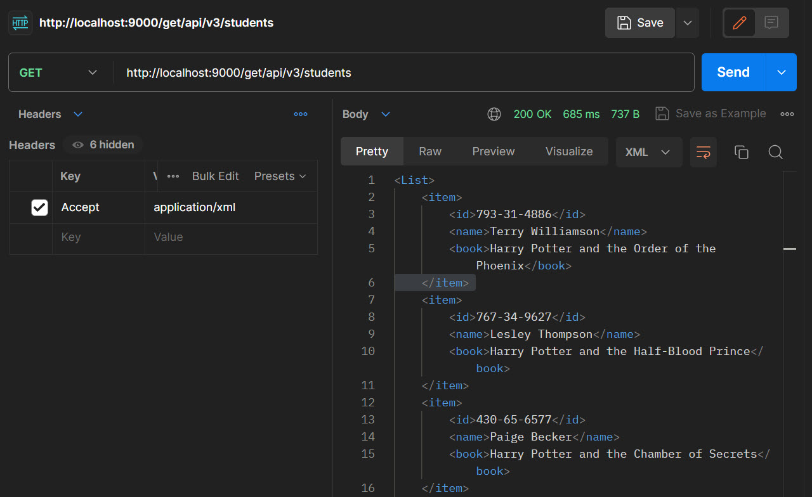
------
# Internationalization - I18N
* Add language specific properties files
  * [messages.properties](src/main/resources/messages.properties)
  * [messages_fr.properties](src/main/resources/messages_fr.properties)
* Inject `org.springframework.context.MessageSource` into our class
* Get locale specific messages using `org.springframework.context.MessageSource`. Refer `helloWorld` method [I18NControllerImpl](src/main/java/com/java/controller/impl/I18NControllerImpl.java)
* Get locale specific messages using `org.springframework.context.MessageSource` with parameters. Refer `helloWorldWithName` method [I18NControllerImpl](src/main/java/com/java/controller/impl/I18NControllerImpl.java)
------
# Filtering
## Static Filtering
* Static filtering will be done using annotations in model class
  * `com.fasterxml.jackson.annotation.JsonIgnoreProperties` at class level
  * `com.fasterxml.jackson.annotation.JsonIgnore` at property level
* Refer [Student](src/main/java/com/java/model/Student.java)
* Both are not needed. We can use any one them. Preferred is `com.fasterxml.jackson.annotation.JsonIgnore` because if property name updated then we need to update property name in `com.fasterxml.jackson.annotation.JsonIgnoreProperties` also

## Dynamic Filtering
* Using `org.springframework.http.converter.json.MappingJacksonValue`
* Define `com.fasterxml.jackson.annotation.JsonFilter` annotation at class level. Refer [User](src/main/java/com/java/model/User.java) class
* Write below logic to filter properties. We can have custom logic specific to API. Refer `users1` method in [GetControllerImpl](src/main/java/com/java/controller/impl/GetControllerImpl.java) class
```
final String jsonFilterName = "StudentPropertyFilter";

List<User> users = userService.findAllUsers();
MappingJacksonValue mappingJacksonValue = new MappingJacksonValue(users);
SimpleBeanPropertyFilter simpleBeanPropertyFilter = SimpleBeanPropertyFilter.filterOutAllExcept("username", "firstName", "lastName");
FilterProvider filterProvider = new SimpleFilterProvider().addFilter(jsonFilterName, simpleBeanPropertyFilter);
mappingJacksonValue.setFilters(filterProvider);
```
* Note `StudentPropertyFilter` should be match in `API` and `model` class
------
# Actuator
* Add following dependency
```
<dependency>
    <groupId>org.springframework.boot</groupId>
    <artifactId>spring-boot-starter-actuator</artifactId>
</dependency>
```
* Add this property in [application properties/yaml](src/main/resources/application.yml) to enable all actuator end points
```
management.endpoints.web.exposure.include: '*'
```
* Open the api - http://localhost:9000/actuator
* We will get more actuator end points. Explore them
------
# HAL
* HAL - JSON Hypertext Application Language
* Used to explore APIs
* Add below dependency to enable spring boot HAL
```
<dependency>
    <groupId>org.springframework.data</groupId>
    <artifactId>spring-data-rest-hal-explorer</artifactId>
</dependency>
```
* Access this url - http://localhost:9000
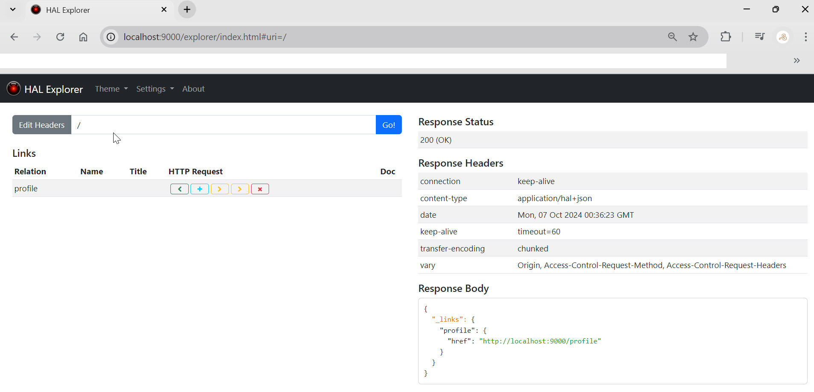
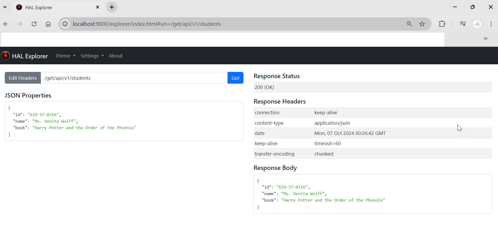
------
# Connect to H2 Database
* Add below dependencies
```
<dependency>
    <groupId>org.springframework.boot</groupId>
    <artifactId>spring-boot-starter-data-jpa</artifactId>
</dependency>

<dependency>
    <groupId>com.h2database</groupId>
    <artifactId>h2</artifactId>
    <scope>runtime</scope>
</dependency>
```
* Add below properties in [application properties/yaml](src/main/resources/application.properties)
```
spring.h2.console.enabled=true
spring.datasource.url=jdbc:h2:mem:db1
spring.datasource.username=user1
spring.datasource.password=07102024
spring.jpa.defer-datasource-initialization=true
```
* Create entities. For example below
  * [EmployeeEntity](src/main/java/com/java/entity/EmployeeEntity.java)
* To insert data to tables create [data.sql](src/main/resources/data.sql) in `src/main/resources` and write insert queries
* Start the application and access h2 console - http://localhost:9000/h2-console
* Login using url, username and password given in [application properties/yaml](src/main/resources/application.properties)
------
# Spring Boot 3 Data JPA With H2 Database
* Add dependencies and properties for H2 database connect. Refer [Connect to H2 Database](#connect-to-h2-database)
------
# Rest Clients
## RestTemplate Examples
* [Get APIs](src/test/java/com/java/rest/client/resttemplate/GetControllerTest.java)

## WebClient Examples
* [Get APIs](src/test/java/com/java/rest/client/webclient/GetControllerTest.java)
------
### [<<Back](../README.md) | [Java V2 All Examples](https://github.com/avinashbabudonthu/java/blob/master/java-v2/README.md) | [Java All Examples](https://github.com/avinashbabudonthu/java/blob/master/README.md)