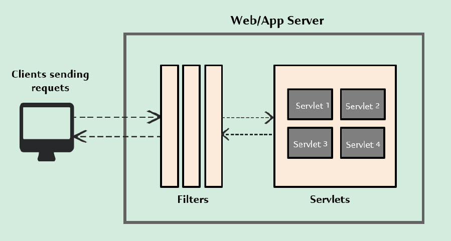
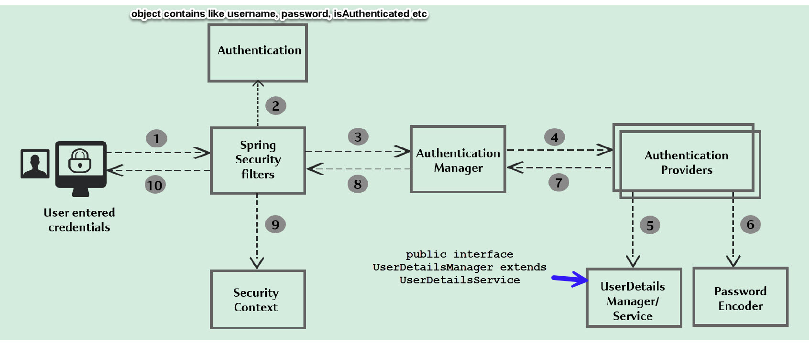
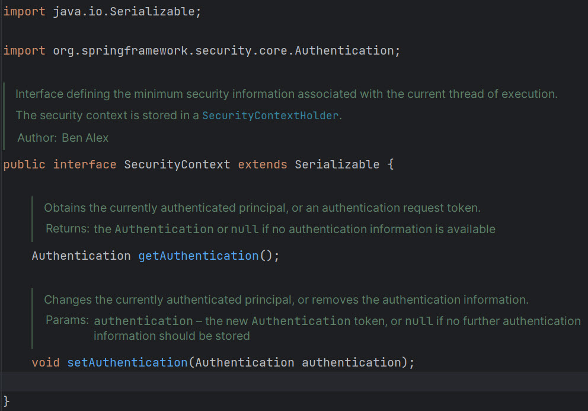
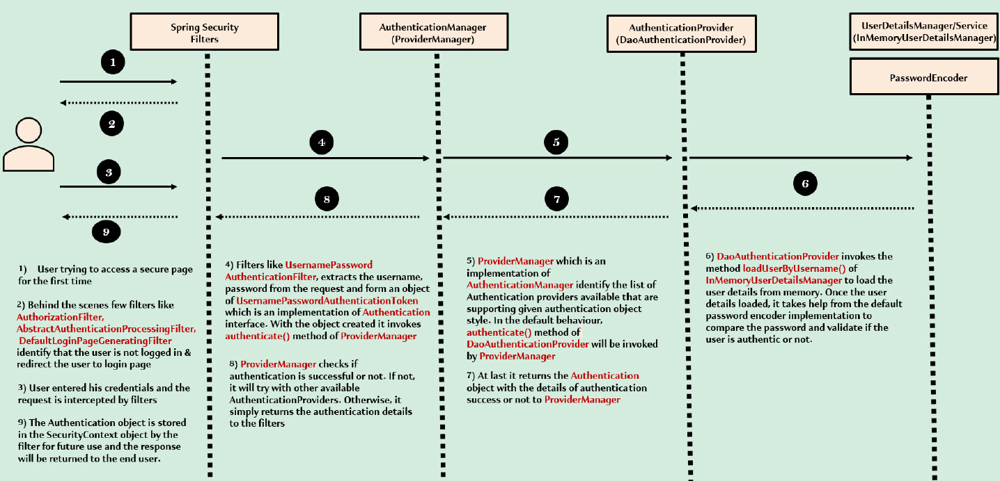

### [<<Back](../README.md) | [Java V2 All Examples](https://github.com/avinashbabudonthu/java/blob/master/java-v2/README.md) | [Java All Examples](https://github.com/avinashbabudonthu/java/blob/master/README.md)
------
# Why security?
* Security is for protecting data and business logic inside web application
------
# Different types of security
* Authentication
* Authorization
* TLS/SSL
* HTTPS
* Firewalls
------
# Why security
* Loosing data
* Lossing money
* Loosing brand
* Loosing trust
------
# Most common attacks
* CSRF - Cross Site Request Forgery
* Session Fixation
* XSS - Cross site scripting
* CORS
------
# Servlets and Filters
* Request flow\

* Role of filters - To intercept each request/response and do some pre work before business logic in servlet. Using same filters spring security enforce security based on our configurations inside our application
* Remember for every web application request - Always filters first then business logic
------
# Spring security internal flow
* Spring secutiry internal flow

* SecurityContext object

* Spring security default behavior

------
### [<<Back](../README.md) | [Java V2 All Examples](https://github.com/avinashbabudonthu/java/blob/master/java-v2/README.md) | [Java All Examples](https://github.com/avinashbabudonthu/java/blob/master/README.md)