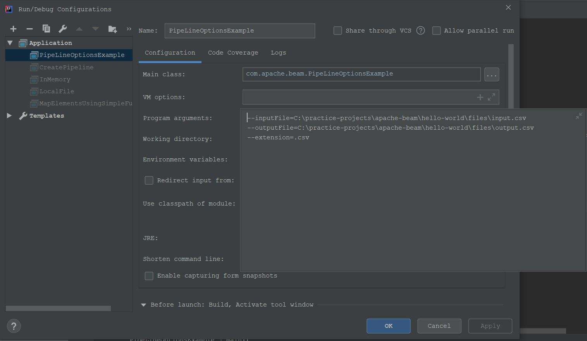

# Examples
* [CreatePipeline](src/main/java/com/apache/beam/CreatePipeline.java)
* [Reading from local file and writing to local file](src/main/java/com/apache/beam/LocalFile.java)
* [Print elements in PCollection](src/main/java/com/apache/beam/PrintElementsInPCollection.java)
* [Reading from in memory file and writing to local file](src/main/java/com/apache/beam/InMemory.java)
* [Pipeline Options example. Run this program with below program arguments](src/main/java/com/apache/beam/PipeLineOptionsExample.java)\

* [MapElements using SimpleFunction](src/main/java/com/apache/beam/MapElementsUsingSimpleFunction.java)
* [ParDo Example](src/main/java/com/apache/beam/ParDoExample.java)
* [Filter Example](src/main/java/com/apache/beam/FilterExample.java)
* [Flatten Example](src/main/java/com/apache/beam/FlattenPractice.java)
* [Partition Example](src/main/java/com/apache/beam/PartitionExample.java)
* [Side Inputs Example](src/main/java/com/apache/beam/SideInputExample.java)
* [Distinct Example](src/main/java/com/apache/beam/DistinctExample.java)
* [Count PCollection](src/main/java/com/apache/beam/CountPCollection.java)
* [Group by key](src/main/java/com/apache/beam/GroupByKeyExample.java)