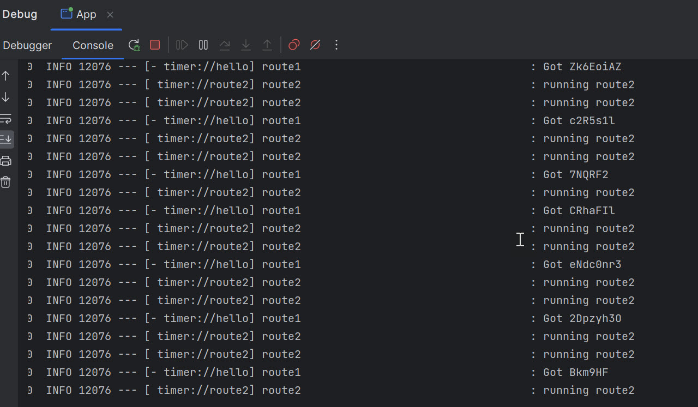

# Apache Camel Spring Boot 3 Hello World
* [pom.xml](pom.xml)
* Main class - [App.java](src/main/java/com/java/App.java)
* Controller class - [AppController.java](src/main/java/com/java/controller/AppController.java)
* Rest Route - Camel route to call rest end point - [RestRoute.java](src/main/java/com/java/route/RestRoute.java)
* `timer.period` in [RestRoute.java](src/main/java/com/java/route/RestRoute.java) is in [application.yml](src/main/resources/application.yml)
* Simple timer route - [SimpleRoute.java](src/main/java/com/java/route/SimpleRoute.java)
* Run the main class [App.java](src/main/java/com/java/App.java)
* Sample output
