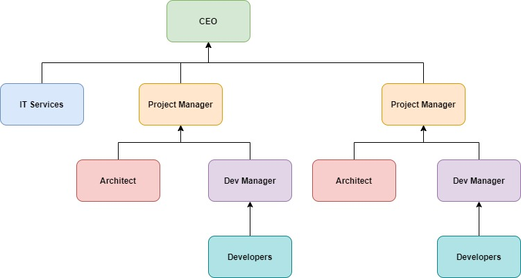
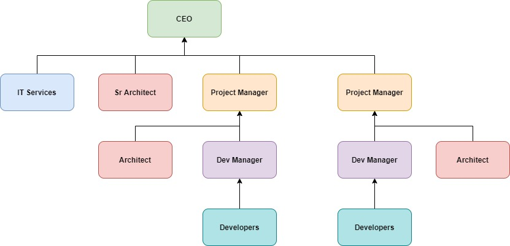
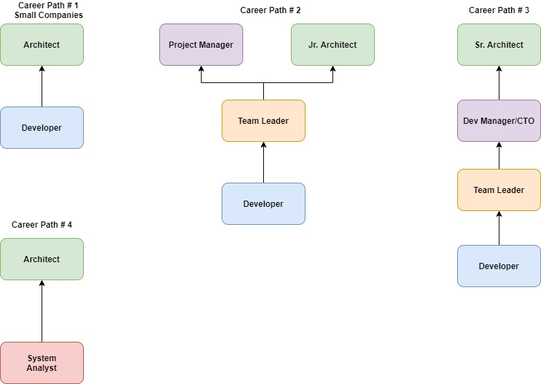

# Why you should become software architect
* Really really very interesting job
	* As software architect, your daily routine may include talking to CIO, CEO, CTO of company
	* Discussing technology with development manager and do research on new software patterns and platforms
	* There is no other role in software industry which as diverse, broad and spread across the organization as role of the architect
	* Good architect talks about business, technology, methodolog, soft skills and more
* Career path and visibility
	* Being architect we communicate with all levels of all organization
	* Being architect will push the career forward
* Money
	* As per studies average salary of architect is double the salary of developer

# Types of Architects
* Infrastructure Architect
* Software Architect
* Enterprise Architect

# Infrastructure Architect
* Designing infrastructure of given system like `servers, VMs, Storage etc`
* Familiar with system requirement
* Career path: `Infrastructure Expert`

# Software Architect
* Also called `Solution Architect` or `System Architect`
* Responsibile for architecture of software
* Developer vs Architect
	* Developer knows what can be done
	* Architect knows what should be done
* Familiar with technology and platform as much as senior developer
* Baseline requirements for any software system
	* Fast
	* Secure
	* Reliable
	* Easy to maintain

# Enterprise Architect
* Works with top level management like CEO, CIO
* Streamlines IT to support business
* Since enterprise architect operates at very high level in the organization, he has no development oriented tasks
* Career path
	* Senior Software Architect
	* Experienced Project Manager
	
# Organization Chart of Architect
* Junior Architect. Will have visibility to project\

* Senior Experienced Architect\

* With Senior and Junior Architects\

# Does architect should code?
* Good Architect must have coding skills because
	* Architecture's trust worthiness
	* Support the developers
	* Respect - One of the key success for architect is to gain respect of developers

# Career path to architect

# Architect mindset
* Understand the business
* Learn inner parts of business
* Make yourself familiar with
	* deep understanding of organization business
	* weaknesses
	* Strengths
	* Competitions
	* Growth Strategy
* Define system goals
	* goals are not requirements
	* Not `What system should do`
	* Goals means `The effect of system on the organization`
	* Usually system goals are described by clients but there are exceptions
* Think about your client's client
* Talk to right people with right language
	* Always keep in mind what is the thing that really matters to person you are talking to

# The Architecture process
* Architecture process\

* Understand system requirements
	* What system should do
* Understand Non Functional Requirements (NFR)
	* Define technical and service level attributes of the system like
		* Users
		* Load
		* Volumes of data
		* Performance
	* Not always known to Client or System Analyst or Product Owners. It is architect job to make them aware of these requirements
	* For architects NFRs are much more important than regular requirements
	* So many architecture elements will be effected by NFRs
* Map components
	* Represents the tasks of system - functional and also non functional
	* Two goals
		* Understand system functionality
		* Communicate your understanding to the client(s)
	* Non Technical
* Select Technology Stack
	* Usually Backend, Frontend, Data store
	* There are lot of factors. Choose wisely
	* Wrong technology stack can lead to failure of whole system
* Design the Architecture
* Design Archicture Document
	* Describes the Process and Architecture
	* Gives developers and management full picture of the system that is going to be built
	* Good architecture document is relevant for all the levels of organization (CEO, CIO, CTO, Project manager, developer etc)
* Support the team
	* Preparing the architecture diagram is not done with architect's job
	* Support the team with all questions, technical solutions etc
	* Have to continue until system is in production. And support work will continue after system is in production
	
# Understanding System Requirements
* 2 types of requirements
	* What system should do? - Functional Requirements
		* Business Flow
		* Business Services
		* User Interface
	* Other Kind - Non Functional Requirements (NFR)
		* What should system deal with
			* Performance
			* Load
			* Data volume
			* Concurrent Users
			* Service Level Agreement - SLA

# Non Functional Requirements NFR
* Never start working on the system before setting NFRs
* 5 important NFRs
	* Performance
		* Always talk in numbers
			* Talk to the client what is expected response time
		* Latency
			* How much does it take to perform single task?
		* Throughput
			* How many tasks can be performed in a given time unit?
				* How many users can be saved in database in a minute?
				* How many files can be read in 2 minutes?
	* Load
		* Quantity of work without crashing
		* Example, In web app, how many concurrent requests can be served without crashing
	* Data volume
		* how much data system will accumulate over time
		* Helps with
			* Deciding on database type
			* Designing queries
			* Storage planning
		* What is data volume on day 1 and forecasted data growth
			* Example: Day-1 == 500MB, Expected growth of 2 TB annually
	* Concurrent Users
		* How many users will be using the system simultaneously
	* Service Level Agreement - SLA
		* Required uptime for the system
		* Manage client's expectations

# Architect role in NFRs
* Framing requirements` bounderies
	* Like current client network does not allow API call to complete in <100 ms
	* Discuss with numbers

# Application Types
* Decided after requirements are set
* Common types
	* Web apps
		* Web sites - best suited for systems that require
			* user interface
			* user initiated actions
			* large scale
			* short and focused actions
		* Request Response based model
	* Web API
		* Similar to webapp
		* Does not serve HTML pages
		* Serve data usually in JSON format
		* It's clients are other applications, not browsers
		* Expose APIs (like REST)
		* Best for systems that require
			* Data retrieval and store
			* Client initiated actions
			* large scale
			* short and focused actions
		* Request Response based model
	* Mobile
	* Console or command line application or CLI
		* No fancy UI
		* Require technical knowledge
		* Limited interactions with users
		* Trigger long running actions
		* Best for systems that require
			* Executes/Triggers long running processes
			* Short actions by trained users of system
	* Service
		* No UI at all
		* Managed by Service Manager of underlying OS
		* Best for systems that require
			* Long running processes like Monitoring folders, processing files
	* Desktop
		* Might connect to web
		* Great UI
		* Best for systems that require
			* user centric actions like word processing
			* Gaming
* More application types
	* AWS Lambda
	* Azure Functions

# Selecting Technology Stack
* Very very very important because
	* Irreversible
	* Emotional
* Decisions must be
	* Made with clear mind
	* Heavily documented
	* Group effort

# Considerations for technology stack
* Can perform required task
* Community
	* Should have large supporting community
* Popularity
	* Use Google trends to know popularity

# Quality attributes
* [List of quality attributes](https://en.wikipedia.org/wiki/List_of_system_quality_attributes)
* Scalability
	* Adding computing resources without any interruption
		* Add VM
		* Notify the load balancer
	* Scale up - add more CPU power like from 64GB to 128GB
	* Scale out - add more CPUs
	* Preferred one is `Scale out`
* Manageability
	* Knowing what is going on with application at any given point of time. Take actions accordingly
* Modularity
	* Easy to maintain
	* much more flexible to changes
* Extensibility
	* System functionality can be extended without modifying the existing code
* Testability
	* How easy it is to test the application

# Components Architecture
* Layers
	* Represents horizontal functionality
		* APIs - Resources
		* Execute Logic - Service Layer
		* Save Retrieve Data - DAO
	* Why
		* Well formed and focused code
		* Modular
	* Layer Vs Tier
		* Layers stay in same system and communicates within same system
		* Tier contains multiple systems deployed in different machines and communicates via network
* Interfaces
* Dependency Injection DI
* SOLID patterns
* Naming conventions
* Exception Handling
* Logging

# System Archicture
* What is system architecture
	* Big Picture view
	* Answers following questions
		* how will system work under heavy load
		* what happen if system will crash at this exact moment in the business flow
		* how compicated can be the update process?
		* etc
* Includes
	* Defining software components (services)
	* Defining the way components communicate
	* Designing the system capabilities (like scalability, redundancy, performance, manageability and more)
* Topics
	* Loose coupling
	* Stateless
	* Caching
	* Messaging
	* Logging & Monitoring

# Loose coupling
* Build yellow pages for service URLs. Every application get URL from yellow pages and make an API call
	* Example: Consul
* Build `Gateway`

# Stateless
* Application state is stored only in 2 places - `data store`, `user interface`

# Messaging
* Messaging criteria
	* Performance
	* Message size
	* Execution model
	* Feedback and reliability
	* Complexity
* Messaging types
	* REST API
	* Push Notifications
	* Queue
	* File based & Database based

# Logging and Monitoring
* Central logging service
* CorrelationID

# Archicture external considerations
* Deadlines
* Existing Dev Team Skills
* IT Support
* Cost

# Archicture Document
* Goals of architecture document
	* Describe what should be developed and how
	* Layout functional and non-functional requirements
* Audience
	* Project Manager or CTO or CEO - this section appears first in the document
		* Requirements reflects essence of the system
		* Executive summary describes best practices and modern patterns
		* Architecture geared towards business goals
	* QA
		* Prepare testing infrastructure
			* Servers
			* Testing tools
			* Coding
	* Development team
		* Technology Stack
		* Components
		* Services
		* Communication
* Contents of document
	* Background and Overview
		* In 1 page
		* Describe system in business point of view
		* System's role
		* Reason for replacing older system
		* Expected business impact
	* Requirements
		* In 1 page
		* Functional
		* Non-functional
	* Executive Summary
		* For Project Manage or CTO or CEO
		* Less than 3 pages
		* Provide very high level architecture. Do not use technical details
		* Tips
			* Use charts and diagrams
			* Use well known technical terms
			* Do not repeat yourself
	* Architecture overview
		* Big Picture of solutions
		* Less than 10 pages
		* No deep dive to specific components
		* Has 3 parts
			* General Description
			* High level diagram
			* Diagram walk through
		* Technology stack
	* Components drill down
		* Unlimited number of pages
		* Sub sections
			* Component's role
			* Technology stack
				* Backend
				* Frontend
				* Datastore
		* Component's Archicture
		* Development Instructions
* [Sample Architecture Document](IOTooArchDoc.docx)

# Advanced Architecture
* Microservices
* Event Sourcing
* CQRS - `C`ommand `Q`uery `R`esponsibility `S`egregation

# Learning
* Read `Blogs`, `Articles`, `Conferences`
* InfoQ site
* ServerSide site