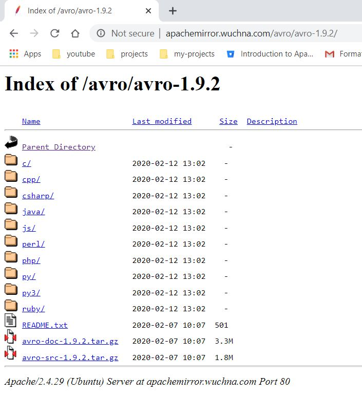
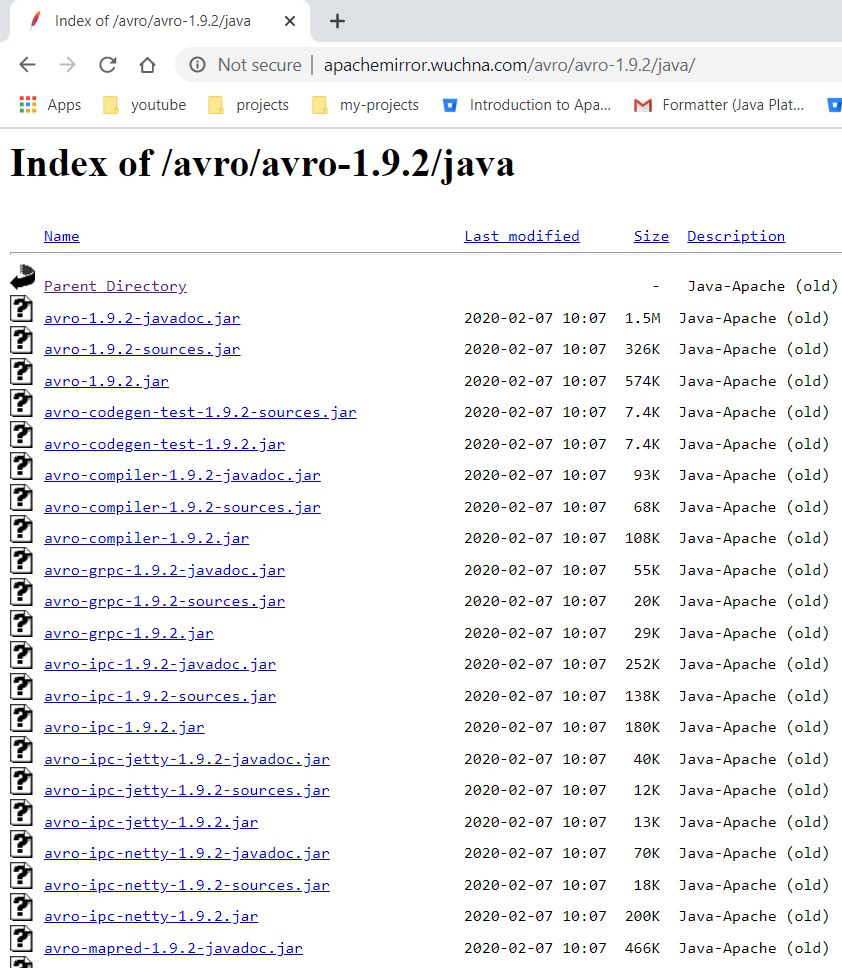

# Avro Java Setup
* Download Avro
* Open url - http://avro.apache.org/
	* Click `Project` link on left
	* Click `Releases` link\

* Follow steps to navigae mirror link to download Avro - http://apachemirror.wuchna.com/avro/
* We will see list of supported languages\

* Click `java`\

* Download
	* avro-1.9.2.jar
	* avro-tools-1.9.2.jar