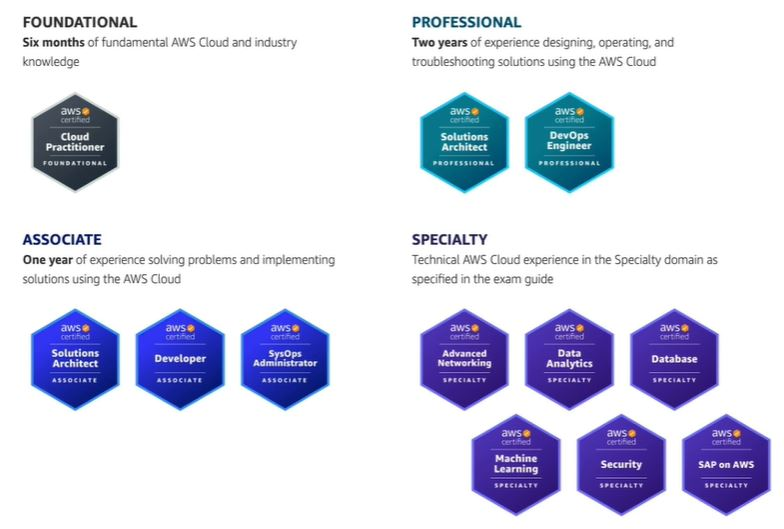

# List of certifications
* https://www.youtube.com/watch?v=Gat9uLmDJ5I&ab_channel=edureka%21

------
# List of certifications
* AWS Certified Cloud Practitioner
* AWS Certified Solutions Architect - Associate
* AWS Certified Solutions Architect - Professional
* AWS Certified Developer - Associate
* AWS Certified DevOps Engineer - Professional
* AWS Certified SysOps Administrator - Associate
* AWS Certified Data Analytics - Speciality
* AWS Certified Machine Learning - Speciality
* AWS Certified Database - Speciality
* AWS Certified Advanced Networking - Speciality
------
# Certifications order
* `Optional` - AWS Certified Cloud Practitioner
* AWS Certified Solutions Architect - Associate - https://aws.amazon.com/certification/certified-solutions-architect-associate/
* AWS Certified Solutions Architect - Professional
* AWS Certified Developer - Associate
* AWS Certified DevOps Engineer - Professional
* AWS Certified SysOps Administrator - Associate
* AWS Certified Data Analytics - Speciality
* AWS Certified Machine Learning - Speciality
* AWS Certified Database - Speciality
* AWS Certified Advanced Networking - Speciality
------
# AWS Certified Cloud Practitioner
## Materials
* Udemy - [NEW] Ultimate AWS Certified Cloud Practitioner - 2022
* Udemy - [NEW] AWS Certified Cloud Practitioner 2022
* Udemy - 6 Practice Exams | AWS Certified Cloud Practitioner CLF-C01
------
# AWS certified Developer Associate
## Materials
* Udemy - Ultimate AWS Certified Developer Associate 2022 - NEW!
* Udemy - Practice Exams | AWS Certified Developer Associate 2022
* Udemy - AWS Certified Developer Associate - AWS Certification

## Exam details
* multiple choice questions and multiple answers
* 80 minutes
* $150 USD
------
# AWS Certified Solutions Architect - Associate
## Materials
* Udemy - AWS Certified Solutions Architect Associate - SAA C03
* Udemy - Ultimate AWS Certified Solutions Architect Associate SAA-C03
* Udemy - Practice Exams | AWS Certified Solutions Architect Associate

## Exam details
* multiple choice questions and multiple answers
* 130 minutes
* $150 USD
------
# AWS Certified Solutions Architect - Professional
## Materials
* Ultimate AWS Certified Solutions Architect Professional 2023

## Exam details
* pre-requisite: aws certified solutions architect - associate
* multiple choice questions and multiple answers
* 170 minutes
* $300 USD
------
# AWS Certified SysOps Administrator - Associate
## Materials
* Ultimate AWS Certified SysOps Administrator Associate 2023

## Exam details
* multiple choice questions and multiple answers
* 80 minutes
* $150 USD
------
# AWS certified DevOps Engineer Professional

## Exam details
* pre-requisite: AWS certified Developer Associate (or) AWS certified SysOps Administrator Associate
* multiple choice questions and multiple answers
* 170 minutes
* $300 USD
------
# Next set of certifications
