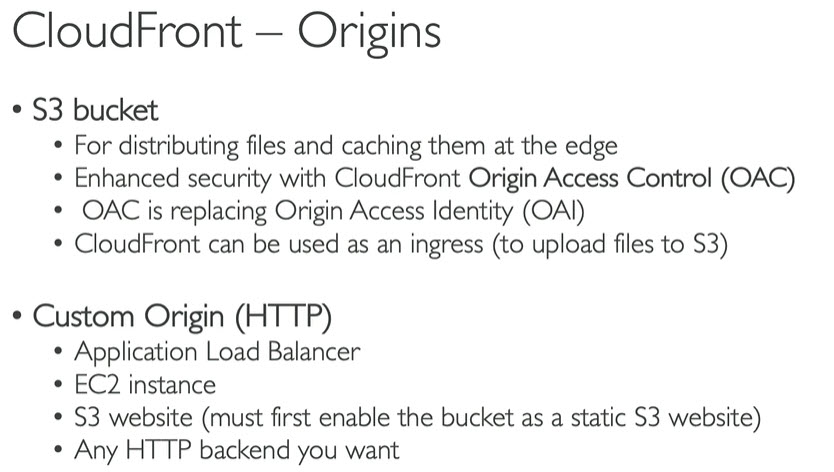
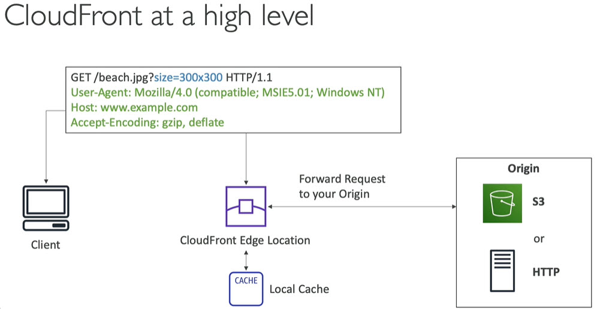
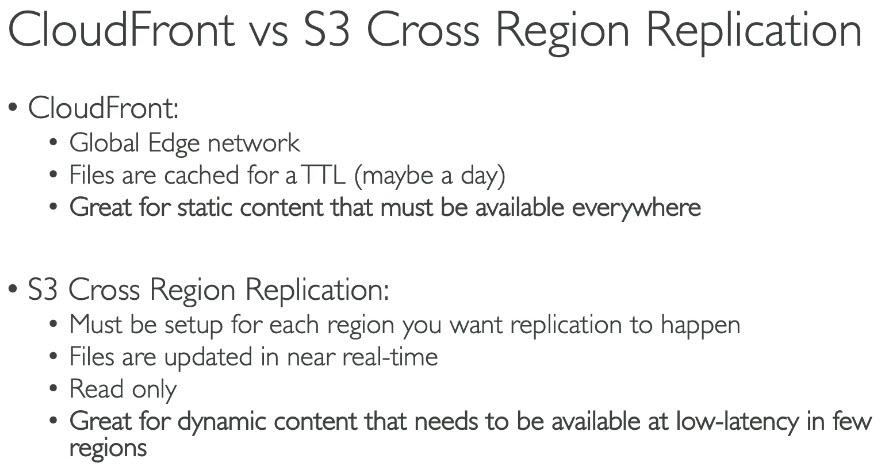
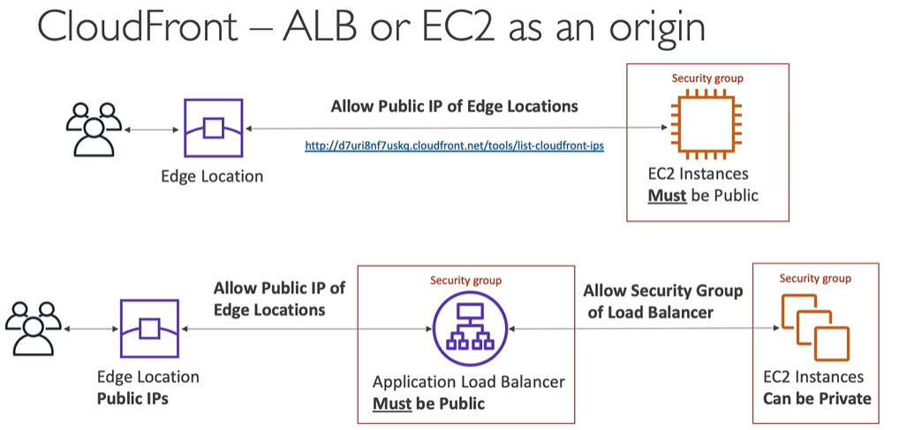
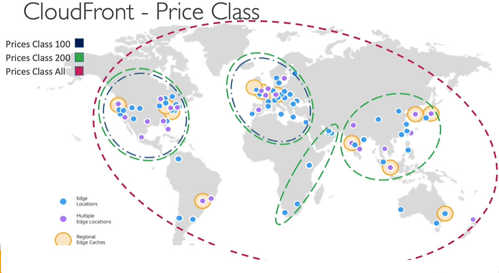
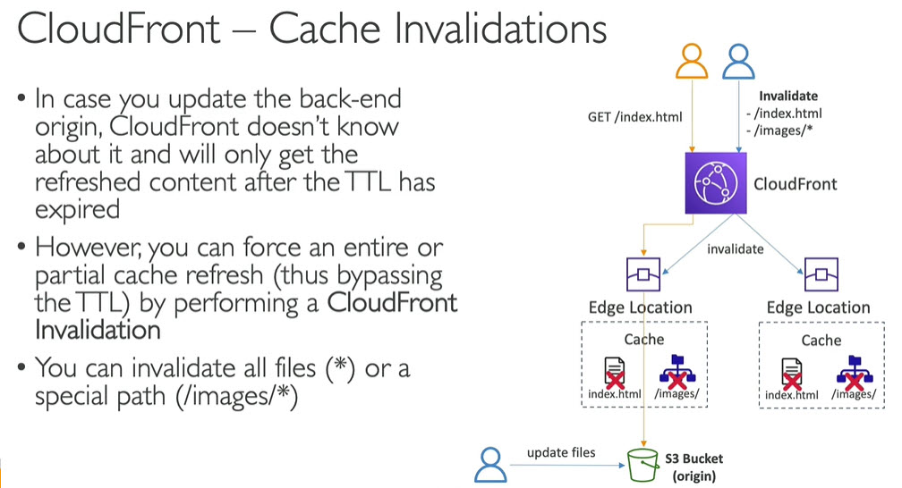
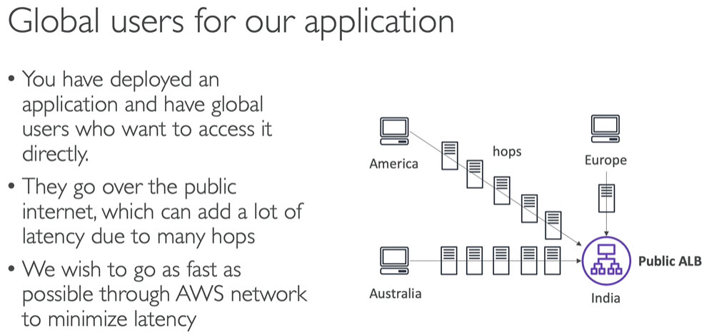
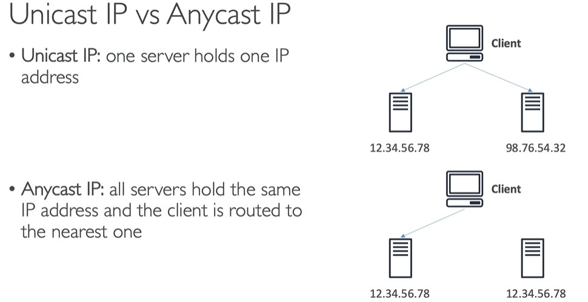
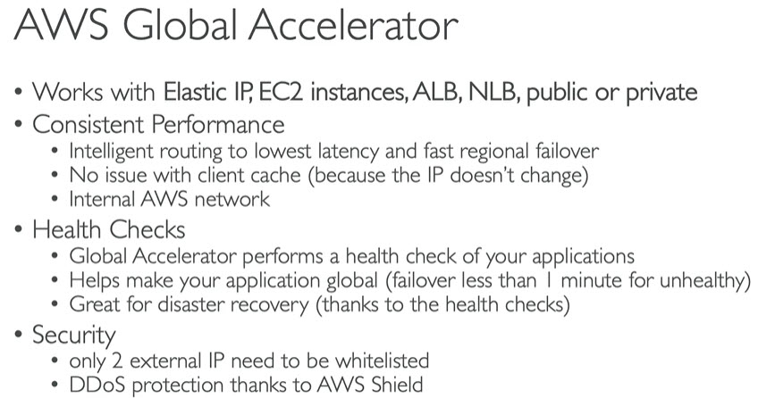
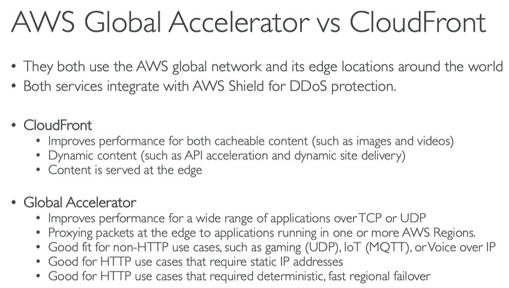

# Cloud Front
* CDN - Content delivery network that allows to serve files globally
* Improves read performance, content is cached at the edge
* Improves user experience
* 216 Point of Present globally (Edge locations)
* DDoS protection (because worldwide), integration with Shield, AWS Web Application Firewall
------
# Origins

------
# Cloudfront at High level

------
# Cloudfront vs s3 cross region replication

------
# ALB or EC2 as an origin

------
# Price classes

------
# Cache Invalidations

------
# Global accelerator

* Global accelerator works on `Anycast IP` concept\

------
