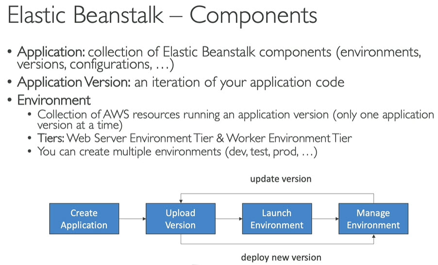
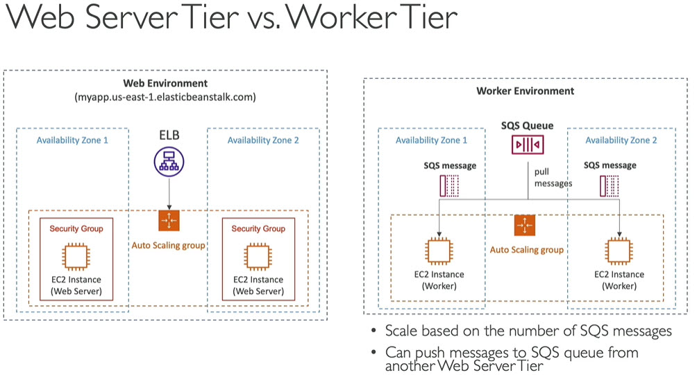
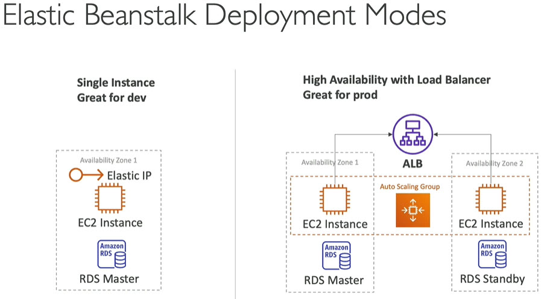

# Elastic Beanstalk
------
# Notes
* service that makes it easy to run our code and scale it on AWS. Under the cover this will simply run our code in EC2
* Developer centric view of deploying application in AWS
* Uses all components - EC2, ASG, ELB, RDS etc
* Managed services
	* Automatically handles capacity provisioning, auto scaling, load balancing, health monitoring, instance configurations etc
	* Just coding the application is developer responsibility
* We will have full control over the configurations
* Beanstalk is free but you pay for underlying instances
------
# EB components

------
# Web server and worker tier
* Web server: Run web server, web application, APIs etc
* worker tier environment: Application that processes long running workloads on demand and performs tasks on schedule\

------
# Deployment modes

------