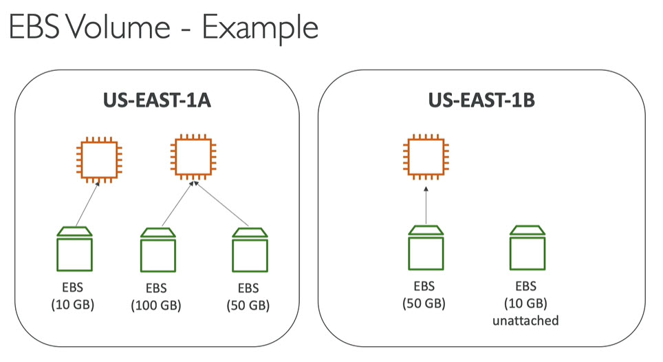
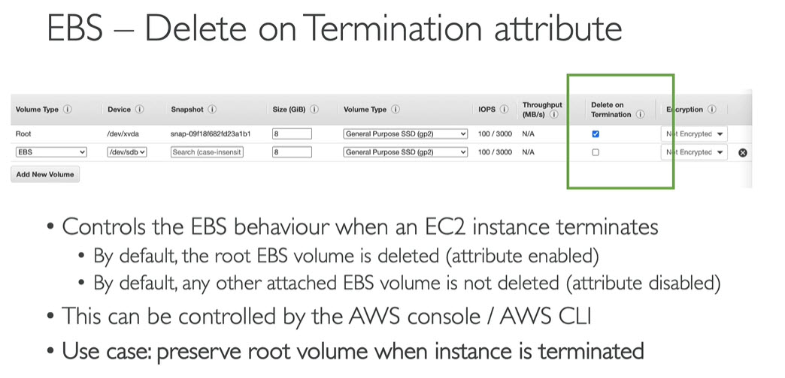

# EBS Elastic Block store
* Persistent block level storage volumes offering consistent and low-latency performance
* Automatically replicated within its availability zone
* Snapshots stored durably in Amazon S3
* Suited for applications that require database file system or raw block level storage
* Provides block level storage volumes used with EC2 instances
* EBS attached to EC2, persist independent of life EC2 instance
* Lifecycle\

* It's a network drive. Means it uses network to communicate the instances, which means there might be bit of latency
* It can be detached from EC2 instance and attach to another one quickly
* It is locked to on availability zone (AZ). An EBS volume in us-east-1a cannot be attached to us-east-1b. To move volume across, we need to Snapshot it
* Its volumn so we need to provide capacity (size in GBs and IOPS - IO operations per second)
* Get billed to provisioned capacity
* Increase capacity of drive over time
* Example\

* EBS Delete on Termination\

# Pricing
* Pricing based on region
* AWS GovCloud (US) pricing page
* Review `Pricing Calculator` online
* Pricing available as
	* Storage
	* IOPS
* check EBS pricing page for current pricing in all regions
