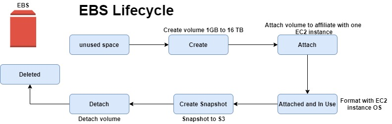

# EBS Elastic Block store
* Persistent block level storage volumes offering consistent and low-latency performance
* Automatically replicated within its availability zone
* Snapshots stored durably in Amazon S3
* Suited for applications that require database file system or raw block level storage
* Provides block level storage volumes used with EC2 instances
* EBS attached to EC2, persist independent of life EC2 instance
* Lifecycle\

# Pricing
* Pricing based on region
* AWS GovCloud (US) pricing page
* Review `Pricing Calculator` online
* Pricing available as
	* Storage
	* IOPS
* check EBS pricing page for current pricing in all regions
