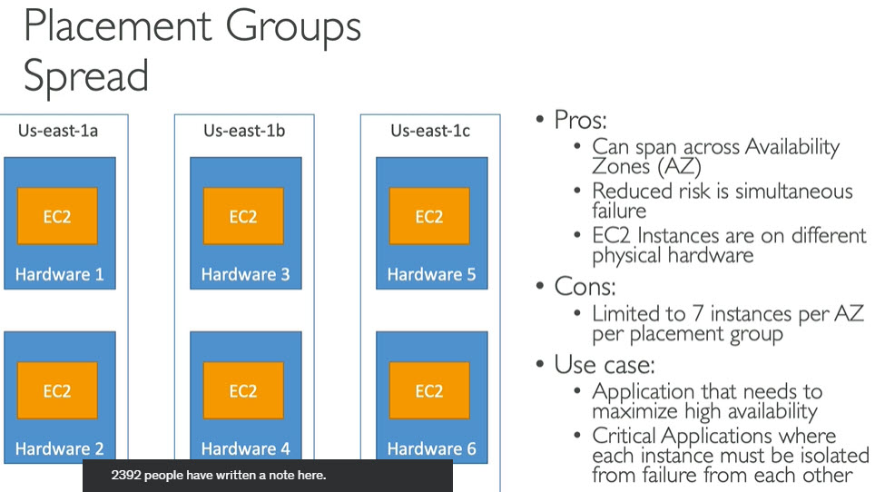

# EC2 Elastic Compute Cloud

------
# Links
* EC2 instance types - https://aws.amazon.com/ec2/instance-types/
* Compare EC2 instances - https://ec2instances.info
------
# Important port numbers to know to work with EC2 instances

------
# EC2 Instances Purchasing Options

------
# Instance Family and use cases
* General purpose (t2, m4, m3)
	* Low traffic websites and web applications
	* Small and mid-size databases
* Compute optimized (c4, c3)
	* High performance front ends like gaming
	* Video encoding
* Memory optimized (r3)
	* High performance databases
	* Distributed memory caches
* Storage optimized (i2, d2)
	* Data warehousing
	* Log or data-processing applications
* GPU instances (g2)
	* 3D application streaming
	* Machine learning
	* Graphic based applications
------
# Instance metadata
* Data about instances
* Public IP of instance
* Can be used to configure or manage running instance
* Getting instance metadata
	* Window instance - open url - http://169.254.169.254/latest/meta-data/
	* Linux instance - curl url from instance
		* $ curl http://169.254.169.254/latest/meta-data/
		* $ GET http://169.254.169.254/latest/meta-data/
* all meta data is returned as text (content type text/plain)
------
# Instance user data
* You can specify user data when launching the instance
* user data can be
	* linux script - executed by cloud-init
	* windows batch or powershell scripts - executed by EC2Config service
* user data scripts run once per instance-id by default
* user data is limited to 16KB
* user data should be Base64 encoded before submitted to API. Amazon EC2 command line tools can perform Base64 encoding
* Getting user data - http://169.254.169.254/latest/user-data
* Sample user data script to start web server
```
#!/bin/bash
# Use this for your user data (script from top to bottom)
# install httpd (Linux 2 version)
yum update -y
yum install -y httpd
systemctl start httpd
systemctl enable httpd
echo "<h1>Hello World from $(hostname -f)</h1>" > /var/www/html/index.html
```
------
# What is EC2
* Service provided by AWS for computing needs
* Computing services operating in remote data servers around the world
------
# What we can do with EC2 instance?
* Instance is a computer
* To run an application
* Login and use it like a virtual machine
------
# What is Elastic means in EC2?
* Instance running computing operations can increase and decrease at will
------
# What is instance?
* Virtual server
------
# Create EC2 instance
* Login to Amazon web console
* click on EC2
* click Launch Instance button
* Select any image
* Select instance Type
* click on `Next: Configure Instance Details` button
* Select Number of instances (replications of same image)
* click on `Next:Add Storage` button
* click `Next: Tag Instance` button
* click `Next: Configure Security Group` button
* click `Review and Launch` button
* click `Launch` button
* select security key pair option
* click `Launch Instances` button
------
# Create EC2 instance
* Login to Amazon web console
* click on EC2
* click Launch Instance button
* click Select button of any image we want
* select instance type we want, as of now I am selecting free ties instance type
* click Next: Configure Instance Details button
* give Number of instances as 1 (we can increase while giving AutoScaling configurations)
* For Network select VPC we have created
* Select any subnet under that VPC
* Auto Assign Public IP: Disable
* leave rest section to defaults
* click Next: Add Storage button
* keep defaults
* click Next: Tag Instance button
* Give Name to instance
* click Next: Configure Security Group
* give Security Group Name `any name for example security-group-1`
* enter description
* click Add Rule button
* keep Type `Custom TCP Rule`
* Port Range = 3000
* Source == Anywhere in the drop down
* click Review and Launch button
* click Launch button
* popup opens asking for key-pair
* select `Create a new key pair` in the first drop down
* give key pair name
* click Download Key pair button
* this will download a .pem file
* save and keep it safe
* click Launch Instances button
------
# Getting inside virtual machine with EC2 and VPC
* AWS Console
* click EC2
* open EC2 dashboard
* click 1 Running Instances under Resources
* navigates to instance dashboard
* at the bottom
* under Description we can see there is no  Public IP for this instance
* We can see Private IP
* we can see Availability Zone where this instance has been created
* we can see Key Pair, this is important because we will use same key-pair to connect via SSH
------
# Create and Assign Public IP address to VPC
* To assign this instance an IP address first we need to create an Elastic IP
* AWS Console
	* EC2
	* click Elastic IPs in the left menu
	* click Allocate New Address button
	* click Yes, Allocate button in the popup
	* click Close button
	* Now we have public IP address
* select Elastic IP created above
	* click Actions button
	* click Associate Address
	* On clicking Instance text box auto suggestion will come, select intance to which we want to assign this IP
	* click Associate button
	* Elastic IP address will be updated with EC2 instance that this IP address is associated with
	* click on instance link
	* navigates to instance details
	* here we can see Public IP address assigned to this instance
	* Copy this IP address so that we can use it in next configurations
------
# Elastic IP
* Public IP addresses that are created, destroyed and assigned independently to EC2 instances
* If underlying instance is terminated then associated IP address can still exist and can be assigned to different instance
------
# Convert pem file to ppk file
* Open PuttyGen
	* Actions
	* click Load button
	* selecte .pem file we have downloaded above
	* click Generate button
	* click Save Private Key button
	* This will generate .ppk file, save it carefully
------
# Connect to EC2 instance via SSH
* Downlod Putty
* Download puttyGen
* Open PuttyGen
	* Actions
	* click Load button
	* selecte .pem file we have downloaded above
	* click Generate button
	* click Save Private Key button
	* This will generate .ppk file, save it carefully
* Open Putty
	* Expand Connection
	* Expand SSH
	* Select Auth
	* Browse
	* select .ppk file generated above
	* click Session on left pane
	* In Host Name text box enter `ec2-user@ec2-instance-public-DNS`
	* click Open
	* EC2 instance will be connected
* Reference - [https://docs.aws.amazon.com/AWSEC2/latest/UserGuide/putty.html?icmpid=docs_ec2_console](https://docs.aws.amazon.com/AWSEC2/latest/UserGuide/putty.html?icmpid=docs_ec2_console)
* After connecting to EC2 instance using Putty -> run this command
	* sudo yum update
------
# Connecting from Windows 10 or later
* Open cmd or powershell
* Navigate to path where `pem` file is present
* Run below command
```
ssh -i pemfile ec2-user@ip-address
```
------
# Connect using EC2 Instance connect
* Login to aws console
* Go to EC2 dashboard
* Select EC2 instance which we want to connect
* Click on `Connect` button
* Opens new tab in browser and connects to EC2 instance
------
# AMI (Amazon Machine Image)
* Operating System + preinstalled softwares like Java, perl, python etc used on an EC2 instance
------
# Storage termed as
* EBS (Elastic Block Storage) in EC2. EBS is specific to storage used by EC2. EBS is not same as S3
* Independent storage volumes used with EC2 instances
------
# Security Groups
* Little firewals installed per instance basis
------
# EC2 dashboard 
* Resources: Details of instances/resources we have created
* Running Instances: EC2 instances we have
* Volumes: Elastic Block Storage volumes
* Launch Instance button: To launch new EC2 instance
------
# Scaling EC2 instances
* Expand or Shrink pool of instances
------
# Auto Scaling Group
* Expand or Shrink pool of instances based on pre-defined rules
* Auto configuration has launch configuration which has an image in it, and scaling rules to expand or shrink a pool of instances automatically
------
# Load Balancer
* Routing appliances that maintains a consistant DNS entry and balances requests to multiple instances
* Load balancer is essentially a router instance that provides a stable end point to reliably send your users and set DNS entries to. Load balancer will keep track of which IPs are available and send users to them efficiently
------
# Creating an AMI from Ec2 Instance
* AWS console
* click EC2
* open EC2 dashboard
* click on instances in the left menu
* Select our instance we want to create AMI
* click on Actions button open drop down
* Image
* click Create Image
* give image name (any user defined name)
* leave rest as defaults
* click Create Image button
* click Close button
* We have an AMI created and ready for deployment
------
# Where to check our AMI
* AWS console
* click EC2
* open EC2 dashboard
* click on instances in the left menu
* click Launch Instance button
* click My AMIs tab
* we can see AMI we have created
* We can also see AMIs in :
	* EC2 dashboard
	* AMIs in left menu
------
# Creating Load Balancer
* AWS console
* click EC2
* open EC2 dashboard
* click Load Balancers in the left menu
* click Create Load Balancer button
* give Load Balancer Name (any user defined name)
* Create LB inside: select our VPC
* do not check `create an internal load balancer`
* Listener section is which ports the load balancer is listening on
* select the Load Balancer Protocol: HTTP
* Load Balancer Port: 80
* Instance Protocol: HTTP
* Instance Port: on which port our application is running (in our case it is 8080)
* Select Subnets section: select subnets we created previously
* click `Next: Assign Security Groups`
* select `Create New Security Group` radio button
* Security group name: any user defined name
* there will be an existing rule which accepts any request on port 80, this is fine for us
* click `Next: Configure Security Settings` button
* click `Next: Configure Health Check` button
* load balancer will continuously check the health of application by using port and ping path, so give settings to which to hit to get 200 OK response
* click `Next: Add EC2 Instances`
* select out EC2 instance
* click `Next: Add Tags` button
* click Review and Create button
* click Create button
* click Close button
* we will navigate to Load Balancer list
------
# Enable stickiness on the load balancer
* If user requests comes to one EC2 instance all sub sequence requests have to go to same instance, otherwise user may end up in other EC2 instance which does not have user's session details which may cause defects. So we need to enable load balancer stickiness. Load Balancer will use cookie to keep track of which user should be sent which EC2 instance
* Select load balancer we have created
	* click Description tab
	* we will see Port Configuration: Stickiness Disabled
	* click Edit link next to it
	* select `Enable load balancer generated cookie stickiness`
	* Expiration Period: give expiration seconds how many days that cookie should be alive
	* click Save button
------
# Creating an Auto scaling group - this is 2 step process
* Create Launch Configuration
* Create Auto Scaling Group
* Creating Launch Configuration
	* AWS console
	* click EC2
	* open EC2 dashboard
	* Auto Scaling Groups in the left menu
	* click Create Auto scaling group button
	* click Create Launch Configuration button
	* click My AMIs tab
	* click Select button on AMI we have created above
	* select free tier instance
	* click Next: Configure Details button
	* Name: any user defined name
	* Expand Advanced Details section
	* in the user data field we need to enter the script that should be run to make our application up and running after scaling new AMI EC2 instance
	* click Next: Add Storage button
	* click Next: Configure Security Group button
	* select `select an existing security group` radio button
	* select our SG group
	* click Review button
	* click Create Launch configuration button
	* choose key pair in popup
	* check confirmation check box
	* click Create Launch Configuration button
* Now starts autscaling group configuration
	* Group Name: any user defined name
	* Group Size (initial number of instances) : 2
	* Network: select our VPC from drop down
	* click in Subnet text box we will get our subnets as auto suggestions select one at a time
	* expand Advanced Details section
	* check `Receive traffic from Elastic Load Balancers` check box
	* click in the input box and select from auto suggestions
	* click `Next: Configure scaling policies` button
	* click `Next: Configure Notifications` button
	* here we can add new notification to be sent anytime scales up or down , for this we need to setup SNS etc
	* click Next: Configure Tags button
	* click Review button
	* click Create Auto Scaling Group button
	* click Close button
	* we will navigate back to auto scaling groups list
------
# Setting security groups to accept requests only from load balancer
* AWS console
* click EC2
* open EC2 dashboard
* click Security Groups in the left menu
* select our security group
* click Inbound tab 
* click Edit button 
* change Source: Custom in drop down 
* type s in the next text box 
* opens auto suggestion box displays our security groups
------
# Adding Scaling policy to our Auto Scaling Group
* AWS console
* click EC2
* open EC2 dashboard
* click Auto scaling groups in the left menu
* select out scaling group
* click Scaling Policies button
* click Add Policy button
* click Create a Simple scaling policy link
* Name: any user defined name. for eample `scale_up`
* Execute policy when: click Create new alarm link
* uncheck `send notification to` check unless you want to an email sent while scaling up
* Whenever : second drop down select `"Network Out`
* Is: give 5000000
* leave the rest to default values
* click Create Alarm button
* click close button
* Take action: first drop down=Add, second text box=1, drop down=Instances
* click Create button.
* Add one more policy to scale down:
	* click Add Policy
	* Name: scale_down
	* click Create new alarm link
	* uncheck Send notification to check box
	* Whenever second drop down: Network Out
	* Is: 1st drop down: < , text box = 5000000
	* leave the rest to default values
	* change the rule name from Higt network out to low network out
	* click Create Alarm button
	* click Close button
	* click Create a simple scaling policy link
	* Take Action: drop down: Remove, text box=1, drop down= Instances
	* click Create button
------
# Deleting an EC2 Instance
* AWS console
* EC2
* instances in the left menu
* select the instances we want to delete
* Actions drop down
* Instance State
* Terminate
* click Yes, Terminate button
* this will take some time
------
# placement groups



