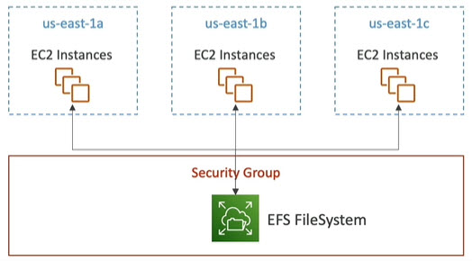
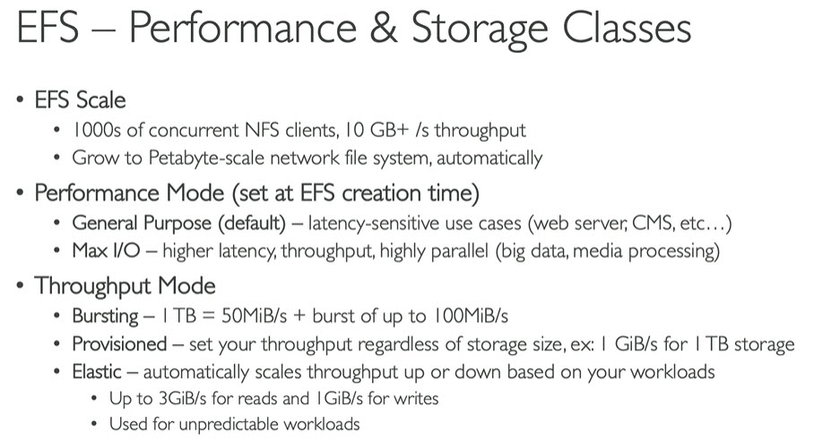
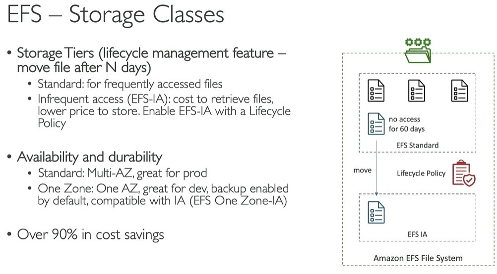

# EFS - Elastic File System
* Managed NFS (Network File System) that can be mounted on many EC2 instances
* EFS works with EC2 instances in multiple AZs
* Highly available, scalable, expensive (3 times to EBS gp2), not need to provision volume like EBS, pay per use\

* Use cases: content management, web serving, data sharing, wordpress
* Uses `NFSv4.1` protocol
* Uses security groups to control access to EFS
* `Compatible with Linux based AMIs (not windows)`
* Encryption using KMS (Key Management Service)
* POSIX file system (~Linux) that has standard file API
* File system scales automatically, pay-per-use, no capacity planning
------
# Storage classes

------
