# ELB Elastic Load Balancing
------
# What is load Balancing?
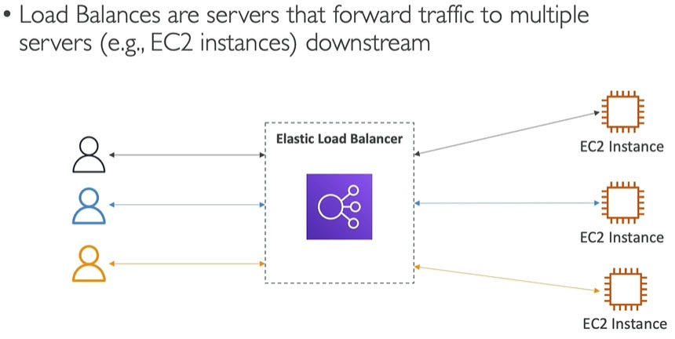
------
# Why load balancing
* Spread load across multiple downstream instances
* Expose single point of access (DNS) to your application
* Seamlessly handle failures of downstream instances
* Do regular health checks to your instances
* Provide SSL termination (HTTPS) to your websites
* Enforse stickiness with cookies
* High availability across zones
* Separate public traffic from private traffic
------
# Why use Elastic Load Balacer
* It is `managed load balancer`
	* AWS guarantees that it will be working
	* AWS takes care of upgrades, maintenance, high availability
	* AWS provides only few configuration knobs
* it costs less to setup own load balancer but it will be lot more effort
* It is integrated with many AWS services
	* EC2, EC2 Auto Scaling Groups, Amazon ECS
	* AWS Certificate Manager (ACM), CloudWatch
	* Route 53, AWS WAF (Web Application Firewall), AWS Global Accelerator
------
# Health checks
* Health checks are crucial for load balancers
* They enable load balancer to know if instance it forwards traffic to are available to reply requests
* Health check is done on `port and route (/health is common)`\
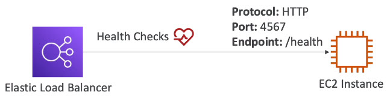
* If response is not 200 (OK) then instance in unhealthy. Then elastic load balancer do not send traffic to that instance
------
# Types of load balancers
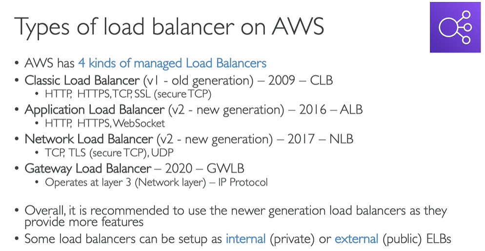
------
# Load balancer security Groups
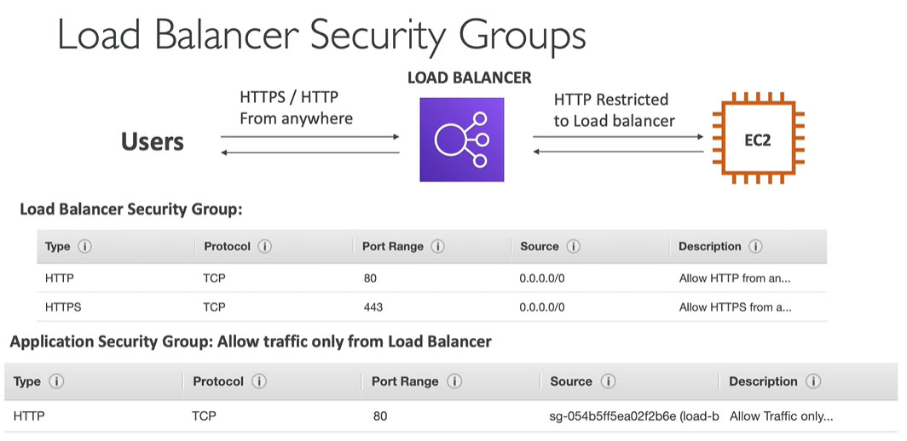
------
# CLB Classic Load balancer
* The Classic Load Balancer is deprecated at AWS and will soon not be available in the AWS Console.
* The exam also has removed any references to it
------
# ALB Application Load Balancer
* Application load balancer is layer 7 that is HTTP
* Load balancing to multiple HTTP application across machines (target groups)
* Load balancing to multiple applications on the same machine (Ex: containers)
* Support for HTTP/2 and WebSocket
* Support redirects (Ex: from HTTP to HTTPS)
* Routing tables to different target Groups
	* Routing based on path in URL (Ex: exampe.com/users & /example.com/posts)
	* Routing based on hostname in URL (Ex: one.example.com & two.example.com)
	* Routing based on query string, headers (example.com/users?id=123&order=true)
* Great fit for microservices and container based applications (Ex: Docker & Amazon ECS)
* Has port mapping feature to redirect to dynamic port in ECS
* In case of CLB, we will need one CLB per application. But in case ALB, one ALB for multiple applications\
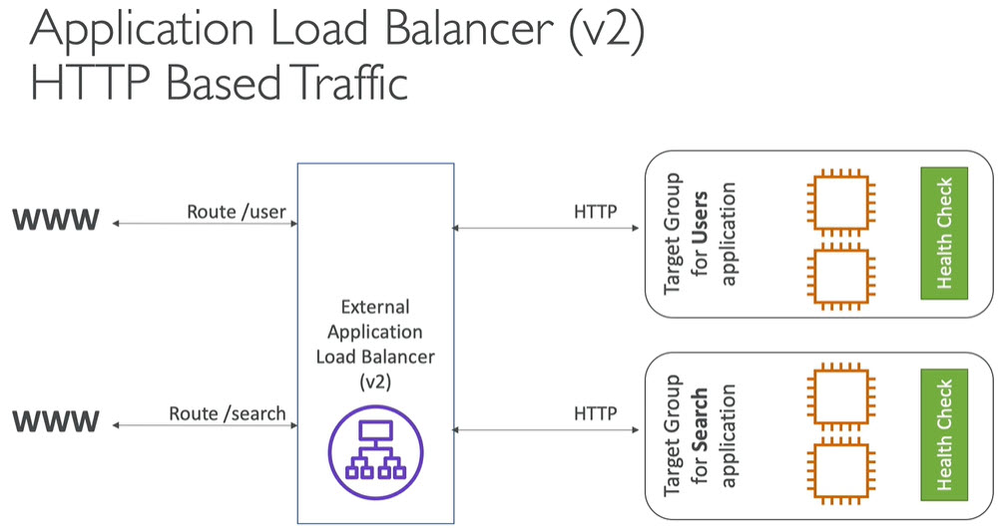

# ALB Target Groups
* EC2 instances (can be managed by auto scaling groups) - HTTP
* ECS tasks (managed by ECS itself) - HTTP
* Lambda functions - HTTP requests translated into JSON event
* IP Addresses - must be private IPs
* ALB can route multiple target groups
* Health checks at target group level\
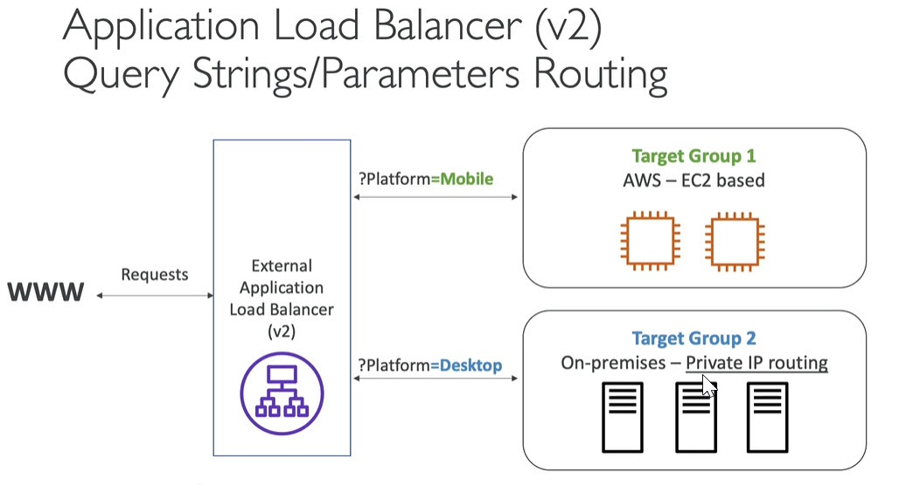

# ALB Good to know
* Applications should have fixed hostname
* Application servers don't see IP of client directly. Request comes from client to load balancer then route to application using load balancer private IP 
	* True IP of client inserted in the header `X-Farwarded-For`
	* Port in header `X-Forwarded-Port`
	* Proto in header `X-Forwarded-Proto`\
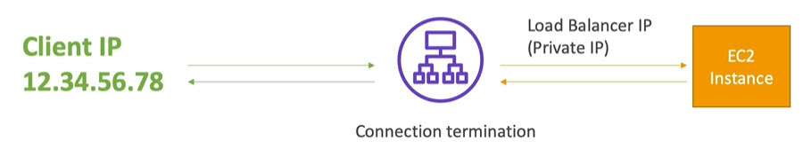
------
# NLB Network Load Balancer
* Network load balancer is layer 4
	* Forward TCP & UDP traffic to your instance
	* Handle millions of requests per second
	* Less latecy ~100 ms (vs ~400 ms for ALB)
* NLP has `one static IP per AZ`. Supports assigning Elastic IP (helpful for whitellisting specific IP)
* NLB are used for extreme performance, TCP or UDP traffic
* Not included in AWS free tier\
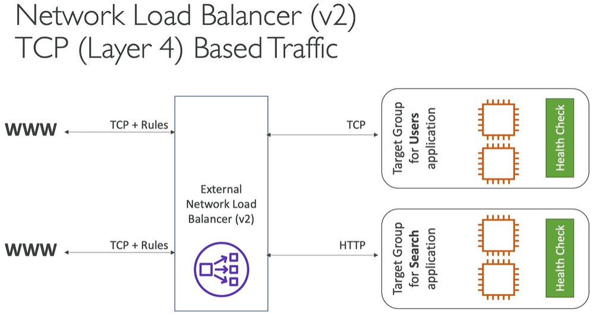

## Targer Groups
* EC2 instances
* IP addresses. Must be private IPs
* Application load balancer\
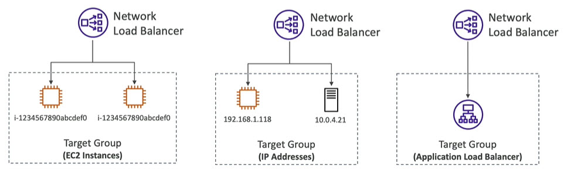
* Health check support 3 different protocols - TCP, HTTP, HTTPS Protocols
------
# Gateway Load Balancer
* Operates at Layer 3 (Network Layer) - IP Packets
* Combines following functions
	* Transparent Network Gateway - single entry. Exit for all traffic
	* Load Balancer - distributes traffic to virtual appliances
* Deploy, scale, & manage fleet of 3rd party network virtual appliances in AWS
	* Example: Firewalls, Intrusion Detection and Prevention Systems (IDPS), Deep Packet Inspection System (DPIS), Payload manipulation\
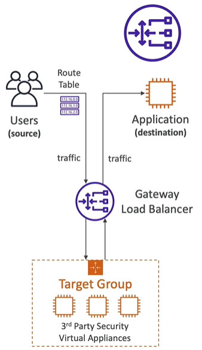
* Uses `GENEVE` protocol on port `6081`

## Target Groups
* EC2 instances
* IP Addresses - must be private IPs\
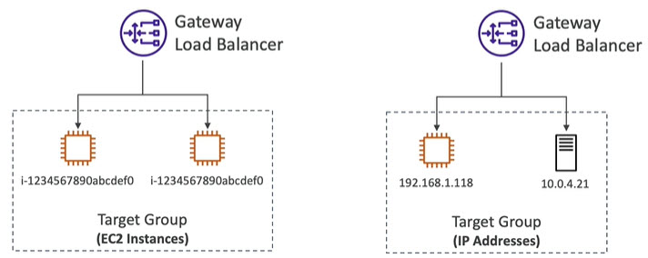
------
