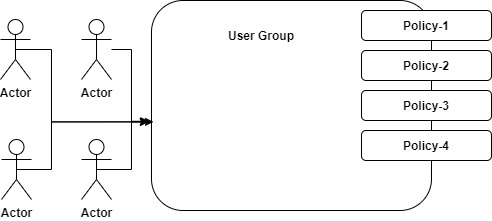

# IAM Identity and Access Management
------
# Creating IAM user for aws account
* 
* when we first create AWS account, the email and password we used is called `root user`
* `root user` can be used for
	* console access
	* programmatic access
* root user have access to everything in aws account. Like root user can close the account
* so for day to day activities, better to create different set of users calls `IAM` users
------
# Create a group
* login to AWS management console
* search for `IAM` service
* click on `groups`
* click `Create New Group`
* Enter group name
* Assign policies to the group. Who ever user added to this group will get permissions as per that group
* click Next
* click `Create Group` button
------
# Create user
* login to AWS management console
* search for `IAM` service
* click `Users` link
* click `Add user` button
* enter `User name` in text box
* Give permissions
	* Programmatic access
	* AWS Management Console access
* Console password
	* Custom password
	* Give password of your choice
* Un check - `User must create a new password at next sign-in`
* Assign group to user
* click `Next` button
* can skip Tags section
* click `Create user` button
* We will get success message
* We will have URL to login to AWS account using this IAM user. Copy and keep it safe
* Copy `Access Key ID`, `Secret access key` and keep them safe
* Logout from root user account
* Login with IAM URL and credentials
------
# Sample IAM policy structure
* Policy JSON
```
{
  "Version": "2012-10-17",
  "Id": "S3-Account-Permissions",
  "Statement": [
    {
      "Sid": "1",
      "Effect": "Allow",
      "Principal": {
        "AWS": [
          "arn:aws:iam::1234567890123:root"
        ]
      },
      "Action": [
        "s3:GetObject",
        "s3:PutObject"
      ],
      "Resource": [
        "arn:aws:s3::mybucket/*"
      ]
    }
  ]
}
```
* Id: identifier for policy
* Statement: one or more individual statements (required)
* Sid: Statement Id (optional)
* Effect: Whether statement allows or denies access (Allow, Deny)
* Principal: account/user/role to which this policy applied to
* Action: list of actions this policy allows or denies
* Resource: list of resources to which the actions applied to
* Condition: condition when this policy is in effect (optional). Not included in above sample JSON
------
