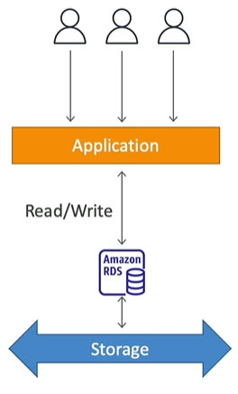
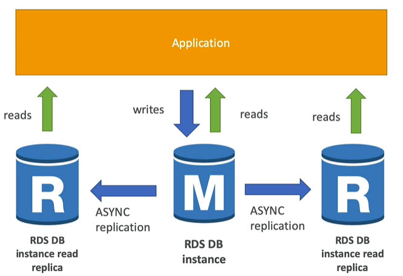

# RDS Relational Database Services
* Collection of AWS services to manage relational databases
* Managed database aspects and benefits
	* AWS will take care of
		* Scheduled automated backups
		* Software Updates
		* Managed infrastructure
		* configure security groups for database security
* RDS databases managed by AWS
	* Oracle
	* Microsoft SQL Server
	* MySQL
	* Postgres
	* Maria DB
	* IBM DB2
	* Aurora (AWS Proprietary database)
* RDS pricing depends on
	* type of database
	* region
	* EC2 instance type
------
# Create PostgreSQL database instance
* AWS web console
* RDS
* Left side we can see dashboard menu
* If we are coming here for the first time, we can see Get Started Now button
* click on Get Started Now button
* Select the database engine we want to create (I am selecting PostgreSQL)
* click on Select button 
* select the purpose for creating this DB instance (production - for creating Multy A(vailibility)-Z(one) database, Dev/Test - single instance), i am selecting Dev/Test
* click on Next Step button
* Fill the details appropriately
* click Next Step button
* VPC drop down: select our VPC created before. Check [here](https://github.com/avinashbabudonthu/aws/tree/master/vpc) to know how to create VPC
* Publicly Accessable: yes
* Database Name: any user defined name
* keep the rest of options to defaults
* click Launch DB Instance button
* This will take some time
------
# Security group created for the database created above
* AWS web console
* RDS
* click on Instances on left menu
* Expand database row
* click on magnifying glass document icon
* click on link available for Security Groups
* click on Inbound tab
* here we can see port for connecting to PostGre SQL DB
* IP Address will be default to our system IP address. If we want to change IP Address
* click on Edit button
* change Source to Anywhere
* click Save button
------
# Connecting to PostGre database created above
* We need to use any of the below tools
	* Postico
	* pgAdmin
* Open Postico
	* click on New Favorite button
	* Nickname: local nick name for DB
	* Host: expand database row in AWS RDS web console, copy End point
	* Port: port our database is running
	* enter username and password
	* enter database name what we gave while creating DB
	* click Connect button
	* now connected to DB
------
# create table in PostGre database created above
* After connecting to database
* click on `+Table` button
* give table name, column names etc
* click Save Changes button
------
# Advantages of using RDS versus deploying DB in EC2
* RDS managed Services
	* Automated provisioning, OS patching
	* Continuous backups and restore to specific timestamp (Point in Time Restore)
	* Monitoring Dashboard
	* Read replicas for improved read performance
	* Multi AZ setup for DR (Disaster Recovery)
	* Maintenance window for upgrades
	* Scaling capability (Horizontal and Vertical)
	* Storage backed by EBS (gp2 or IO1)
* BUT we can't SSH into your RDS running instances
------
# RDS Storage Auto Scaling
* Helps you increase storage on your RDS DB instance dynamically
* When RDS detects that you are running out of storage, it scales automatically
* Avoid manual scaling your database Storage
* You have to set `Maximum storage threshold` (Maximum storage limit for DB storage)
* automatically modify Storage if
	* Free storage is `< 10%` of allocated Storage
	* Low storage lasts atleast 5 min
	* 6 hours have passed since last modification
* Useful for application with unpredictable work loads
* Supports all RDS database engines

------
# RDS Read Replicas vs Multi AZ
* Upto 15 Read replicas
* Within AZ, Cross AZ, Cross region
* Replication is ASYNC, so reads are eventually consistent
* Replicas can be promoted to their own DB. Means we can make read replica as main db, then it will be out from read replicas list and have it's own database life cycle
* Applications must update the connection string to leverage read replicas
