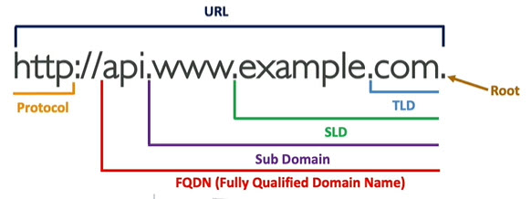
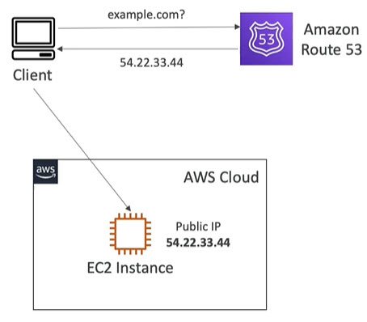
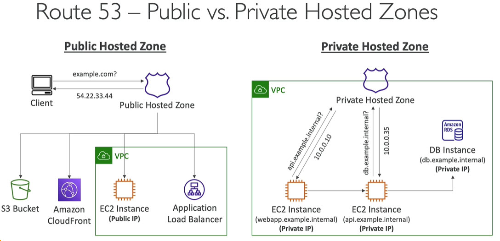
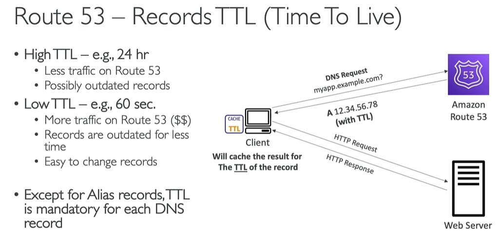
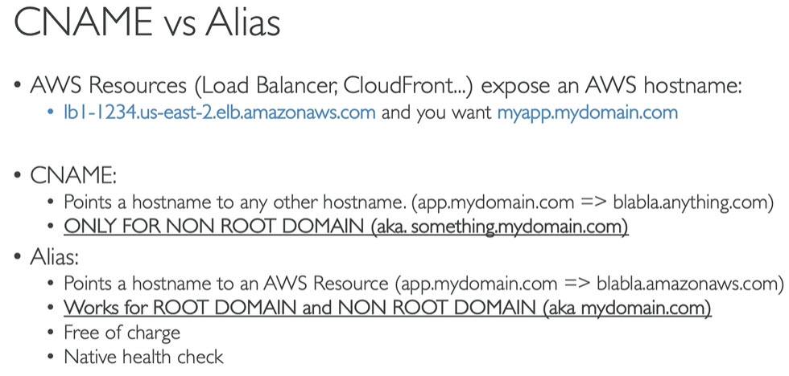
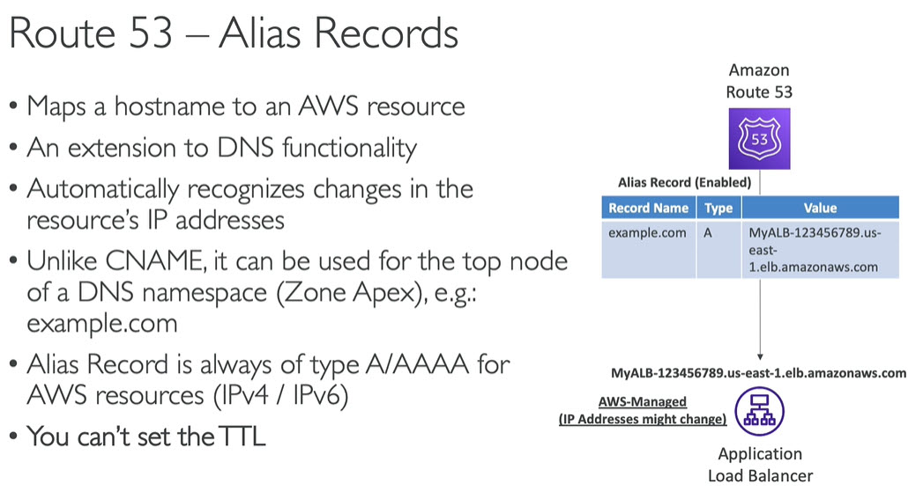
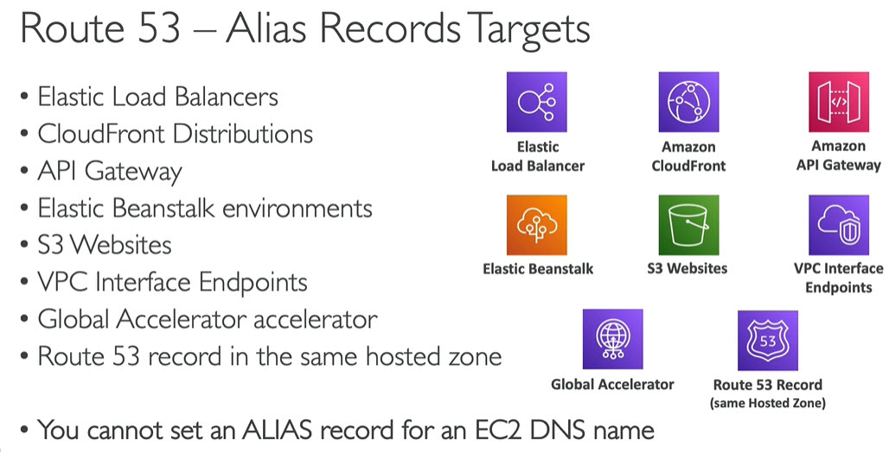
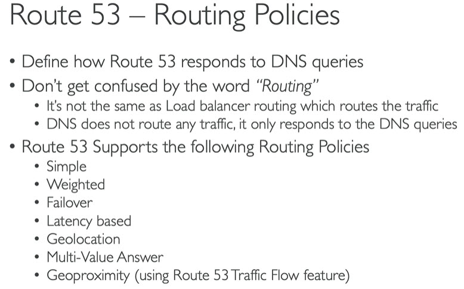
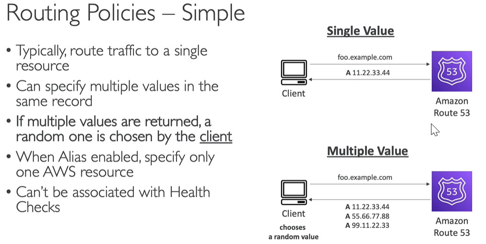

# Route 53
* Hosted DNS Service
* DNS maps url to ip address
------
# What is DNS
* Domain Name System which translates human fiendly hostnames to machine IP address
* DNS is backbone of the internet
------
# Terminology
* Domain Registrar: Amazon Route 53, GoDaddy
* DNS Records: A, AAAA, CNAME, NS etc
* Zone File: contains DNS Records
* Name Server: resolves DNS queries (Authoritative or Non-Authoritative)
* Top Level Domain (TLD): .com, .us, .in, .gov, .org
* Second Level Domain (SLD): amazon.com, google.com
* FQDN: Fully Qualified Domain Name
* URL: Uniform Resource Locator\

------
# How DNS works

------
# Route 53
* High available, scalable, fully managed and authoritative DNS
	* Authoritative means - Customer can update DNS records
* Route 53 is also Domain Registrar
* Ability to check health of your resources
* Only AWS service with 100% SLA
* Why Route `53`? - 53 is reference to traditional DNS port\

------
# Route 53 Records
* How you want to route traffic for Domain
* Each record contains
	* Domain and Sub domain name - Ex: example.com
	* Record Type - Ex: A, AAAA
	* Value - Ex: 12.34.56.78
	* Routing Policy - how route 53 respond to queries
	* TTL - Time To Live - amount of time record cached at DNS resolvers
* Route 53 supports following DNS types
	* must know - A, AAAA, CNAME, NS
	* advanced - CAA, DS, MX, NAPTR, PTR, SOA, TXT, SPF, SRV
-----
# Record Types
* A - maps hostname to IPv4
* AAAA - maps hostname to IPv6
* CNAME - maps hostname to another hostname
	* Target domain name which must have A or AAAA record
	* Can't create CNAME records for top node of DNS namespace (Zone Apex)
	* Ex: We can't create for `example.com` and but we can create for `www.example.com`
* NS - Name Servers for Hosted Zone
	* Control how traffic is routed for domain
------
# Hosted Zones
* Container of DNS records that define how to route traffic to domain and subdomain
* A hosted zone is the base layer of Route 53, and usually corresponds to a domain name or sub domain
* Public hosted zones - contains records that specify how to route traffic on internet
* Private hosted zones - contain records that specify how to route traffic within one or more VPCs (private domain names)
* Costs $0.50 per month per hosted Zone
* Public vs private hosted Zones\

------
# Route 53 TTL
* TTL - Time To Live\

------
# CNAME vs Alias

------
# Route 53 Alias

------
# Alias Targets

------
# Routing Poliies

# Routing Policy Simple

------
