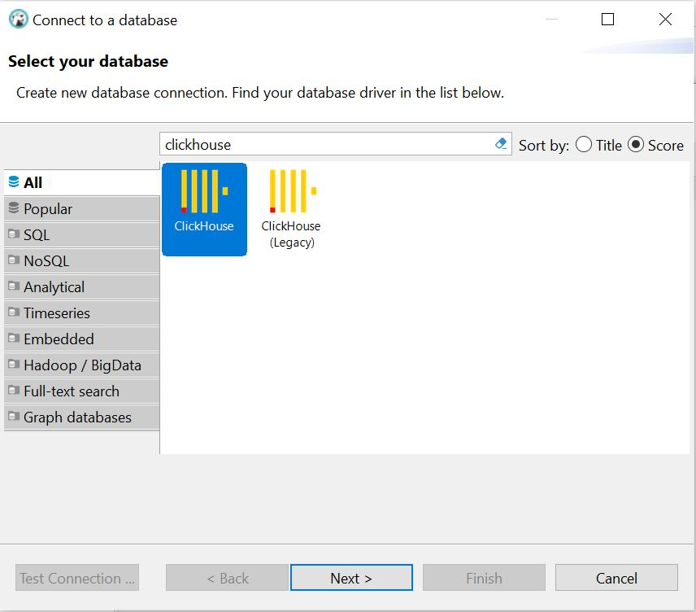
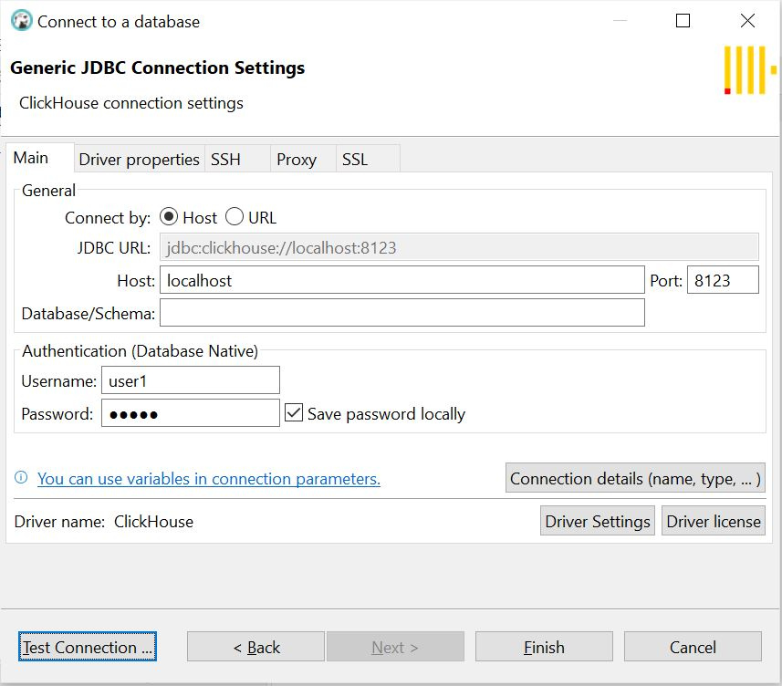
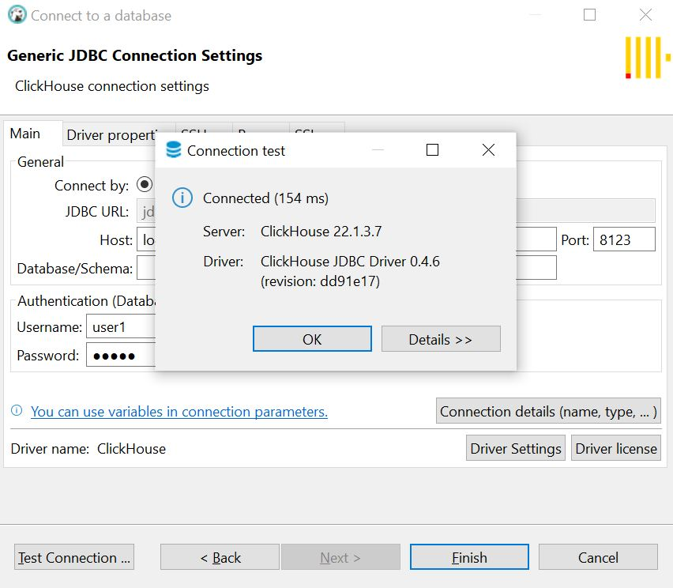
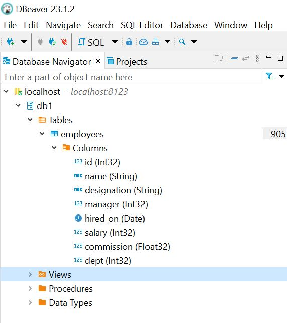

# Materials in study order
* https://clickhouse.com/docs/en/intro
* Run clickhouse in local using docker - https://www.bytebase.com/blog/how-to-run-clickhouse-with-docker-and-connect-using-mysql-client/
------
# Quick start
* https://clickhouse.com/docs/en/getting-started/quick-start
# Create a table
* Use CREATE TABLE to define a new table. Typical SQL DDL commands work in ClickHouse with one addition - tables in ClickHouse require an ENGINE clause. Use MergeTree to take advantage of the performance benefits of ClickHouse:
```
CREATE TABLE my_first_table
(
    user_id UInt32,
    message String,
    timestamp DateTime,
    metric Float32
)
ENGINE = MergeTree
PRIMARY KEY (user_id, timestamp)
```

# Insert data
You can use the familiar INSERT INTO TABLE command with ClickHouse, but it is important to understand that each insert into a MergeTree table causes a part (folder) to be created in storage. To minimize parts, bulk insert lots of rows at a time (tens of thousands or even millions at once).
```
INSERT INTO my_first_table (user_id, message, timestamp, metric) VALUES
    (101, 'Hello, ClickHouse!',                                 now(),       -1.0    ),
    (102, 'Insert a lot of rows per batch',                     yesterday(), 1.41421 ),
    (102, 'Sort your data based on your commonly-used queries', today(),     2.718   ),
    (101, 'Granules are the smallest chunks of data read',      now() + 5,   3.14159 )
```

#Query your new table
You can write a SELECT query just like you would with any SQL database:
```
SELECT *
FROM my_first_table
ORDER BY timestamp
```
------
# Java Language Client Options for ClickHouse
* https://clickhouse.com/docs/en/integrations/java
------
# Run clickhouse in local using docker
* Run clickhouse server
```
docker run -d --name tutorial-clickhouse-server -p 8123:8123 --ulimit nofile=262144:262144 yandex/clickhouse-server
```
* check containers
```
docker ps -a
```
* copy `users.xml` from container to local folder
```
docker cp <container-id>:/etc/clickhouse-server/users.xml .
```
* In users.xml, add <access_management>1</access_management>. After the change, the file structure should be something like below. Note that this is unsafe and you should change it back to <access_management>0</access_management> after finishing your work
```
<users>
    <default>
        <access_management>1</access_management>
    </default>
</users>
```
* Copy changed `users.xml` to container
```
docker cp users.xml <container-id>:/etc/clickhouse-server/users.xml
```
* Run clickhouse client
```
docker run -it --rm --link tutorial-clickhouse-server:clickhouse-server yandex/clickhouse-client --host clickhouse-server
```
* Create user
```
CREATE USER user1 IDENTIFIED WITH PLAINTEXT_PASSWORD BY 'pass1';
```
* Create database
```
CREATE DATABASE IF NOT EXISTS db1;
```
* Grant database privileges to the user
```
GRANT ALL PRIVILEGES ON db1.* TO user1;
```
* Disconnect client
```
exit
```
* Connect client with new user
```
docker run -it --rm --link tutorial-clickhouse-server:clickhouse-server yandex/clickhouse-client --host clickhouse-server -u user1 --password pass1
```
* Create table
```
USE db1;

DROP TABLE IF EXISTS employees;

CREATE TABLE employees(
    id          integer,
    name        text,
    designation text,
    manager     integer,
    hired_on    date,
    salary      integer,
    commission  float,
    dept        integer
)
ENGINE = MergeTree()
PRIMARY KEY id
ORDER BY id;
```
* Connect with DBeaver\
\
\
\
\

* See list of tables
```
SHOW TABLES;
```
* Describe employees table
```
DESCRIBE TABLE employees;
```
* Insert data to employees table
```
INSERT INTO employees (id, name, designation, manager, hired_on, salary, commission, dept) VALUES
    (1,'JOHNSON','ADMIN',6,'1990-12-17',18000,NULL,4)
    (2,'HARDING','MANAGER',9,'1998-02-02',52000,300,3)
    (3,'TAFT','SALES I',2,'1996-01-02',25000,500,3)
    (4,'HOOVER','SALES I',2,'1990-04-02',27000,NULL,3)
    (5,'LINCOLN','TECH',6,'1994-06-23',22500,1400,4)
    (6,'GARFIELD','MANAGER',9,'1993-05-01',54000,NULL,4)
    (7,'POLK','TECH',6,'1997-09-22',25000,NULL,4)
    (8,'GRANT','ENGINEER',10,'1997-03-30',32000,NULL,2)
    (9,'JACKSON','CEO',NULL,'1990-01-01',75000,NULL,4)
    (10,'FILLMORE','MANAGER',9,'1994-08-09',56000,NULL,2)
    (11,'ADAMS','ENGINEER',10,'1996-03-15',34000,NULL,2)
    (12,'WASHINGTON','ADMIN',6,'1998-04-16',18000,NULL,4)
    (13,'MONROE','ENGINEER',10,'2000-12-03',30000,NULL,2)
    (14,'ROOSEVELT','CPA',9,'1995-10-12',35000,NULL,1);
```
* Run some sample queries
```
SELECT designation,COUNT(*) AS nbr, (AVG(salary)) AS avg_salary FROM employees GROUP BY designation ORDER BY avg_salary DESC;
SELECT name,hired_on FROM employees ORDER BY hired_on;
```
* Reference - https://www.bytebase.com/blog/how-to-run-clickhouse-with-docker-and-connect-using-mysql-client/
------
# Create Database and users
* Create database
```
CREATE DATABASE IF NOT EXISTS db1;
```
* Grant database privileges to the user
```
GRANT ALL PRIVILEGES ON db1.* TO user1;
```
* Use database
```
USE db1;
```
------
# Create Drop tables
* Drop table
```
DROP TABLE IF EXISTS employees;
```
* Create table
```
CREATE TABLE employees(
    id          integer,
    name        text,
    designation text,
    manager     integer,
    hired_on    date,
    salary      integer,
    commission  float,
    dept        integer
)
ENGINE = MergeTree()
PRIMARY KEY id
ORDER BY id;
```
* See list of tables
```
SHOW TABLES;
```
* Describe employees table
```
DESCRIBE TABLE employees;
```
* Create table. `user_id`: a 32-bit unsigned integer. `message`: a String data type, which replaces types like VARCHAR, BLOB, CLOB and others from other database systems. `timestamp`: a DateTime value, which represents an instant in time. `metric`: a 32-bit floating point number
```
CREATE TABLE helloworld.my_first_table
(
    user_id UInt32,
    message String,
    timestamp DateTime,
    metric Float32
)
ENGINE = MergeTree()
PRIMARY KEY (user_id, timestamp)
```
* Notes on Table Engine
```
The table engine determines:
How and where the data is stored
Which queries are supported
Whether or not the data is replicated
There are many engines to choose from, but for a simple table on a single-node ClickHouse server, MergeTree is your likely choice.
```
* Create table which stored last 14 months data. Any data inserted not in this range will be delete automatically. See `TTL toDateTime(creationTimestamp) + toIntervalMonth(14)`
```
CREATE TABLE employees(
    id          integer,
    name        text,
    designation text,
    manager     integer,
    hired_on    date,
    salary      integer,
    commission  float,
    dept        integer,
	creationTimestamp DateTime64(3) COMMENT 'Record creation timestamp in milliseconds'
)
ENGINE = MergeTree()
PRIMARY KEY id
ORDER BY id
TTL toDateTime(creationTimestamp) + toIntervalMonth(14)
;
```
------
# Insert data
* Insert data to employees table
```
INSERT INTO employees (id, name, designation, manager, hired_on, salary, commission, dept) VALUES
    (1,'JOHNSON','ADMIN',6,'1990-12-17',18000,NULL,4)
    (2,'HARDING','MANAGER',9,'1998-02-02',52000,300,3)
    (3,'TAFT','SALES I',2,'1996-01-02',25000,500,3)
    (4,'HOOVER','SALES I',2,'1990-04-02',27000,NULL,3)
    (5,'LINCOLN','TECH',6,'1994-06-23',22500,1400,4)
    (6,'GARFIELD','MANAGER',9,'1993-05-01',54000,NULL,4)
    (7,'POLK','TECH',6,'1997-09-22',25000,NULL,4)
    (8,'GRANT','ENGINEER',10,'1997-03-30',32000,NULL,2)
    (9,'JACKSON','CEO',NULL,'1990-01-01',75000,NULL,4)
    (10,'FILLMORE','MANAGER',9,'1994-08-09',56000,NULL,2)
    (11,'ADAMS','ENGINEER',10,'1996-03-15',34000,NULL,2)
    (12,'WASHINGTON','ADMIN',6,'1998-04-16',18000,NULL,4)
    (13,'MONROE','ENGINEER',10,'2000-12-03',30000,NULL,2)
    (14,'ROOSEVELT','CPA',9,'1995-10-12',35000,NULL,1);
```
