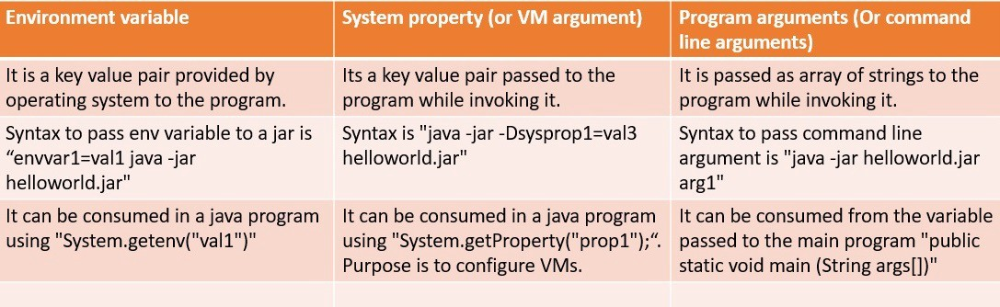

# Environment Variables vs System properties (or VM Arguments) vs Program arguments (or Command line arguments) | Java
* Whether you are an experienced Java developer or a newbie, I am sure you must have heard these terminologies many times and taken their definitions for granted. 
* Recently I had to write one command to execute a jar and I was required to pass all these variables to the executable and I had no idea how they were different from each other.
* Environment variable vs System Property vs Program Arguments in Java\

* Windows
```
D:> set envvar1=val1
D:> java -jar -Dsysprop1=val2 HelloWorld-0.0.1-SNAPSHOT.jar arg1
```
* Linux:
```
@shell:~ $ envvar1=val1 java -jar -Dsysprop1=val2 HelloWorld-1.0-SNAPSHOT.jar arg1
```
* Sample program to access these variables
```
public class HelloWorld {

	public static void main(String[] args) {
		System.out.println("Environment Variable envvar1 is: " + System.getenv("envvar1"));
		System.out.println("System property sysprop1 is: " + System.getProperty("sysprop1"));
		if (args != null && args.length > 0) {
			System.out.println("Command line arguments are: ");
			for (String arg : args) {
				System.out.println(arg);
			}
		}
	}
}
```
* Output

