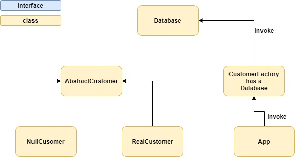

# Null Object Pattern

# Files
* [Database](Database.java)
* [AbstractCustomer](AbstractCustomer.java)
* [RealCustomer](RealCustomer.java)
* [NullCusomer](NullCusomer.java)
* [CustomerFactory](CustomerFactory.java)
* [App](App.java)