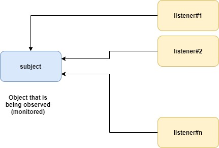
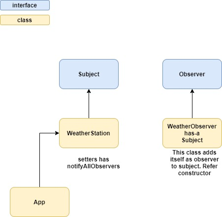

# Observer pattern
* Defines one-to-many between given objects or entities
* one object changes it's state all of it's dependents are notified and updated automatically
* Subject is the object that is being monitored
* observers (or listeners) are depending on the subject\

* used to achieve loosely coupled software system
* when two objects are loosely coupled they can interact but they have `little knowledge` of each other
* the only thing subject knows about an observer is that it implements certain interface
* we can add observers whenever we want, just have to implement the `Observer` interface
* do not have to modify the subject to add new type of observers
* we can independently reuse subject or observer
* we can independently change subject or observer
* loosely coupled design is very good. we can build flexible systems that can handle change

# Files

* Subject
	* [Subject](Subject.java)
	* [WeatherStation](WeatherStation.java)
* Observer
	* [Observer](Observer.java)
	* [WeatherObserver](WeatherObserver.java)
* Test class
	* [App](App.java)