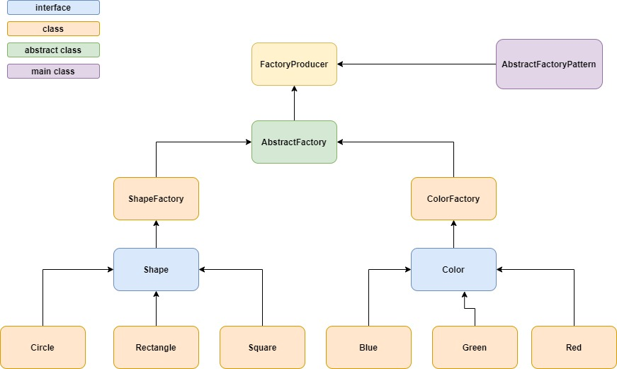

# Abstract Factory Pattern

# Color objects
* Create an interface [Color.java](Color.java)
* Create an implementation class [Blue.java](Blue.java)
* Create an implementation class [Green.java](Green.java)
* Create an implementation class [Red.java](Red.java)

# Shape objects
* Create an interface [Shape.java](Shape.java)
* Create an implementation class [Circle.java](Circle.java)
* Create an implementation class [Rectangle.java](Rectangle.java)
* Create an implementation class [Square.java](Square.java)

# Abstract Factory
* Create [ColorFactory](ColorFactory.java) class
* Create [ShapeFactory](ShapeFactory.java) class
* Create [AbstractFactory](AbstractFactory.java) class
* Create [FactoryProducer](FactoryProducer.java) class

# Test class
* Create [AbstractFactoryPattern](AbstractFactoryPattern.java) class
* Get factory object from factory producer
* Get actual object from factory
* Call method on actual object