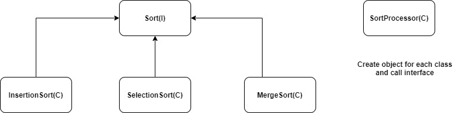

# Notes
* design and writing of the code should be done in a way that new functionality should be added with minimum changes in the existing code
* we have to design software entities (classes, methods, modules so on) `open for extension, close for modifications`
* Design patterns to implement open close principle
	* strategy pattern
	* template pattern
	
# Example1
* Problem statement
```
we have to solve the problem of dealing with multiple sorting algorithms.
So there are multiple sorting algorithms we have to deal with:

InsertionSort
SelectionSort
MergeSort

We have to make sure the SorterProcessor can handle any of these types. 
So let's use abstraction to solve this problem without violating the SOLID principles.
```
* Solution1\
