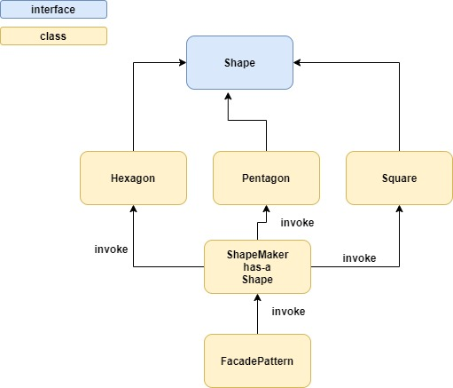

# Facade pattern notes
* Relatively easily understandable interface to complicated system
* Facade provides simple interface to complicated framework or system

# Implementation

# Files
* [Shape](Shape.java)
* [Square](Square.java)
* [Hexagon](Hexagon.java)
* [Pentagon](Pentagon.java)
* [ShapeMaker](ShapeMaker.java)
* [FacadePattern](FacadePattern.java)