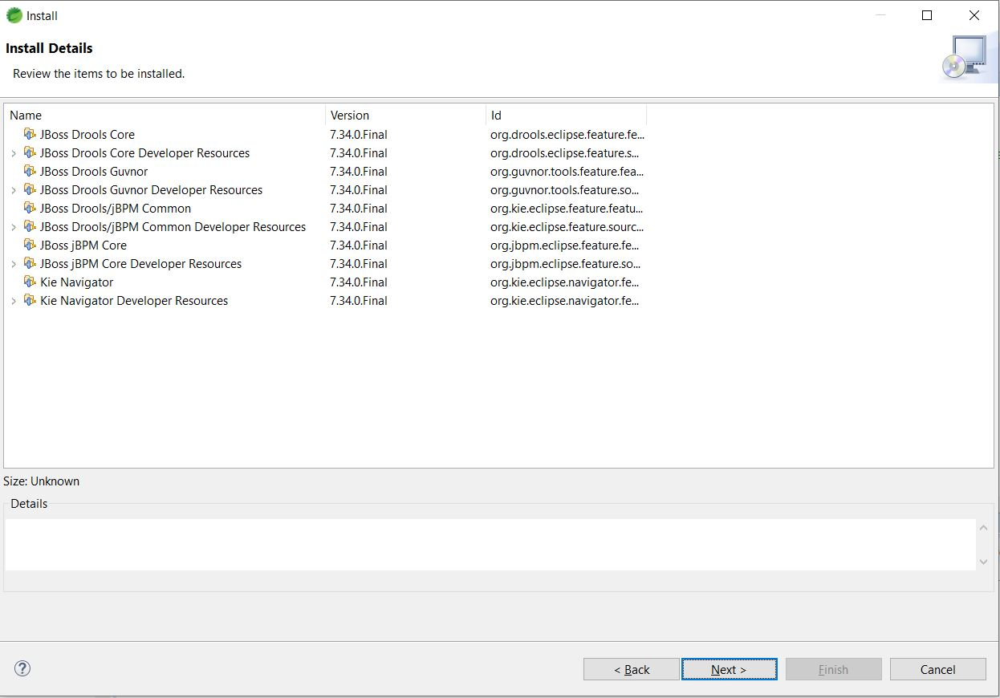
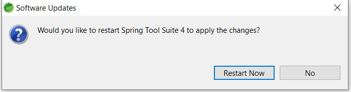
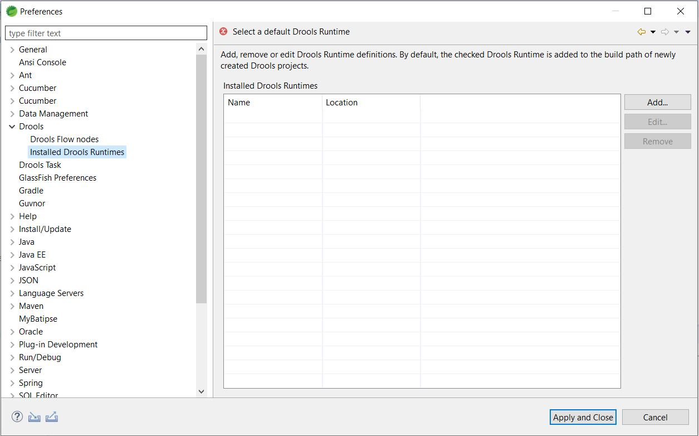
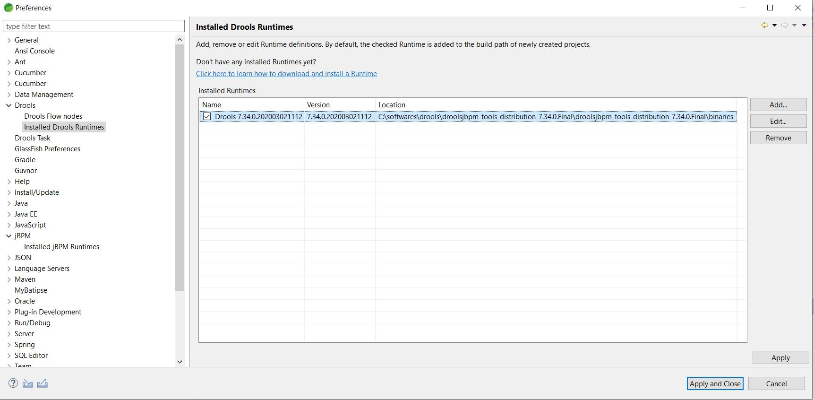

## Drools Plugin Installation in Eclipse
* Download drools binaries from https://download.jboss.org/drools/release/7.34.0.Final/
	* Download `droolsjbpm-tools-distribution-7.34.0.Final.zip` file
* Extract zip
* Install in Eclipse
	* Open Eclipse - Help - Install New Software...
	* Paste this entry 
		* https://download.jboss.org/drools/release/7.34.0.Final/org.drools.updatesite/
	* Select `Drools and jBPM` check box

	* Click `Next` button
	
	* Accept `license agreement`
	
	* Click `Finish` button
	* Click `Install anyway` button

	* Click `Restart Now` button

	* After restart - go to - `Window/Preferences/Drools/Installed Drools Runtimes`

	* Click `Add` button. Click `Browse` and select until `droolsjbpm-tools-distribution-7.34.0.Final\binaries`. Click `Ok` button

	* Select `Drools 7.34.0.202003021112`
	