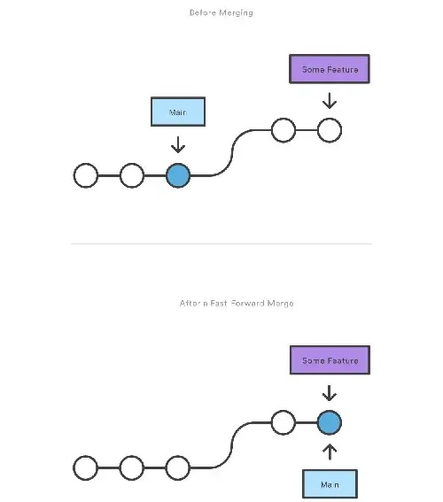
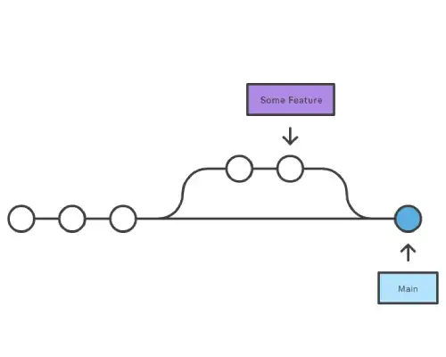

# Git Commands
* Overview of all useful commands
```
git help
```
* Complete list of all git commands
```
git help -a
```
* List all git concepts
```
git help -g
```

* Create a branch
```
git branch <branch>
```
* Create a branch and switch to it using the checkout command
```
git checkout -b [branch]
```
* Current branch. This shows current branch along with other branches present in local
```
git branch
```
* Show only current branch
```
git branch --show-current
```
* Check all branches
```
git branch -a
git branch --all
```
* `git branch` useful flags
```
-a: Display all branches (local & remote)
-r: Display remote branches
-v: Display branches with last commit
```
* Count number of branches
```
git branch -r | wc -l
```
* switch to another branch
```
git checkout branch-name
```
* Delete the feature branch from local repository
```
git branch --delete branch_name
git branch -d branch_name
git branch -D branch_name
```
* change the default branch from master to main
```
git branch -m main
```
* Merge branch-1 to current branch
```
git merge branch-1
```
* Merge master to develop
	* switch to develop
		* git checkout develop
	* merge master to develop
		* git merge master
* Merge master to branch-1
```
git merge branch-1 master
```
* Pull latest changes from current branch
```
git pull
```
* Check status
```
git status
```
* Make all files ready to commit. Add all files to staging
```
git add *
git add .
```
* Add file to staging (ready to commit)
```
git add file-name
```
* Add all files with extension .java ready to staging
```
git add **/*.java
```
* Add all files with extension .java and .html ready to staging
```
git add **/*.java **/*.html
```
* Make all files under src/main/java folder ready to commit (add to staging)
```
git add src/main/java/*
```
* Commit changes to local repository
```
git commit -m "commit message"
```
* Add all changes made to tracked files & commit
```
git commit -a -m "<message>"
git commit -am "<message>"
```
* Push the changes to current branch. Send all commits from local repository to remote repository
```
git push
```
* Push changes to master branch
```
git push <remote name> <branch>
git push origin master
git push -u origin master
```
* Push specific branch to your remote repository
```
git push origin [branch_name]
```
* Push all branches to your remote repository
```
git push --all origin
```
* Revert all local changes
```
git reset --hard HEAD
```
* Reset local repository and point your local master branch to latest history fetched from remote server
```
git reset --hard origin/master
```
* Add a remote repository
```
git remote add <remote name> <url>
```
* If you haven't connected your local repository to a remote server, To add a remote server to a local repository
```
git remote add origin [repo_url]
```
* Create a new local repository (or) Initialize a local repository. The `[directory]` is optional. If you don't specify it, the current directory will be used
```
git init
git init [directory]
```
* Initital repo with `main` as default branch
```
git init -b main
git init -b main [directory]
```
* Create new remote repository and check in local new repository to remote repository
	

* Revert specific file changes
```
git checkout -- fileName
git checkout -- file1.txt
```

* Revert files with specific extension
```
git checkout -- **/*.java
```
* Display the commit history
```
git log
```
* Remove files from the staging area
```
git reset HEAD file-name
or
git reset <file>
```
* Remove ignored files
```
git clean -fX
```
* Remove ignored and non-ignored files
```
git clean -fx
```
* Remove un tracked directories
```
git clean -fd
```
* Clean repository to initial stage
```
git clean -x -d -f
```
* Revert specific commit
```
git revert commit-id

git revert 0ad5a7a6
```
* Store git credentials. This command will create file named `.git-credentials` in `C:\Users\user-name` folder
```
git config --global credential.helper store
```
* Git configurations list
```
git config --list
```
* Git configurations list with origins
```
git config --list --show-origin
```
* Update git remote url to existing local repo
```
git remote set-url origin git@github.com:avinashbabudonthu/python.git
```
* Remove remote branch from local repo
```
git remote remove <name>
git remote remove heroku
```
* Rename a remote repository
```
git remote rename <old name> <new name>
```
* Fetch changes from a remote repository
```
git fetch <remote name>
```

* Fetch changes from a particular branch
```
git fetch <remote name> <branch>
```

* Allow long paths
```
git config --system core.longpaths true
```
* Delete un pushed git local commits
```
git reset --hard origin
git reset --hard origin/<branch>
git reset --hard origin/feature/my-cool-stuff
```
* Delete un pushed git local commits but keep the local work
```
git reset --soft origin
git reset --soft origin/<branch>
git reset --soft origin/feature/my-cool-stuff
```
* Remove file from local git repo. we need to commit after deleting
```
git rm [file-name]
git status
git commit -m "commit-message"
```
* You can also remove it from staging area only using `--cached` flag
```
git rm --cached <file>
```
* If remove file from directory then git does not know about it, then execute following commands
```
git add -u
git status
git commit -m "commit-message"
```
* Move or rename a file
```
git mv [file-name] [folder-name-with-path]
git commit -m "commit-message"
```
* Moving files without git
```
git add -u
git status
git commit -m "commit-message"
```
* Reset local unfinished merge
```
git reset --merge
```
* Checkout a previous commit
```
git checkout <commit id>
```
* Revert a commit
```
git revert <commit id>
```
* Reset a commit
```
git reset <commit id>
```
* You can also add the --hard flag to delete all changes, but use it with caution
```
git reset --hard <commit id>
```
* Display the changes to unstaged files
```
git diff
```
* You can also use the --staged flag to display the changes to staged files
```
git diff --staged
```
* Display the changes between two commits
```
git diff <commit id 01> <commit id 02>
```
------
# Useful flags:
* --no-ff: Create a merge commit even if the merge resolves as a fast-forward
* --squash: Squash all commits from the specified branch into a single commit
* Fast forward merge\

* Non fast forward merge\

* It is suggested to not use the `--squash` flag as it will squash all commits into a single commit, leading to a messy commit history
