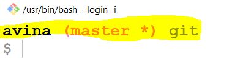
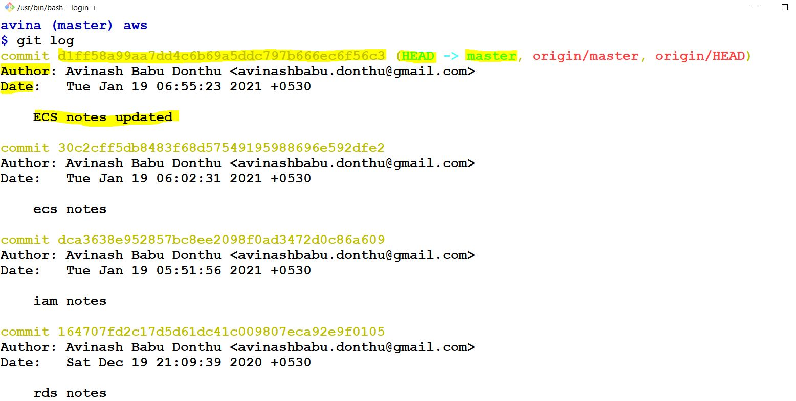
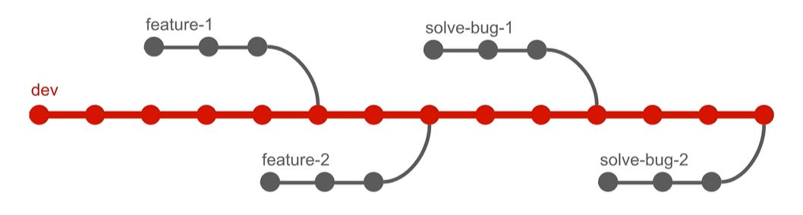
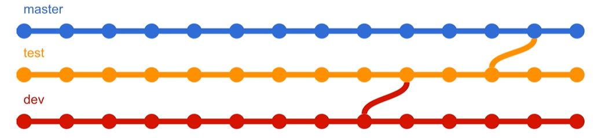

# Git Notes
* What is version control?
	* also called `Revision Control`, `Source Control`
	* management of changes like
		* who made change by doing `blame`
		* what is the change made
		* when is the change made
	* 2 developers working on same code base. Writes code for different features. We need system that can track all the changes done by all developers on all files
	* Version control is a system that records changes to file/files over time so that we can recall specific versions later
	* versions can be recorded in repository
	* there are `Local`, `Centralized`, `Distributed` version control systems
* Why version control system?
	* Keep track of changes
	* able to go back to previous version
	* easily add some one's work into our own (like merge)
	* collaboration
		* shared workspace
		* realtime updates
	* manage versions
	* rollbacks
	* reduced down time
	* project analysis
* What is repository
	* centralized directory to allow any developer to submit the code
	* we can keep code files, images, text files inside repository
	* Example online repositories
		* Github
		* Bitbucket
		* Gitlab
	
# Revert specific commit
* There are a couple of ways to `undo` commits in Git. The `reset` command, for example, allows you to restore your project at any previous revision - effectively `undoing` all the commits that came afterwards
* A different situation, however, is when you want to undo the effects of only a certain commit - and not discard any commits that came after that one. This is a classic scenario for the `revert` command
* Using the revert command doesn't delete any commits. Quite the contrary: it creates a new revision that reverts the effects of a specified commit
* Just use the `revert` command and provide the commit you want to `undo`
```
git revert 0ad5a7a6
```

# Git vs Github vs Gitlab
* Git
	* Version control system
	* Allows us to track changes
	* Maintains hystorical backup like snapshots
	* Allows team based development. Allow teams to work on same codebase simultaneously
	* Flexible. Can work local, devops etc
	* CLI
	* Trunk based development
		* master branch as main branch/trunk
		* we can create as many branches as needed and work
	* We have repo
		* Place where we have our code
* Github and Gitlab
	* Hosted Git in cloud
	* Web based
	* Open source
	* Bug tracker available
* Reference
	* Youtube - https://www.youtube.com/watch?reload=9&v=wpISo9TNjfU&ab_channel=IBMCloud


# Setup git workspace in windows
* Download file [Setup-Git-Workspace-on-Windows.zip](Setup-Git-Workspace-on-Windows.zip)
* Unzip it
* open `Git Bash`
* Enter command `start .`
* copy below files/folder from above unzip folder to start folder opened with command `start .`
	* terminal-config
	* bash_profile
* These file/folder names need to start with `.`. Do that renaming from Git Bash using below commands
	* mv terminal-config .terminal-config
	* mv bash_profile .bash_profile
* check is files renamed correctly or not
* Git Bash before making above changes\

* Git Bash after making above changes from normal folder\

* Git Bash after making above changes from any repository
	* username
	* branch
	* current directory\


# First commit
* Create any folder
* Navigate to that folder in Git Bash
* Execute command
```
git init
```
* check the files
```
ls
```
* check for hidden files. we can see folder named `.git`
```
ls -a
```
* By default `master` branch will be created as and when we did init
* branch contains `#` sign. Means we have files that need to staged (make them ready to commit)
* add file
```
git add [file-name]
git add file-1.txt
```
* now we can see `#` sign changed to `+` means one file is staged and ready to commit
* commit the staged changes
```
git commit -m "commit-message"
```


# Review file changes
* Refer [First commit](#first-commit) before proceeding
* make changes to `file-1.txt`
* check for modified files
```
git status
```
* Once file is modified we can see `` * `` symbol in branch name. Means there are file changes in this branch
* Check the file changes
```
git diff [file-name]
git diff file-1.txt
```
* Add file to stage
```
git add file-1.txt
```
* Now `` * `` symbol changes to `+`
* Commit the file
```
git commit -m "file 1 updated v1"
```

* If we want to diff file changes with specific commit, use below command
```
git diff [commit-id] -p
```
* If we want to compare different commits
```
git diff [commit-id-1] [commit-id-2]
```
* Add all files changes to stage in current directory
```
git add .
```

# Git configurations
* These configurations used to identify who made changes while we commit
* List all git configurations
```
git config --list
git config -l
```
* list all git configurations
```
git config --global --list
git config --global -l
```
* By default email and username won't be set
* Set username. `--global` is to set globally
```
git config --global user.name [our-name]
git config --global user.name "Donthu Avinash Babu"
```
* Set email. `--global` is to set globally
```
git config --global user.email [email-id]
git config --global user.email "my-email@gmail.com"
```
* add editor. Here I am setting visual code as editor. `--wait` is to make git wait for editor to close
```
git config --global core.editor "code --wait"
```

# push local repo to git
* Create repository in github
* Copy the path of new repository
* Open Git Bash in local repository
* Add remote repository url to local repository
	* `origin` is the name we gave to remote repository
```
git remote add origin [url]
```
* push changes to remote repository
	* `master` is the branch name
```
git push origin master
```

# fatal: unable to access url: The requested URL returned error: 403
* Go to window credential manager
	* `control panel > user accounts > credential manager > windows credentials > Generic credentials`
	* or
	* Search for `Generic credentials` in `start`
* Delete the existing git credentials

# pull from remote repository
* change any file in git repository (or) some other developer made and pushed changes to remote repository
* pull changes to local
```
git pull origin master
```

# Set branch for tracking
* If we want to pull and push to specific branch then no need to type remote and branch name every time if we execute following command
```
git branch --set-upstream-to=origin/master master
```
* After this we can directly pull with remote and branch name as below
```
git pull
```

# Fork github repository
* we can copy repository from another account to our account using fork. Means everything in that repository are available to us like `code`, `branches` etc
* we will have all commits until that repository is forked. After fork we will entirely different set of commits made by us to our copy of repository\

* owner will be able to continue with their commits. owner cannot access our commits. We cannot access owner's commits

# Exploring logs
* Open Git Bash in any git repository
* To get the commits done till now
```
git log
```
* We will see
	* commit id
	* Author
	* Date
	* Commit message
	* etc


# Getting details of commit
* Get what happened/changed in specific commit
```
git show [commit-id]
```
* First commit has extra information like
	* HEAD -> master
	* origin/master
	* origin/HEAD
* We can use above information to get commit information of HEAD without commit-id
```
git show HEAD
```
* we can commit information of previous commits without commit-id by using `HEAD` as reference. For example we want to know commit information of 5th previous commits
```
git show HEAD~nthCommitNumberFromHeadCommit
```
```
git show HEAD~5
```

* We can get commit information of specific file. This is like log of specific file
```
git annotate [file-name]
```
```
git annotate notes.md
```
* we can integrate `git annotate` functionality into IDE. For that we need to install plugins specific to IDE. For example
	* For Visual Code we have to install `GitLens`
		* search for `git` in extensions
		* we can find and install `GitLens`

# Reverting commits
* Revert to previous version of file if we did not stage the file
```
git checkout -- [file-name]
```
* Revert many files changes in the current directory
```
git checkout -- .
```
* Revert to previous version of file we staged the file. We need to execute following 2 commands
	* git reset - unstage the file
	* git checkout - to revert the changes
```
git reset HEAD [file-name]
git checkout -- [file-name]
```
* Revert the file to specific commit
```
git checkout [commit-id] [file-name]
```

# Branches
* For every repo we have default branch `master`
* we should always have working version of our project. This is where branches comes into picture
* Always `master` branch should have fully working version
* Have test branch
	* Use this for internal testing or small group of users
	* once tested then decide whether we merge this to master or not
* Have `dev` branch
	* create feature or bug fixes branches from dev branch\


* Best practices in branches
	* `master` default branch - Production branch
	* create `test` from `master`
	* create `develop` from `master`
	* create `release` from `develop`
	* create `feature` from `release`
	* merge `feature` to `release`
	* merge `release` to `develop`
	* merge `develop` to `test`
	* merge `test` to `master`
	* deploy `master` to `production`
* If we have many teams working on huge code base then
	* Rather creating branch for each team and each team member create `fork` for each component
	* each component can raise PR from their `fork` to actual repository
* Pull Request - PR
	* To merge changes from one branch to another branch

