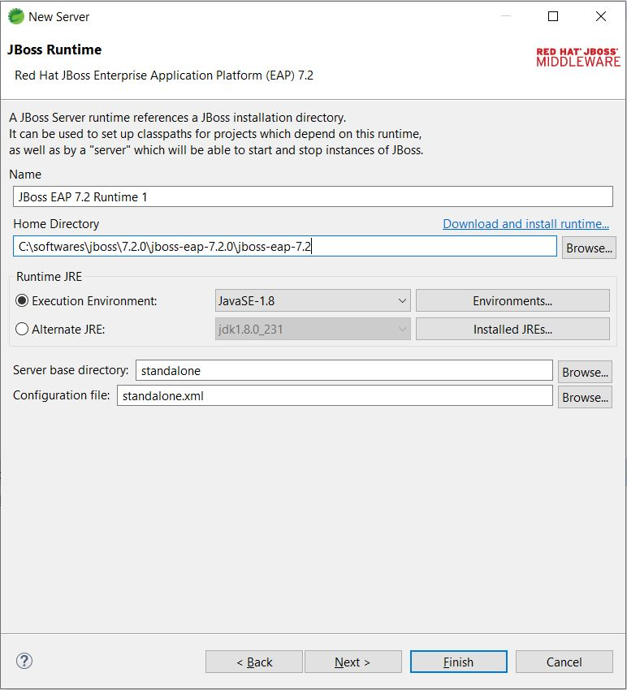

# Notes

## Installing Jboss 7.2.0 using zip
* Create redhat account. This is needed to download jboss 7.2.0 zip
* Download jboss 7.2.0 zip from https://developers.redhat.com/products/eap/download
* Unzip to any folder
* Add new user
	* Navigate to unzipped folder bin location. Ex: `jboss-eap-7.2.0\jboss-eap-7.2\bin`
	* Run `add-user.bat` file. Give credentials when prompted
```
C:\softwares\jboss\7.2.0\jboss-eap-7.2.0\jboss-eap-7.2\bin>add-user.bat

What type of user do you wish to add?
 a) Management User (mgmt-users.properties)
 b) Application User (application-users.properties)
(a): a

Enter the details of the new user to add.
Using realm 'ManagementRealm' as discovered from the existing property files.
Username : jboss
User 'admin' already exists and is disabled, would you like to...
 a) Update the existing user password and roles
 b) Enable the existing user
 c) Type a new username
(a): b
Updated user 'admin' to file 'C:\softwares\jboss\7.2.0\jboss-eap-7.2.0\jboss-eap-7.2\standalone\configuration\mgmt-users.properties'
Updated user 'admin' to file 'C:\softwares\jboss\7.2.0\jboss-eap-7.2.0\jboss-eap-7.2\domain\configuration\mgmt-users.properties'
Updated user 'admin' with groups null to file 'C:\softwares\jboss\7.2.0\jboss-eap-7.2.0\jboss-eap-7.2\standalone\configuration\mgmt-groups.properties'
Updated user 'admin' with groups null to file 'C:\softwares\jboss\7.2.0\jboss-eap-7.2.0\jboss-eap-7.2\domain\configuration\mgmt-groups.properties'
Press any key to continue . . .
```
* Start jboss
	* Run `standalone.bat` from `bin` folder
```
C:\softwares\jboss\7.2.0\jboss-eap-7.2.0\jboss-eap-7.2\bin>standalone.bat
Calling "C:\softwares\jboss\7.2.0\jboss-eap-7.2.0\jboss-eap-7.2\bin\standalone.conf.bat"
Setting JAVA property to "C:\Program Files\Java\jdk1.8.0_231\bin\java"
===============================================================================

  JBoss Bootstrap Environment

  JBOSS_HOME: "C:\softwares\jboss\7.2.0\jboss-eap-7.2.0\jboss-eap-7.2"

  JAVA: "C:\Program Files\Java\jdk1.8.0_231\bin\java"

  JAVA_OPTS: "-Dprogram.name=standalone.bat -Xms1G -Xmx1G -XX:MetaspaceSize=96M -XX:MaxMetaspaceSize=256m -Djava.net.preferIPv4Stack=true -Djboss.modules.system.pkgs=org.jboss.byteman -verbose:gc -Xloggc:"C:\softwares\jboss\7.2.0\jboss-eap-7.2.0\jboss-eap-7.2\standalone\log\gc.log" -XX:+PrintGCDetails -XX:+PrintGCDateStamps -XX:+UseGCLogFileRotation -XX:NumberOfGCLogFiles=5 -XX:GCLogFileSize=3M -XX:-TraceClassUnloading "

===============================================================================

14:35:35,997 INFO  [org.jboss.modules] (main) JBoss Modules version 1.8.6.Final-redhat-00001
14:35:37,646 INFO  [org.jboss.msc] (main) JBoss MSC version 1.4.5.Final-redhat-00001
14:35:37,664 INFO  [org.jboss.threads] (main) JBoss Threads version 2.3.2.Final-redhat-1
14:35:37,891 INFO  [org.jboss.as] (MSC service thread 1-1) WFLYSRV0049: JBoss EAP 7.2.0.GA (WildFly Core 6.0.11.Final-redhat-00001) starting
14:35:39,040 INFO  [org.wildfly.security] (ServerService Thread Pool -- 27) ELY00001: WildFly Elytron version 1.6.1.Final-redhat-00001
14:35:40,122 INFO  [org.jboss.as.controller.management-deprecated] (Controller Boot Thread) WFLYCTL0028: Attribute 'security-realm' in the resource at address '/core-service=management/management-interface=http-interface' is deprecated, and may be removed in a future version. See the attribute description in the output of the read-resource-description operation to learn more about the deprecation.
14:35:40,145 INFO  [org.jboss.as.controller.management-deprecated] (ServerService Thread Pool -- 26) WFLYCTL0028: Attribute 'security-realm' in the resource at address '/subsystem=undertow/server=default-server/https-listener=https' is deprecated, and may be removed in a future version. See the attribute description in the output of the read-resource-description operation to learn more about the deprecation.
14:35:40,199 INFO  [org.jboss.as.server] (Controller Boot Thread) WFLYSRV0039: Creating http management service using socket-binding (management-http)
14:35:40,218 INFO  [org.xnio] (MSC service thread 1-6) XNIO version 3.6.5.Final-redhat-00001
14:35:40,227 INFO  [org.xnio.nio] (MSC service thread 1-6) XNIO NIO Implementation Version 3.6.5.Final-redhat-00001
14:35:40,278 WARN  [org.jboss.as.txn] (ServerService Thread Pool -- 68) WFLYTX0013: The node-identifier attribute on the /subsystem=transactions is set to the default value. This is a danger for environments running multiple servers. Please make sure the attribute value is unique.
14:35:40,305 INFO  [org.wildfly.extension.microprofile.opentracing] (ServerService Thread Pool -- 59) WFLYTRACEXT0001: Activating MicroProfile OpenTracing Subsystem
14:35:40,302 INFO  [org.jboss.as.security] (ServerService Thread Pool -- 66) WFLYSEC0002: Activating Security Subsystem
14:35:40,297 INFO  [org.jboss.as.webservices] (ServerService Thread Pool -- 70) WFLYWS0002: Activating WebServices Extension
14:35:40,298 INFO  [org.jboss.as.clustering.infinispan] (ServerService Thread Pool -- 48) WFLYCLINF0001: Activating Infinispan subsystem.
14:35:40,313 INFO  [org.jboss.as.naming] (ServerService Thread Pool -- 60) WFLYNAM0001: Activating Naming Subsystem
14:35:40,315 INFO  [org.wildfly.extension.microprofile.config.smallrye._private] (ServerService Thread Pool -- 57) WFLYCONF0001: Activating WildFly MicroProfile Config Subsystem
14:35:40,326 INFO  [org.jboss.as.security] (MSC service thread 1-5) WFLYSEC0001: Current PicketBox version=5.0.3.Final-redhat-3
14:35:40,328 INFO  [org.wildfly.extension.microprofile.health.smallrye] (ServerService Thread Pool -- 58) WFLYHEALTH0001: Activating Eclipse MicroProfile Health Subsystem
14:35:40,362 INFO  [org.jboss.as.jaxrs] (ServerService Thread Pool -- 50) WFLYRS0016: RESTEasy version 3.6.1.SP2-redhat-00001
14:35:40,382 INFO  [org.jboss.as.jsf] (ServerService Thread Pool -- 55) WFLYJSF0007: Activated the following JSF Implementations: [main]
14:35:40,383 INFO  [org.jboss.as.mail.extension] (MSC service thread 1-4) WFLYMAIL0002: Unbound mail session [java:jboss/mail/Default]
14:35:40,388 INFO  [org.jboss.as.connector] (MSC service thread 1-1) WFLYJCA0009: Starting JCA Subsystem (WildFly/IronJacamar 1.4.11.Final-redhat-00001)
14:35:40,420 INFO  [org.wildfly.extension.undertow] (MSC service thread 1-8) WFLYUT0003: Undertow 2.0.15.Final-redhat-00001 starting
14:35:40,437 INFO  [org.jboss.as.connector.subsystems.datasources] (ServerService Thread Pool -- 41) WFLYJCA0004: Deploying JDBC-compliant driver class org.h2.Driver (version 1.4)
14:35:40,502 INFO  [org.jboss.as.connector.deployers.jdbc] (MSC service thread 1-3) WFLYJCA0018: Started Driver service with driver-name = h2
14:35:40,552 INFO  [org.jboss.as.naming] (MSC service thread 1-3) WFLYNAM0003: Starting Naming Service
14:35:40,596 INFO  [org.jboss.as.mail.extension] (MSC service thread 1-8) WFLYMAIL0001: Bound mail session [java:jboss/mail/Default]
14:35:40,604 INFO  [org.jboss.as.connector.subsystems.datasources] (MSC service thread 1-8) WFLYJCA0010: Unbound data source [java:jboss/datasources/ExampleDS]
14:35:40,770 INFO  [org.wildfly.extension.undertow] (ServerService Thread Pool -- 69) WFLYUT0014: Creating file handler for path 'C:\softwares\jboss\7.2.0\jboss-eap-7.2.0\jboss-eap-7.2/welcome-content' with options [directory-listing: 'false', follow-symlink: 'false', case-sensitive: 'true', safe-symlink-paths: '[]']
14:35:41,125 INFO  [org.wildfly.extension.io] (ServerService Thread Pool -- 49) WFLYIO001: Worker 'default' has auto-configured to 16 core threads with 128 task threads based on your 8 available processors
14:35:41,145 INFO  [org.jboss.as.ejb3] (MSC service thread 1-8) WFLYEJB0481: Strict pool slsb-strict-max-pool is using a max instance size of 128 (per class), which is derived from thread worker pool sizing.
14:35:41,146 INFO  [org.jboss.as.ejb3] (MSC service thread 1-7) WFLYEJB0482: Strict pool mdb-strict-max-pool is using a max instance size of 32 (per class), which is derived from the number of CPUs on this host.
14:35:41,239 INFO  [org.jboss.remoting] (MSC service thread 1-3) JBoss Remoting version 5.0.8.Final-redhat-1
14:35:41,242 INFO  [org.wildfly.extension.undertow] (MSC service thread 1-7) WFLYUT0012: Started server default-server.
14:35:41,247 INFO  [org.wildfly.extension.undertow] (MSC service thread 1-1) WFLYUT0018: Host default-host starting
14:35:41,309 INFO  [org.wildfly.extension.undertow] (MSC service thread 1-7) WFLYUT0006: Undertow HTTP listener default listening on 127.0.0.1:8080
14:35:41,357 INFO  [org.jboss.as.ejb3] (MSC service thread 1-8) WFLYEJB0493: EJB subsystem suspension complete
14:35:41,386 INFO  [org.jboss.as.patching] (MSC service thread 1-6) WFLYPAT0050: JBoss EAP cumulative patch ID is: base, one-off patches include: none
14:35:41,407 WARN  [org.jboss.as.domain.management.security] (MSC service thread 1-6) WFLYDM0111: Keystore C:\softwares\jboss\7.2.0\jboss-eap-7.2.0\jboss-eap-7.2\standalone\configuration\application.keystore not found, it will be auto generated on first use with a self signed certificate for host localhost
14:35:41,412 INFO  [org.jboss.as.server.deployment.scanner] (MSC service thread 1-5) WFLYDS0013: Started FileSystemDeploymentService for directory C:\softwares\jboss\7.2.0\jboss-eap-7.2.0\jboss-eap-7.2\standalone\deployments
14:35:41,450 INFO  [org.jboss.as.connector.subsystems.datasources] (MSC service thread 1-5) WFLYJCA0001: Bound data source [java:jboss/datasources/ExampleDS]
14:35:42,086 INFO  [org.wildfly.extension.undertow] (MSC service thread 1-2) WFLYUT0006: Undertow HTTPS listener https listening on 127.0.0.1:8443
14:35:42,334 INFO  [org.jboss.ws.common.management] (MSC service thread 1-4) JBWS022052: Starting JBossWS 5.2.4.Final-redhat-00001 (Apache CXF 3.2.5.redhat-00001) 
14:35:42,403 INFO  [org.jboss.as.server] (Controller Boot Thread) WFLYSRV0212: Resuming server
14:35:42,406 INFO  [org.jboss.as] (Controller Boot Thread) WFLYSRV0060: Http management interface listening on http://127.0.0.1:9990/management
14:35:42,406 INFO  [org.jboss.as] (Controller Boot Thread) WFLYSRV0051: Admin console listening on http://127.0.0.1:9990
14:35:42,407 INFO  [org.jboss.as] (Controller Boot Thread) WFLYSRV0025: JBoss EAP 7.2.0.GA (WildFly Core 6.0.11.Final-redhat-00001) started in 7685ms - Started 306 of 527 services (321 services are lazy, passive or on-demand)
```
* Access jboss using url - `http://localhost:8080`\

* Access jboss admin console using url - `http://localhost:9990`\
	* Enter credentials of user created above


## Configure Jboss EAP 7.2.0 in STS
* Window > Preferences > Server > Runtime Environments > click Add
* Should have jboss plugin like below\

* If jboss plugin are not there then go Help > Install New Software
* Paste this url - https://download.jboss.org/jbosstools/photon/stable/updates/
* Install Jboss server tools
* Select appropriate jboss plugin version based on jboss version
* Next\

* Give jboss home directory\

* Start server
* Access jboss - `http://localhost:8080`
* Access jboss admin console using url - `http://localhost:9990`