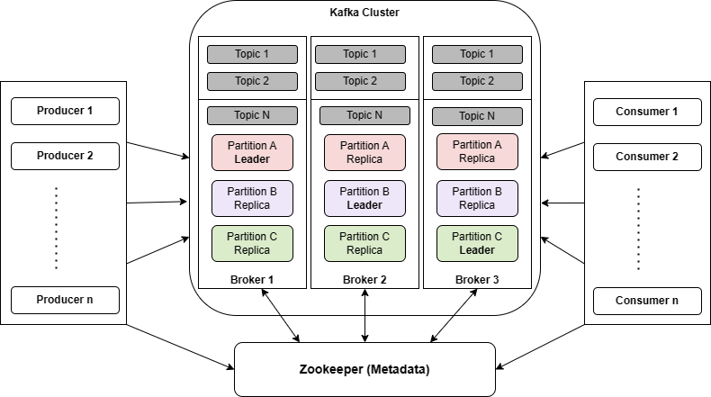
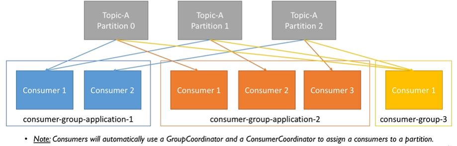
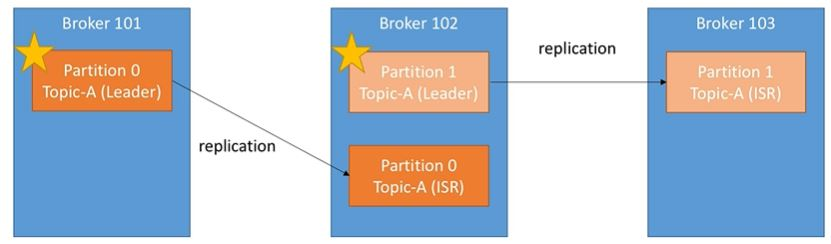
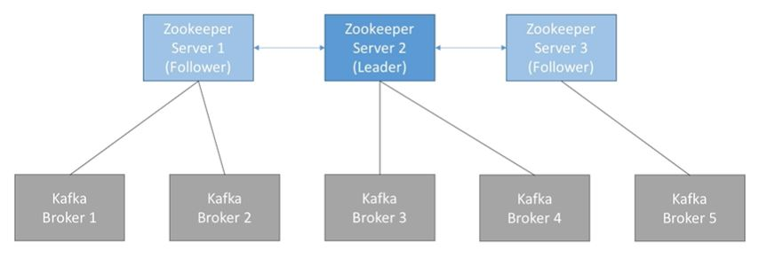

# Kafka Notes

## Why Kafka
* We have source system and target system and they exchange data
* So next step is there are number of source systems and number of target systems. When all of them want to exchange data with one another then things become very complicated
* Lets say we have 5 source systems and 6 target systems then we need to write (5*6) == 30 integrations
* Each integration can have it's difficulties like
	* Protocol - how data has to be exchanged like TCP, Http, REST, FTP, JDBC etc
	* Data Format like Binary, CSV, XML, JSON, AVRO etc
	* Data schema and evaluation
* There can be increased load from the connections
* To solve above problem we need to use Apacha Kafka
	* Allows decouple data streams and systems (source and target)
	* Source systems send data to Apache Kafka
	* Target system take data from Apacha Kafka
	* Once we have data in Kafka we can put in systems like
		* Database
		* Analytics systems
		* Schema systems

## Basics
* Message retaining
	* Traditional messaging system has transient message persistance. Means once message is consumed by consumer it will be deleted from the message broker
	* In the case of Kafka - event will be saved in the file system where kafka is installed. Events are retained for certain time
* All the events in kafka are immutable. Means once message sent to kafka, it cannot be altered
* Any consumer who has access to broker can read the message
* Kafka is distributed streaming system. Not a just messaging system
* Created by LinkedIn and open sourced
* Currently maintained by `Confluent`. Refer [Confluent Docs](https://docs.confluent.io/current/)
* Distributed
* Resilient Architecture - Means recover quickly from failures
* Fault Tolerant
* Horizontal Scalability
	* Can have 100s of brokers
	* Can scale to millions of messages per second
* High performance (latency of less than 10 ms)

## Use cases
* Messaging system
* Activity Tracking
* Gather metrics from many different locations
* Application log gathering
* Stream processing
	* Kafka streams API
	* Spark
* De-coupling system dependencies
* Integration with big data systems like
	* Spark
	* Flink
	* Storm
	* Hadoop

## History
* Kafka Connect introduced in Kafka 0.9.x in Nov-2015
* Kafka Streams API introduced in Kafka 0.10.x in May-2016
* Kafka 0.10.1 and 0.10.2 - end of 2016 to March 2017
	* Improved Connect API
	* Single Message Transforms API

# Architecture

	
## Kafka Terminology and Client APIs
* Broker: all kafka clients interact with
* Cluster
	* consists of multiple brokers
	* In order to manage multiple brokers in cluster we need Zookeeper. Zookeeper keeps track of health of brokers and manage the cluster for you
* [Topic](#topic)
* [Partition](#partitions)
* Partitioner
	* [Send message without key](#sending-message-without-key)
	* [Send message with key](#sending-message-with-key)
* [Producers](#producers)
	* Client to kafka broker
	* Produce new data to kafka
* [Consumer](#consumer)
	* Consume messages from kafka broker
* Kafka Connect
	* Source Connector: Used to pull the data from external data source such as database, file system, ElasticSearch into kafka topic
	* Sink Connector: Push data from kafka topic to external data sources such as database, file system, ElasticSearch etc
* Kafka Streams
	* Kafka to Kafka data transfer
	* Take the data from kafka and perform simple to complex transformations and put it back to kafka
* Offset
* [__consumer_offsets](#consumer-offset)
* [Consumer Groups](#consumer-groups)
* [Commit Logs](#commit-log)
* [Retention Policy](#retention-policy): Determines how long the message is going to be retained
* Broker Controller: Let's say we have kafka cluster with 3 brokers. out of 3 brokers 1 broker will behave as controller. Normally this will be first broker which joined the cluster
* replication-factor: number of copies of same message
* [ISR - In-sync replica](#in-sync-replica-isr): Represents the number of replicas in sync with each other in the cluster including leader and follower replica
* [Leader Replica](#kafka-handling-data-loss)
* [Follower Replica](#kafka-handling-data-loss)
* Record Accumulator
* RecordBatch
	
## Kafka Topics and Partitions
### Topic
* Kafka topic is like table in database (without constraints)
* We can have as many topics we want
* Every topic is defined by it's name
* Topics are split into `Partitions`
	* Each partition has number starts with zero(0) like partition-0, partition-1
	* Each partition is ordered
	* Each message within partition get an incermental id called `offset`\

* Topic live inside kafka broker
* Kafka clients uses topic name to produce and consume messages
* Kafka consumers generally poll continuously for new messsages
### Partitions
* Where message actually located inside topic
* Each topic can have one or more partitions
* Partitions have effect on scalable message consumption
* Each partition is ordered, immutable, sequence of records
* Each record has number associated with it called `offset`
* `offset` is generated when record is published to kafka topic
* Each partition is independent of each other
* Ordering is guaranteed only at partition level
* Partitions continuously grow as new records produced and offset gets incremented one by one
* All records are persisted in commit log in file system where kafka is installed
* Producer can control to which partition the message can go

## Producers
* Client to kafka broker
* Produce new data to kafka
* Producers can choose to receive acknowledgement of data it writes to kafka
	* acks=0; - Producer won't wait for acknowledgement. Possible data loss
	* acks=1; Producer will wait for leader to acknowledge. Default value. Limited data loss
	* acks=all; Leader and all replicas acknowledge. No data loss
* Producers can send key with message. Key data type can be anything like String, Integer, Char etc
* If key==null, data is sent in round robin to multiple partitions
* If key is sent, then all messages with same key go to same partition
* A key is basically needed if we want to sort message by specific fields
	* For example if we want transactions of one account-number in one partition then we can use account-number as key
* We cannot say which key goes to which partition. But all same keys go to same partition

## Consumer
* Consumer read data from topic (identified by name)
* Consumer should know broker details
* Data is read sequentially within each partition
* Consumers can read data from multiple partition
* There is no guarantee in the order of reading multiple partitions
* Multiple partition reads happens in parallel

## Consumer Groups
* Consumers read data in consumer groups
* Each consumer within group reads from exclusive partitions\

* If we have more consumers than partitions in the same consumer group then some consumers will be inactive\

* Group id plays major role when it comes to scalable message consumption
* Different applications need to have unique group id
* who manages consumer group?
	* Kafka broker manages the consumer groups
	* Kafka broker also acts as group co-ordinator
	
## Consumer Offset
* Kafka stores the offsets at which consumer group has been reading
* Any message produced to topic will have unique id called `offset`
* Consumers will have 3 options when reading messages from topic
	* from-beginning: all messages from starting
	* latest: read only messages that came after consumer started. `Default value`
	* specific offset: read messages in the topic by passing `offset` values from consumer. This option can only be done programmatically
* Consumer read each message and after reading message offset incremented by 1. Once all the poll records are read then consumer commits the offset to the topic named `__consumer_offsets` with the group id. Now consumer is down and brought up after some time. By this time producer produced some more messages. Now consumer know where to start to consume message with the value present in `__consumer_offsets` topic with the group id

## Delivery semantics for consumers
* Consumers can choose when to commit offsets
* There are 3 delivery semantics
	* At most once
		* offsets are committed as soon as message is received
		* If processing went wrong then message will be lost (it won't be read again)
		* Not preferred
	* At least once
		* Preferred
		* Offsets are committed after the message is processed
		* If process went wrong then message will be read again
		* This technique is duplicates messages processing so make sure processing again the message won't impact the system
	* Exactly once
		* Can be achieved for Kafka-to-Kafka workflows using Kafka Streams API
		* For Kafka to external system workflows (like databases), we have to use idempotent consumers to make sure there are no duplicate records

## Sending message without key
* When we send message to topic, it will go through `Partitioner`
* If key is not present with message `partitioner` will follow round robin technique
* Partitioner will send messages to different partitions in round robin fashion

## Sending message with key
* Every message will have a key
* We can use any datatype for key. General practice is to use String
* When message contains key then `partitioner` will apply hashing technique to determine partition
* Multiple messages can be sent with same key. Then they all goes to same partition

## Commit Log and Retention Policy
### Commit Log
* When producer sends a message, first it reaches topic and then record written to file system in the machine. Record always writtent to file system as bytes
* In file system where that records needs to be written is configured with `log.dirs` property in `kafka-directory/config/server.properties` file
* File will be present in that location with extension `.log`
* Each partition will have it's own log
* After messages are written to log files then records are committed. Consumer who is polling records can only see records which are committed to the file system
* As new records produced they get appended to log file
### Retention Policy
* Determines how long the message is going to be retained?
* Retention policy is configured using property `log.retention.hours` in `kafka-directory/config/server.properties` file. Default retention period is `168 hours` that is `7 days`

## Kafka as distributed streaming platform
### What is distributed system
* collection of systems work together to deliver the functionality
#### Charateristics of distributed system
* Availability and fault tolerance
* Reliable work distribution. client requests equally distributed among the available systems
* Easily scalable
* Handling concurrency is easy
### Single point of failure
* All Producer and consumers interact with kafka with Broker
* If broker goes down then all producer and consumer requests will fail
* This will become single point of failure
### How to solve single point of failure
* Let's say we have cluster of 3 brokers
* Cluster will be managed by zoo-keeper
* All brokers send heart beat to zoo-keeper at regular intervals to ensure state of kafka broker is healthy to serve client requests
* Client requests distributed among 3 brokers. If any of the broker goes down then zoo-keeper gets notified then all client requests will be routed to other available brokers

## Setting up kafka cluster in local with 3 brokers
* In order to start multiple kafka brokers, we need to have different `server.properties` file for each broker. This new `server.properties` should have unique values compared to other `server.properties`
```
broker.id=1
listeners=PLAINTEXT://localhost:9093
log.dirs=C:/softwares/kafka/logs1
auto.create.topics.enable=false(optional)
```
* Start `zoo-keeper`
```
\zoo-keeper\apache-zookeeper-3.6.1-bin.tar\apache-zookeeper-3.6.1-bin\apache-zookeeper-3.6.1-bin\bin\zkServer.cmd
```
* Create 3 new `server.properties` files. Pass each `server.properties` while starting the broker
	* Refer samples `server.properties` files - https://github.com/avinashbabudonthu/jms/tree/master/kafka/kafka-server-properies-files
* Start 3 brokers
```
.\bin\windows\kafka-server-start.bat .\config\server.properties
.\bin\windows\kafka-server-start.bat .\config\server-1.properties
.\bin\windows\kafka-server-start.bat .\config\server-2.properties
```
* Go to log files
	* we will have log folder with log files each with respective broker's logs
	
## How kafka cluster distributes the client requests
### How Topics are distributed across available brokers
* Let's say we have kafka cluster with 3 brokers
	* out of 3 brokers 1 broker will behave as `controller`. Normally this will be first broker which joined the cluster
* when create topic command is executed then zoo-keeper redirects request to controller
	* Let's say want to create `test` topic with 3 partitions
* Controller distributes the ownership of partitions to available brokers. This concept of distributing partitions to brokers is called `Leader Assignment`
* Finally `test` topic is distributed across kafka cluster
### Kafka distribute client requests from Kafka Producer
* Messages will go through `partitioner`
* Producer requests are distributed based on partitions. Since partitions present on different brokers, messages will go to different brokers
### Kafka distribute client requests from Kafka Consumer
* When poll is executed then request goes to all partitions and retrieve records from them
### Kafka distribute client requests with Kafka Consumer Groups
* Let's say we have 2 brokers, each with 1 partition
* We have 3 consumers with same group id. Now each consumer will be polling on each partition
* Now requests from consumer will be routed to respective partition and get message
### Summary
* Parition leader is assigned during topic creation
* Clients only invoke leader of partition  to produce and consume data
	* Load is evenly distributed between the brokers
	
## How kafka handles data loss when broker fails?
* We have kafka cluster with 3 brokers
	* broker-1
	* broker-2
	* broker-3
* We have 3 partitions distributed to 3 brokers
	* partition-0 to broker-1
	* partition-1 to broker-2
	* partition-2 to broker-3
* Now broker-1 goes down. This is leader of partition-0
	* All the data written to partition-0 present in broker-1 file system
	* Now data in broker-1 is lost
### Kafka handling data loss
* Kafka handles data loss issue told above using `Replication`
* We give `replication-factor` while creating topic
```
kafka-topics.bat --create --zookeeper localhost:2181 --replication-factor 3 --partitions 4 --topic topic-2
```
* Replication factor means number of copies of same message
* Kafka producer produced message to partition-0 and it goes to broker-1. Message is persisted to file system
* since `replication-factor=3`, 2 more copies of same message will be created to
	* broker-2
	* broker-3
* Here for this data
	* broker-1 is `Leader Replica`
	* broker-2, broker-3 are `Follower Replica`\

	
## In-sync replica (ISR)
* Represents the number of replicas in sync with each other in the cluster including leader and follower replica
* Recommended value for in-sync-replica is greater than 1
* Ideal value is ISR == Replication Factor
* This can be configured with property `min.insync.replicas`
	* This can be set at `topic` or `broker` level
```
kafka-topics.bat --alter --zookeeper localhost:2181 --topic library-events --config min.insync.replicas=2
```	
## Fault Tolerance and Robustness
* Even though broker is down in cluster then clients does not know about it
* Client can still send and receive messages

## How to send message from spring boot to kafka
* Using `org.springframework.kafka.core.KafkaTemplate<K, V>`
### How KafkaTemplate works
* KafkaTemplate.send(): Sends message to kafka
* Before message goes to kafka it goes through some other layers as below
	* `Serializer`: Any record that sent to kafka needs to be serialized to `Bytes`. There are 2 types serialization techniques that applies to any record. This is mandatory for any producer. Client has to provide values for `key.serializer` and `value.serializer`. Kafka client java libraries comes with some pre-defined serializers
		* key.serializer
		* value.serializer
	* `Partitioner`: To decide which partition that message has to go in the topic. Kafka Producer API comes with `DefaultPartitioner` to handle partitioner logic. There are options to override `DefaultPartitioner` logic
	* `Record Accumulator`: Any record that sent from KafkaTemplate goes to Record Accumulator. Record Accumulator buffers the records and sent to kafka topic once buffer is full. The reason for this is to limit the number of calls from application to kafka cluster. Records in Record Accumulator are saved as `RecordBatch`.
		* Each RecordBatch has batch size. Represented by `batch.size` property. Value is number of bytes
		* Record Accumulator has buffer memory represented by property `buffer.memory`. Value is number of bytes
		* Once RecordBatch is full then message will be sent to Kafka topic
		* If batch is not full then Producer API is not going to wait until it is full. We can declare property `linger.ms` which is in milli seconds. If RecordBatch is not full but `linger.ms` time is up then message will be sent to kafka topic
### Configuring kafka template
* Mandatory values
```
bootstrap-servers: localhost:9092, localhost:9093, localhost:9094 ## broker urls
key-serializer: org.apache.kafka.common.serialization.IntegerSerializer
value-serializer: org.apache.kafka.common.serialization.StringSerializer
```
* We can write custom key-serializer or value-serializer
* KafkaTemplate Auto configuration with Spring Boot `application.yml`
```
spring:
 profiles: localhost
  kafka:
   producer:
    bootstrap-servers: localhost:9092, localhost:9093, localhost:9094
    key-serializer: org.apache.kafka.common.serialization.IntegerSerializer
    value-serializer: org.apache.kafka.common.serialization.StringSerializer
```
* `org.springframework.boot.autoconfigure.kafka.KafkaAutoConfiguration` reads kafka properties from `application.yml` and create `KafkaTemplate`

## spring Kafka Consumers
* `MessageListenerContainer` interface. It has 2 implementations
	* KafkaMessageListenerContainer
	* ConcurrentMessageListenerContainer
* KafkaListener annotation
	* Uses `ConcurrentMessageListenerContainer` internally
### KafkaMessageListenerContainer
* Implementation of MessageListenerContainer
* Polls the records
* Commits the offsets
* Single threaded. Means poll call is handled by single thread
### ConcurrentMessageListenerContainer
* Represents multiple `KafkaMessageListenerContainer`
### KafkaListener annotation
* Simplest way to build kafka consumer
* Sample code
	* Add `@KafkaListener` annotation to a method in class which is bean
	* Add `@EnableKafka` annotation to Configuration class 
```
@KafkaListener
public void onMessage(ConsumerRecord<Integer, String> consumerRecord){
	log.info("consumer-record={}", consumerRecord);
}

@Configuration
@EnableKafka
@Slf4j
public class AppConfig{
	---
}
```
* We need to provide following KafkaConsumer configuration
	* key-deserializer
	* value-deserializer
	* group-id
* References - https://docs.spring.io/spring-kafka/reference/html/#receiving-messages

## Spring Boot Kafka Consumer auto configuration
* Every thing is from `KafkaAutoConfiguration`, `KafkaAnnotationDrivenConfiguration` classes

## Kafka Schema Registry
### Why schema registry
* Kafka takes bytes as input and publish them
* Kafka does not perform any data verification
* Producer sends bytes (0s and 1s)
* Multiple consumers receive them
* What if producer sends bad data? what if field gets renamed? what if data format changes? - then consumers will BREAK
* We need data to be self describable
* We need to be able to evovle data without breaking downstream consumers. For this we need `schema` and `schema registry`

### What if kafka brokers verify messages they receive?
* This will break what makes kafka so good
	* Kafka does not parse or even read data (no CPU usage)
	* Kafka takes the bytes as input without even loading them into memory (that is called zero copy)
	* Kafka distributes bytes
	* As for kafka, it does not know if data is Integer or String etc
* If we change this behavior then we see performance hit

### Solve above issue with Schema Registry
* Schema registry has to be separate component
* Producers and consumes should be able talk to it
* Schema registry must able to reject bad data
* Common data format must be agreed upon. Data format should have following characteristics:
	* Support Schemas
	* Support Evolution
	* Lightweight

## Concept of Leader for Partition
* At any time only ONE broker can be leader for given partition
* Only that leader can receive or send data for partition
* The other brokers will synchronize the data
* So each partition will have 1 leader and multiple ISR (In Sync Replica)\


## Kafka broker discovery
* Every kafka broker is called `bootstrap server`
* We only need to connect to one broker and we will be connected to entire cluster
* Each broker knows about all brokers, topics, partitions\

* Above will be done automatically we don't need to externally code for it

## Zookeeper
* Manages brokers (keeps list of them)
* Helps in performing leader election for partitions
* Sends notifications to kafka in case of changes like
	* new topic
	* broker dies
	* broker came up
	* delete topic
* Kafka can't work without zookeeper
* Zookeeper by design operated with an odd number of servers. Means if we want to have zookeeper cluster then we need to start 1, 3, 5, 7 instances
* zookeeper has leader (handle writes) the rest of servers are followers (handle reads)\

------
# Kafka and Kafka UI with Docker
* Rename file `docker-compose-with-kafka-ui.yml` to `docker-compose.yml`
* Docker compose file [docker-compose.yml](docker-compose.yml)
* In this setup, our Zookeeper server is listening on port=2181 for the kafka service, which is defined within the same container setup. However, for any client running on the host, it'll be exposed on port 22181.
* Similarly, the kafka service is exposed to the host applications through port 29092, but it is actually advertised on port 9092 within the container environment configured by the KAFKA_ADVERTISED_LISTENERS property.
* Start Kafka Server. Open `cmd` where `docker-compose.yml` file is there. Start the Kafka server by spinning up the containers using the docker-compose command
```
$ docker-compose up -d
Creating network "kafka_default" with the default driver
Creating kafka_zookeeper_1 ... done
Creating kafka_kafka_1     ... done
```
* To connect to kafka ui tool like `Offset Explorer`
* Zookeeper url - http://localhost:22181
* Kafka broker url - http://localhost:29092
* Kafka UI - open this link in browser - http://localhost:8080
* Stop containers
```
docker-compose down
```