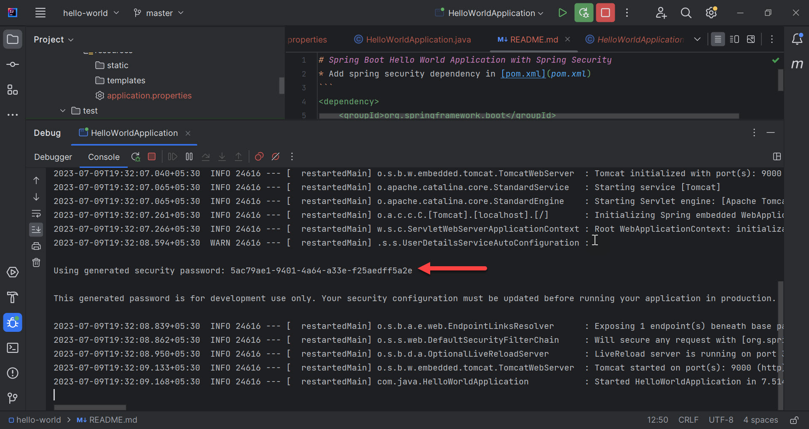
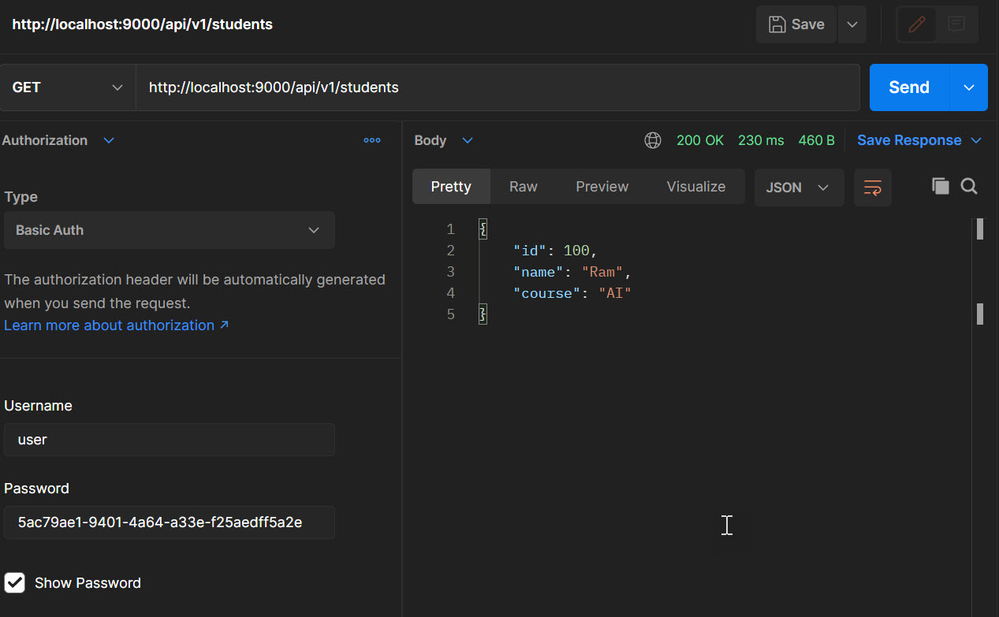

# Spring Boot Basic Authentication Hello World Application with Spring Security
* Add spring security dependency in [pom.xml](pom.xml)
```
<dependency>
    <groupId>org.springframework.boot</groupId>
    <artifactId>spring-boot-starter-security</artifactId>
</dependency>
```
* Main class - [HelloWorldApplication.java](src/main/java/com/java/HelloWorldApplication.java)
* Properties - [application.properties](src/main/resources/application.properties)
* Controller class - [AppController](src/main/java/com/java/controller/AppController.java)
* Start the application. Check the console for default random password\

* Hit API - http://localhost:9000/api/v1/students
* Enter credentials
	* username - user
	* password - password-generated-above\

* [postman collection](postman/hello-world.postman_collection.json)