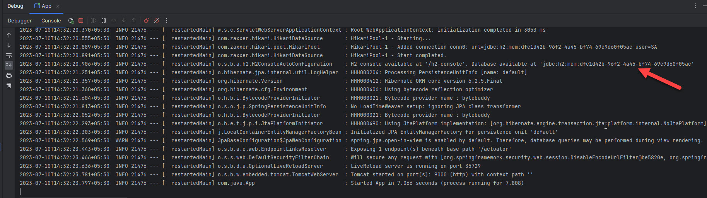
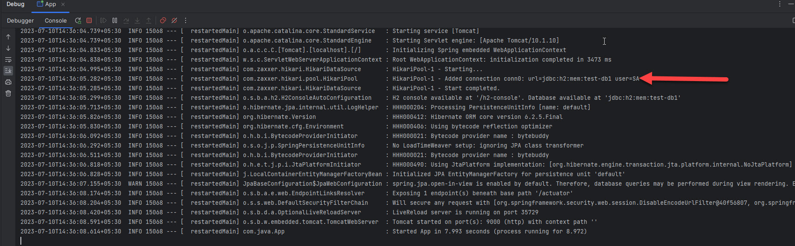

# With H2 DB
* Dependencies in [pom.xml](pom.xml)
  * H2 dependency added
* Main class - [App.java](src/main/java/com/java/App.java)
* Properties - [application.properties](src/main/resources/application.properties)
* Postman collection - [postman collection](postman)
* Start the application. H2 db also started. We can see logs in console. Open url - http://localhost:9000/h2-console
  * Enter any one of credentials - user1/pwd1, user2/pwd2 - created in [SecurityConfig.java](src/main/java/com/java/config/SecurityConfig.java)

* On every login new connection url will be created for h2 database. To avoid this we can add following property in [application.properties](src/main/resources/application.properties)
```
spring.datasource.url=jdbc:h2:mem:test-db1
```

* After opening url - http://localhost:9000/h2-console - enter credentials and then enter db credentials `SA`, no password - we will 403 error. Do following to fix this
* Disable `CSRF`, `Frames`. Refer [SecurityConfig.java](src/main/java/com/java/config/SecurityConfig.java) - `filterChain` method
------
# Reference Documentation
For further reference, please consider the following sections:
* [Official Apache Maven documentation](https://maven.apache.org/guides/index.html)
* [Spring Boot Maven Plugin Reference Guide](https://docs.spring.io/spring-boot/docs/3.1.1/maven-plugin/reference/html/)
* [Create an OCI image](https://docs.spring.io/spring-boot/docs/3.1.1/maven-plugin/reference/html/#build-image)
* [Spring Web](https://docs.spring.io/spring-boot/docs/3.1.1/reference/htmlsingle/#web)
* [Spring Boot Actuator](https://docs.spring.io/spring-boot/docs/3.1.1/reference/htmlsingle/#actuator)
* [Spring Boot DevTools](https://docs.spring.io/spring-boot/docs/3.1.1/reference/htmlsingle/#using.devtools)
* [Spring Security](https://docs.spring.io/spring-boot/docs/3.1.1/reference/htmlsingle/#web.security)
* [Spring Data JPA](https://docs.spring.io/spring-boot/docs/3.1.1/reference/htmlsingle/#data.sql.jpa-and-spring-data)
------
# Guides
The following guides illustrate how to use some features concretely:
* [Building a RESTful Web Service](https://spring.io/guides/gs/rest-service/)
* [Serving Web Content with Spring MVC](https://spring.io/guides/gs/serving-web-content/)
* [Building REST services with Spring](https://spring.io/guides/tutorials/rest/)
* [Building a RESTful Web Service with Spring Boot Actuator](https://spring.io/guides/gs/actuator-service/)
* [Securing a Web Application](https://spring.io/guides/gs/securing-web/)
* [Spring Boot and OAuth2](https://spring.io/guides/tutorials/spring-boot-oauth2/)
* [Authenticating a User with LDAP](https://spring.io/guides/gs/authenticating-ldap/)
* [Accessing Data with JPA](https://spring.io/guides/gs/accessing-data-jpa/)

