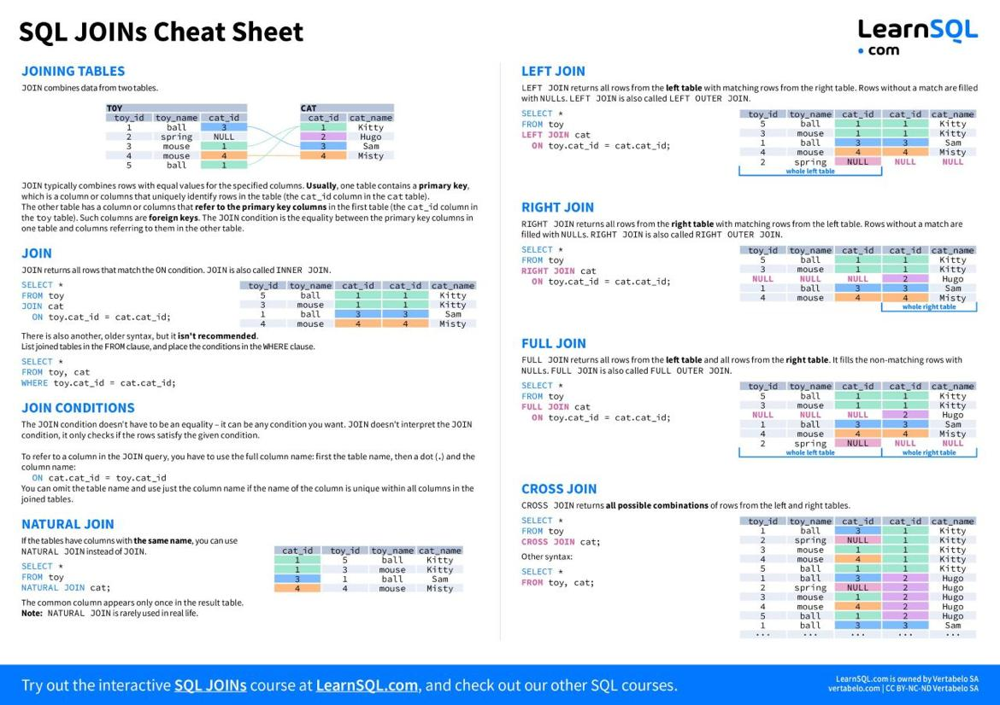

# Materials
* [Client server model](The+Client-Server+Model.pdf)
------
# Notes

# Steps in Setting up databases
*Database design
	* ER Diagram
	* Relational Schema
* Create database
* Update database
* DBA
	* Regular health and maintenence of database
* Table name with columns - Relational Schema
* Relational schema with relations is Database schema

# what is sql?
* Structured Query Language designed to work with databases
* Allows
	* Create
	* Manipulate
	* Share
* SQL language is used to define and manuplate data in SQL databases
* For complex queries SQL best fit with features like joins
* Declarative language
	* Not on how the implementation is done
	* Focus is on what results we want to get

# Query
* Piece of code inducing the computer to execute certain operation that will delivery desired output

# Some SQL Platforms/Databases
* MySQL
* Oracle
* PostgreSql
* Sql Server
* SQLite
* MariaDB
* Microsoft Access

# Joins
* Joins\

* Joins Detailed Explanation\


# SQL Commands


# Normal Forms
* First Normal Form
	* No repeating elements or groups of elements
* Second Normal Form
	* No partial dependencies on composite primary key
* Third Normal Form
	* No dependencies on non-key attributes
	
# Components of Sql
* DDL - Data Definition Language
* DML - Data Manipulation Language
* DCL- Data Control Language
* TCL - Transaction Control Language

# DDL Create Statement
* Syntax
```
create table object_name(column_name data_type);
```
* Example
```
create table sales(purchase_number int);
```

# DDL Alter Statement
* Add column
```
alter table sales add column date_of_purchase date;
```

# DDL Drop Statement
* Drop table
```
drop table sales;
```

# DDL Rename statement
* Remane table
```
rename table customers to customer_data;
```

# DDL Truncate statement
* Delete all records from customer table
```
truncate table customers;
```

# Relationships
* One-to-Many
* Many-to-One
* One-to-One
* Many-to-Many
------
# DCL Data Control Language statements
* Grant
* Revoke

# Grant
* Syntax
```
grant type_of_permission on database_name.table_name to 'username'@'localhost'
```
------
# Transaction Control Language
* Not every change make to database is saved automatically

# Statements
* commit
* rollback

# Commit
* Works for `insert`, `update`, `delete` clauses
* will save changes perminantly

# rollback
* will revert to last committed stage
* syntax
```
rollback;
```
------
# What is OLAP
* OLAP stands for Online Analytical Processing. It is a broad term that can be looked at from two perspectives: technical and business. But at the very high level, you can just read these words backward
* Processing: Some source data is processed
* Analytical: To produce some analytical reports and insight
* Online: In real-time
* Reference - https://clickhouse.com/docs/en/concepts/olap
------
# Difference between Views and Materialized Views in SQL
* The main constituent of any database is its tables, in order to make data accessibility custom there is concept of Views in other words we can say that with the help of Views of a table we can restrict any user to access only that data which is supposed to be accessed by him. Now on the basis of characteristic and features of the views we can distinguish between Views and Materialized Views.
* In this article, we will discuss the important differences between Views and Materialized Views in SQL. But before, let’s have look into the basics of views and materialized view individually for better understanding of the differences between them.
## Views in SQL
* Views are the logical and virtual copy of a table that is created by executing a ‘select query’ statement. The views are not stored anywhere on the disk. Thus, every time, a query has to be executed when certain data is required. But, the query expression is stored on the disk.
* Views do not have a storage/update cost associated with it. Views are designed with a specific architecture, which means there is an SQL standard to define a view. Views are used when data has to be accessed infrequently, but data gets updated frequently.
## Materialized Views in SQL
* Materialized views are the views whose contents are computed and stored. Materialized views are also a logical virtual table, but in this case the result of the query is stored in the table or the disk. The performance of the materialized views is better than normal views. This is because the data is stored on the disk.
* Sometimes, materialized views are also called as "indexed views" because the table created after the query is indexed and can be accessed faster and efficiently. Materialized Views are used when data is to be accessed frequently and data in table not get updated on frequent basis.

## Difference between Views and Materialized Views in SQL
* Definition: 
	* Technically, the View of a table is a logical virtual copy of the table created by the "select query", but the result is not stored anywhere in the disk.
	* Whenever we need the data, we need to fire the query. So, the user always gets the updated or latest data from the original tables.	
	* Materialized views are also the logical virtual copy of data−driven by the "select query", but the result of the query will get stored in the table or disk.
* Storage
	* In Views the resulting tuples of the query expression is not get storing on the disk only the query expression is stored on the disk.	In case of Materialized views both query expression and resulting tuples of the query get stored on the disk.
* Query Execution
	* The query expression is stored on the disk and not its result, so the query expression gets executed every time when the user tries to fetch the data from it so that the user will get the latest updated value every time.	The result of the query gets stored on the disk and hence the query expression does not get executed every time when user try to fetch the data so that user will not get the latest updated value if it get changed in database.
* Cost Effective
	* As Views does not have any storage cost associated with it so they also does not have any update cost associated with it.	Materialized Views have a storage cost associated with it so also have update cost associated with it.
* Design
	* Views in SQL are designed with a fixed architecture approach due to which there is an SQL standard of defining a view.	Materialized Views in SQL are designed with a generic architecture approach, so there is no SQL standard for defining it, and its functionality is provided by some databases systems as an extension.
* Usage	
	* Views are generally used when data is to be accessed infrequently and data in table get updated on frequent basis.	Materialized Views are used when data is to be accessed frequently and data in table not get updated on frequent basis.

## Conclusion
* Views and Materialized Views in SQL are quite different from each other. Views are used when data is to be accessed infrequently and the data in a table gets updated on a frequent basis. In contrast, Materialized Views are used when data is to be accessed frequently and data in table not get updated on frequent basis.