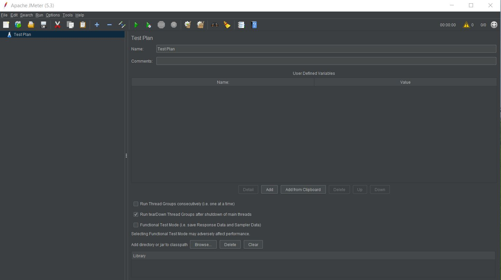
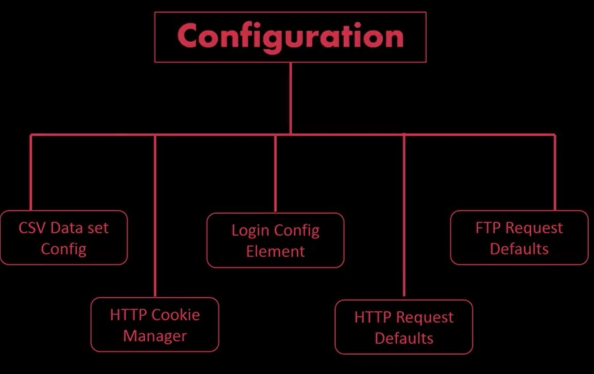

# Apache JMeter Notes

## What is jmeter
* Open source software used for load testing for analysis and measuring performance of variety of services

## Why we need jmeter
* To verify product performance

## What is performance testing
* Type of software testing to ensure software perform well under their expected work load
* Performance testing check whether application under test satisfies required benchmark for
	* Load testing - check whether application can handle required number of concurrent user accesses without any failure
	* Stress testing - how application performing with high load with limited resources

## Advantages of jmeter

* Open source
* Platform independent
* Good GUI
* Supports scripting
* Test plans are in xml format
* Supports protocols
	* http
	* jdbc
	* soap
	* jms
	* ftp
* Documentation

## Installation of jmeter
* Open - https://jmeter.apache.org/download_jmeter.cgi
* Download options - tgz, zip, pgp. Download as per OS
* Unzip the file
* Run `jmeter.bat` in `unzipped-folder/bin` to run jmeter in GUI mode\

## Elements of jmeter
* Thread Group
* Samplers
* Listeners
* Configuration
* We need to create `Test Plan`
* Test plan consists for one more above elements 

### Thread Group
* Collection of threads
* Each thread represents one user of application
* Each thread simulates one real user request\

### Samplers

* Thread group knows which type of request it needs to make using Samplers

### Listeners

* Shows the results of test execution in different formats
	* Tree
	* Table
	* Graph
	* Log

### Configuration

* Sets default variables for later use by samplers

## JMeter for load testing and performance testing
