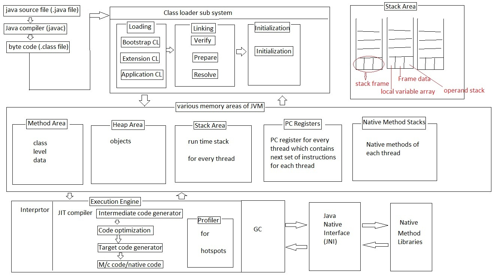
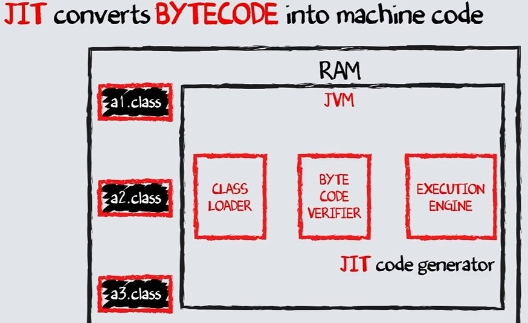
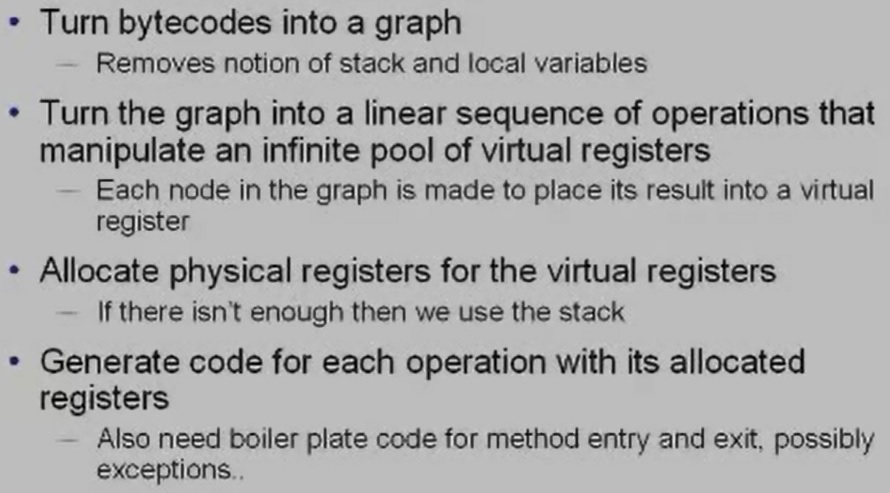

# Architecture
* JVM Introduction\

* Overall architecture of JVM\

* Memory areas\

* JVM Internals\

* JIT compiler converts Byte code to machine code\

* JIT - Just In Time compiler\

* JVM in OS\

* Inside an interpreter\

* Portability with compile once, run everywhere\

* Sources of Inefficiency in interpreter\
