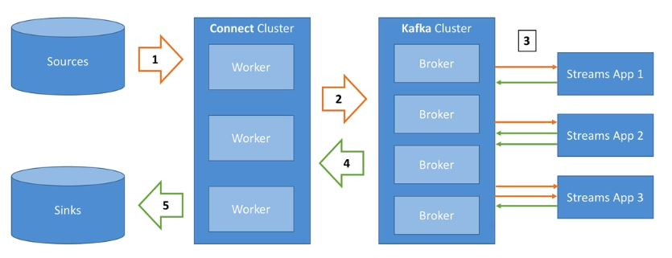
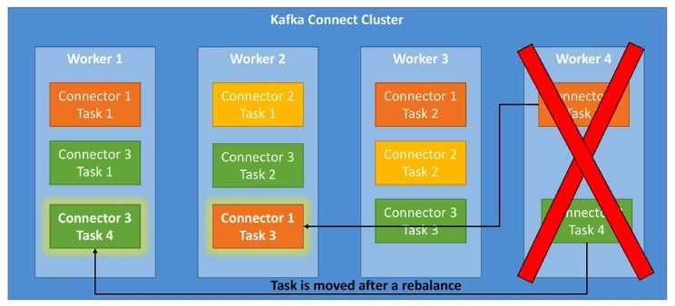

# Kafka Connect Notes
## Two types of kafka connect
* Source connector: Used to pull the data from external data source such as database, file system, ElasticSearch into kafka topic
* Sink connector: Push data from kafka topic to external data sources such as database, file system, ElasticSearch etc

## Some Source Connectors
* FileSystemSourceConnector
* TwitterSourceConnector

## Some Sink connectors
* ElasticSearchSinkConnector
* JDBCSinkConnector

## Why is Kafka Connect?
* Source connect To get data from multiple sources like
	* Databases, JDBC, Couchbase, GoldenGate, SAP, Blockchain, Cassandra, DynamoDB, FTP, IOT, MongoDB, MQTT, SQS, Salesforces, Twitter etc
* Sink connect to send data to multiple sources like
	* S3, ElasticSearch, HDFS, JDBC, DocumentDB, Cassandra, DynamoDB, HBase, MongoDB, Redis, Solr, Splunk, Twitter etc
* Make it easier to quickly get the data reliably into kafka
* Can be part of ETL pipeline
* Scaling made easy. Kafka connect scales very well in distributed mode
* Re-usable code

## Kafka Connect and Streams Architecture Diagram

## Kafka Connect Concepts
* Kafka connector cluster has multiple connectors
	* Each connector is reusable code. They are basically `java jars`
	* Many connectors exist in open source
* Connector + User Configuration == Tasks
	* Task linked to connector configuration
	* Job configuration may create multiple tasks
* Tasks are executed by `Kafka Connect Workers`
	* Worker is single java process
	* Worker can be in standalone or cluster
### Kafka Connect workers standalone
* Single process runs connectors and tasks
* configuration is bundled with process
* Very easy to start with. useful for developing and testing
* Not fault tolerant
* No scalability
* Hard to monitor
### Kafka Connect workers distributed or cluster
* Multiple workers run configuration and tasks
* Configuration is submitted using REST API
* Easy to scale. Just add more workers
* Fault tolerant. If worker dies all the tasks are rebalanced with available workers
* Used for production deployment of connectors

## Kafka connect cluster distributed architecture

## Kafka connect logs
