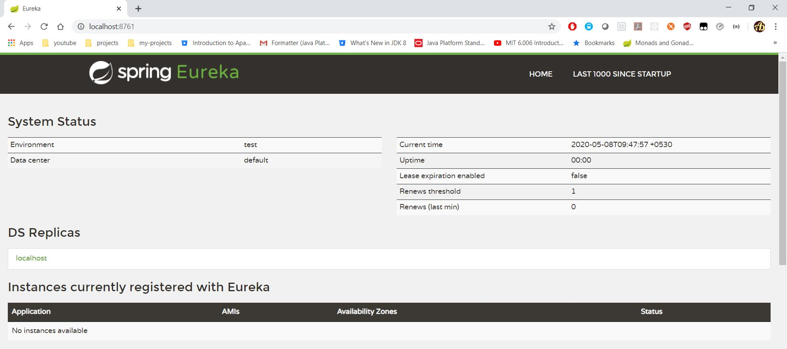
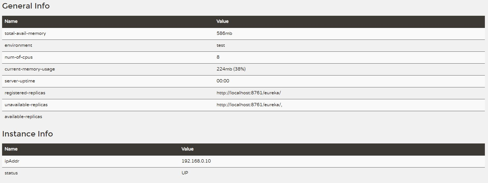
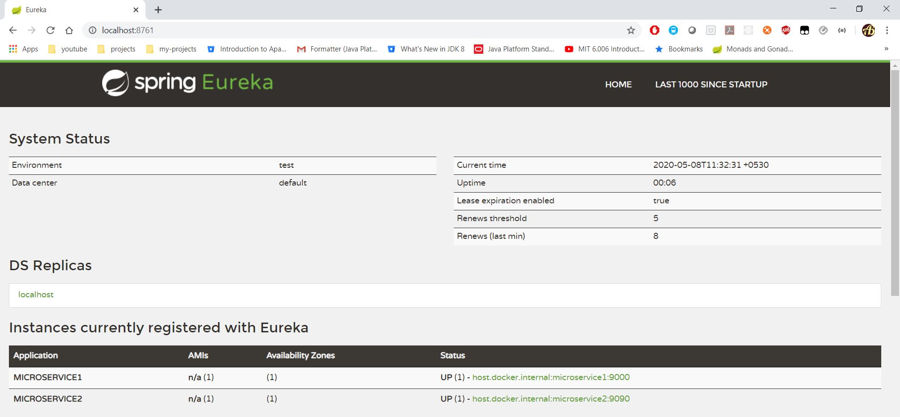

# Feign Euerka Example

## Requirement
* Create 2 microservices
	* microservice1
	* microservice2
	* microservice2 calls microservice1 using Feign with Eureka server
* Create Eureka server
* Create microservice1
	* Make this eureka client
* Create microservice2
	* Make this Feign client
	* Consume microservice1 using Feign

## Eureka Server
* Create project using maven
```
mvn archetype:generate -DgroupId=com.eureka.server -DartifactId=eureka-server -Dversion=1.0 -DarchetypeArtifactId=maven-archetype-quickstart -DinteractiveMode=false
```
* Add gradle also. Execute below command from `eureka-server` project created above
```
gradle init --type pom
```
* Add following dependency management in [pom.xml](eureka-server/pom.xml)
```
<dependencyManagement>
	<dependencies>
		<dependency>
			<groupId>org.springframework.cloud</groupId>
			<artifactId>spring-cloud-starter-parent</artifactId>
			<version>Greenwich.SR3</version>
			<type>pom</type>
			<scope>import</scope>
		</dependency>
	</dependencies>
</dependencyManagement>
```
* Add following dependency management in [build.gradle](eureka-server/build.gradle)
```
ext {
	set('springCloudVersion', "Greenwich.SR3")
}

dependencyManagement {
	imports {
		mavenBom "org.springframework.cloud:spring-cloud-dependencies:${springCloudVersion}"
	}
}
```
* Add following dependency in [pom.xml](eureka-server/pom.xml)
```
<dependency>
	<groupId>org.springframework.cloud</groupId>
	<artifactId>spring-cloud-starter-netflix-eureka-server</artifactId>
</dependency>
```
* Add following dependency in [build.gradle](eureka-server/build.gradle)
```
compile 'org.springframework.cloud:spring-cloud-starter-netflix-eureka-server'
```

* Make application eureka server. Add `@EnableEurekaServer` annotation in the main class [App.java](eureka-server/src/main/java/com/eureka/server/App.java)
* Refer [pom.xml](eureka-server/pom.xml) or [build.gradle](eureka-server/build.gradle)
* Add following entry in [application.yml](eureka-server/src/main/resources/application.yml)
```
server.port: 8761 # default port for eureka server

eureka:
  client:
    register-with-eureka: false #built-in Eureka Client not to register with ‘itself' because our application should be acting as a server
    fetch-registry: false
```
* Start application. Execute main class [App.java](eureka-server/src/main/java/com/eureka/server/App.java)
* Open url - http://localhost:8761



## Microservice1
* Create project using maven command
```
mvn archetype:generate -DgroupId=com.microservice1 -DartifactId=microservice1 -Dversion=1.0 -DarchetypeArtifactId=maven-archetype-quickstart -DinteractiveMode=false 
```
* Add gradle. Execute below command from `microservice1` folder
```
gradle init --type pom 
```
* Add following dependencyManagement in [pom.xml](microservice1/pom.xml)
```
<dependencyManagement>
	<dependencies>
		<dependency>
			<groupId>org.springframework.cloud</groupId>
			<artifactId>spring-cloud-starter-parent</artifactId>
			<version>Greenwich.SR3</version>
			<type>pom</type>
			<scope>import</scope>
		</dependency>
	</dependencies>
</dependencyManagement>
```
* Add following dependencyManagement in [build.gradle](microservice1/build.gradle)
```
ext {
	set('springCloudVersion', "Greenwich.SR3")
}

dependencyManagement {
	imports {
		mavenBom "org.springframework.cloud:spring-cloud-dependencies:${springCloudVersion}"
	}
}
```
* Add following dependency in [pom.xml](microservice1/pom.xml)
```
<dependency>
	<groupId>org.springframework.cloud</groupId>
	<artifactId>spring-cloud-starter-netflix-eureka-client</artifactId>
</dependency>
```
* Add following dependency in [build.gradle](microservice1/build.gradle)
```
compile 'org.springframework.cloud:spring-cloud-starter-netflix-eureka-client'
```
* Refer full [pom.xml](microservice1/pom.xml) (or) [build.gradle](microservice1/build.gradle)
* Add either `@EnableEurekaClient` or `@EnableDiscoveryClient` to [App.java](microservice1/src/main/java/com/microservice1/App.java)
	* Note that this annotation is optional if we have the spring-cloud-starter-netflix-eureka-client dependency on the classpath.
* Create controller [AppController.java](microservice1/src/main/java/com/microservice1/controller/AppController.java)
* Add following entry in [application.yml](microservice1/src/main/resources/application.yml) to register with `eureka-server`
```
eureka:
  client:
    service-url: 
      defaultZone: http://localhost:8761/eureka
  instance.prefer-ip-address: true
```
* Start `eureka-server`. Execute main class [eureka-server/App.java](eureka-server/src/main/java/com/eureka/server/App.java)
* Start `microservice1`.  Execute main class [microservice1/App.java](microservice1/src/main/java/com/microservice1/App.java)
* Open url - http://localhost:8761


## Microservice2
* Create project using maven command
```
mvn archetype:generate -DgroupId=com.microservice2 -DartifactId=microservice2 -Dversion=1.0 -DarchetypeArtifactId=maven-archetype-quickstart -DinteractiveMode=false 
```
* Add gradle. Execute below command from `microservice2` folder
```
gradle init --type pom
```
* Add following dependencyManagement in [pom.xml](microservice2/pom.xml)
```
<dependencyManagement>
	<dependencies>
		<dependency>
			<groupId>org.springframework.cloud</groupId>
			<artifactId>spring-cloud-starter-parent</artifactId>
			<version>Greenwich.SR3</version>
			<type>pom</type>
			<scope>import</scope>
		</dependency>
	</dependencies>
</dependencyManagement>
```
* Add following dependencyManagement in [build.gradle](microservice2/build.gradle)
```
ext {
	set('springCloudVersion', "Greenwich.SR3")
}

dependencyManagement {
	imports {
		mavenBom "org.springframework.cloud:spring-cloud-dependencies:${springCloudVersion}"
	}
}
```
* Add following dependency in [pom.xml](microservice2/pom.xml)
```
<dependency>
	<groupId>org.springframework.cloud</groupId>
	<artifactId>spring-cloud-starter-netflix-eureka-client</artifactId>
</dependency>

<dependency>
	<groupId>org.springframework.cloud</groupId>
	<artifactId>spring-cloud-starter-openfeign</artifactId>
</dependency>
```
* Add following dependency in [build.gradle](microservice2/build.gradle)
```
compile 'org.springframework.cloud:spring-cloud-starter-netflix-eureka-client'
compile 'org.springframework.cloud:spring-cloud-starter-openfeign'
```
* Add `@EnableFeignClients` annotation on main class [App.java](microservice2/src/main/java/com/microservice2/App.java) to make this as Feign client
* Add `@EnableEurekaClient` annotation on main class [App.java](microservice2/src/main/java/com/microservice2/App.java) to make this as Eureka client
* Create Feign client interface - [Microservice1FeignClient.java](microservice2/src/main/java/com/microservice2/rest/clients/Microservice1FeignClient.java)
	* Add `@FeignClient("microservice1")` annotation
	* `microservice1` is `spring.application.name` property in [microservice1/application.yml](microservice1/src/main/resources/application.yml)
* Inject [Microservice1FeignClient.java](microservice2/src/main/java/com/microservice2/rest/clients/Microservice1FeignClient.java) in [AppController.java](microservice2/src/main/java/com/microservice2/controller/AppController.java)
* Start `eureka-server`. Execute main class [eureka-server/App.java](eureka-server/src/main/java/com/eureka/server/App.java)
* Start `microservice1`.  Execute main class [microservice1/App.java](microservice1/src/main/java/com/microservice1/App.java)
* Start `microservice2`.  Execute main class [microservice2/App.java](microservice2/src/main/java/com/microservice2/App.java)
* Open url - http://localhost:8761

* Hit API - http://localhost:9000/hello
```
Hello from MICROSERVICE1
```
* Hit API - http://localhost:9090/greet
```
Hello from MICROSERVICE2, Hello from MICROSERVICE1
```

## API
* [feign-eureka.postman_collection.json](files/feign-eureka.postman_collection.json)